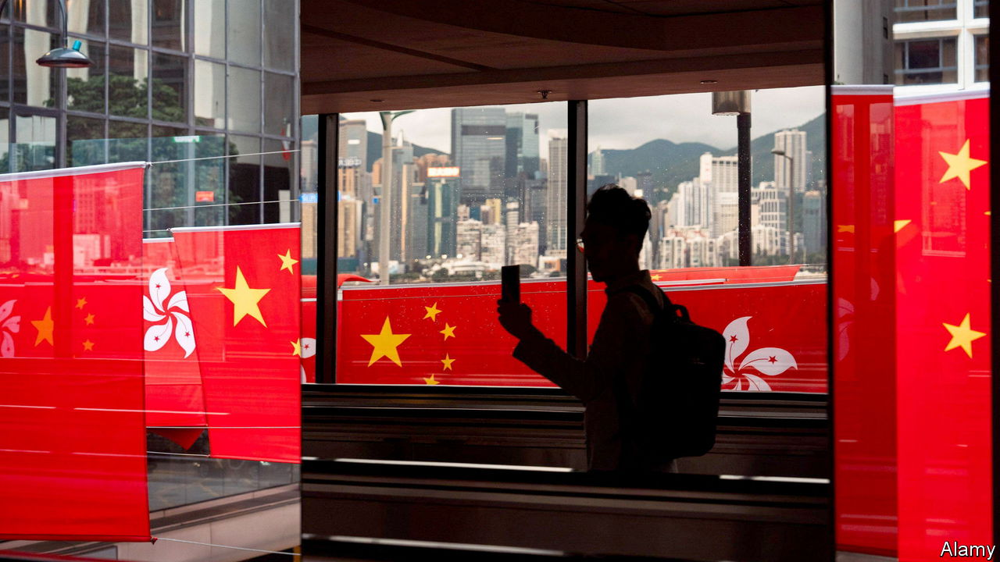

###### Westerners out, Chinese in

# Hong Kong is becoming less of an international city 

##### As foreigners leave, people from the mainland are taking their place 

 

> Jan 25th 2024 

Vegan restaurants do not usually serve beef. But 2084, a plant-based joint in Hong Kong’s New Territories, hopes doing so will help it attract more customers this year. “All the expats are gone,” says Naz Farah, the owner. “Now a lot of mainland Chinese are coming and they don’t like vegan food.” Across the road a once-popular Western takeaway has already closed. A bustling Chinese restaurant stands in its stead.

The demography of Hong Kong (with a population of 7.5m) is changing as the city tries to reverse a brain drain that has seen around 200,000 workers leave in recent years. In 2023 the government lifted strict pandemic controls and announced a slew of new visa schemes. But this “trawl for talent”, as the city’s chief executive, John Lee, calls it, has netted a rather homogenous catch. The city granted just 8,000 visas to Westerners between January and November 2023. Ten times as many went to people from mainland China.

Westerners appear less interested in Hong Kong as a place to live. Many left because of covid-19. But they also complained of China’s tightening grip on the territory. Those who still desire to move there for work have struggled to find jobs owing to the city’s slow economic recovery and changing language requirements. “Every job I applied for required Mandarin, especially in law,” says a woman who trained as a lawyer in Britain, but moved to the city to work as a financial analyst. “Now all the business and corporate work is Beijing-focused. Singapore is really the hub for international work in Asia.” 

People from the mainland see things differently. To them Hong Kong offers more freedoms and still has an international feel. When his wife became pregnant, Barry He, a trader in Beijing, successfully applied for a Top Talent Pass visa, which aims to entice high earners and graduates of the world’s best universities. “I think this scheme will give me an opportunity to see the international job market,” he says, adding that he hopes his child will also benefit from a better education. Of the 60,000 Top Talent visas approved between January and November last year, 95% went to people from the mainland. 

Previous waves of Chinese immigrants to Hong Kong came mostly from the southern part of the country. They often spoke Cantonese and integrated quickly. But the latest influx comes from all over the mainland, says Eric Fong of the University of Hong Kong. “Integration, if it occurs, may take longer than in the past.” Hong Kongers, protective of their distinct identity, are not always the most welcoming bunch. When a group of mainland children was spotted squatting on a train platform last year (as is customary in parts of China), locals poked fun at them on social media.

But the environment is changing. Mandarin is increasingly the language of choice in boardrooms and in the street. Yew Chung Yew Wah Education Network, a leading international-school chain, plans to offer the mainland curriculum by 2026. And in more troubling ways Hong Kong is looking more Chinese. A national-security law imposed on the city by the government in Beijing has dismantled local democratic institutions. Some residents think that the authorities are actively trying to replace more liberal residents with mainlanders. 

Some of these changes cut at the heart of what makes Hong Kong attractive not just to foreigners, but to mainland Chinese. The territory’s appeal is that it is not just another Chinese city. But as the government in Beijing draws it closer, that image is fading. For expats like Ms Farah, it may already be too late. “There’s no connection, no community left,” she says. “I always used to say I would never leave Hong Kong. But now I’m losing hope.” ■


