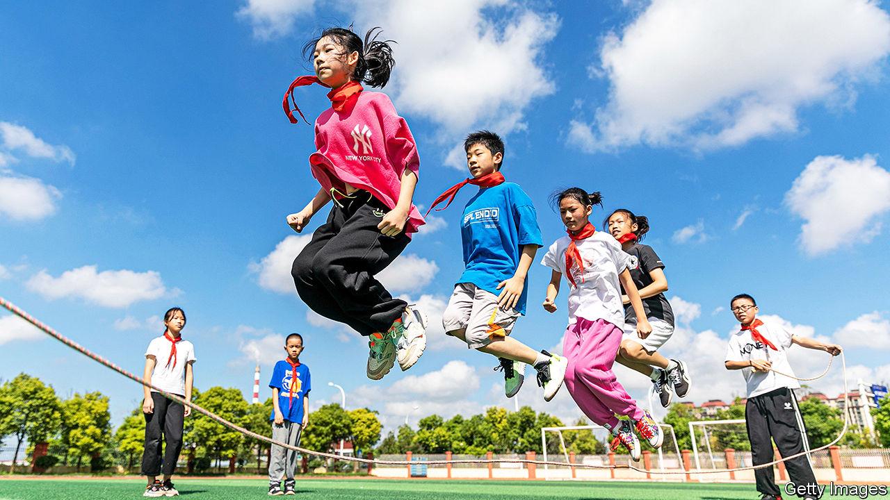

###### Skip, skip, scandal

# Why skipping ropes are so expensive in China 

##### A new reason for parents to be angry with the education system 

 

> Jan 25th 2024 

Skipping rope is a big deal in China. Children must be good at it to become eligible for scholarships. Most provinces include skipping tests (measuring skips per minute) in their versions of the high-school entrance exam, known as the  In the south-western province of Yunnan, for example, elite skippers can score 11 points on the exam, where the maximum total is 700.

That may not sound like much, but the difference of a single point on the  can decide whether or not a child goes to a good school, setting them up for university. So on weekends parents often bring their children to parks for drills. An app that lets pupils compare skipping scores has over 10m users.

Officials want children to be more physically active. They like skipping in particular because anyone can do it. No fancy equipment is needed. State media claim that skipping lessons in rural schools have produced more fit and well-rounded students. Indeed, such schools have produced skipping champions such as Cen Xiaolin, who at the age of 12 broke a world record by skipping over 200 times in 30 seconds in 2016.

But some schools seem more interested in fleecing parents. An investigation by Xinhua, the official news agency, found that schools in several cities were demanding that children buy specially branded ropes to use for the . These typically cost many times more than a basic model, which sells for less than 20 yuan ($3). Some suspect that school officials were colluding with the companies that sell ropes. 

The amount of money involved in the scandal is relatively small, but that is largely beside the point. China’s education system is fiercely competitive. Parents shell out for things like after-school classes just so their children can keep up. Expensive skipping ropes have made them hopping mad. “It’s a real scam,” said a commenter on WeChat, a social-media platform.

The government has long tried to level the playing field for education. In 2021 it cracked down on private tutoring. Now rope sellers are the target. In Hangzhou officials have fined those selling the expensive variety. Other cities may follow suit. But a bigger problem still is professional skipping coaches, whom some parents employ for hundreds of yuan per hour. They keep children from wealthy families one jump ahead.■


