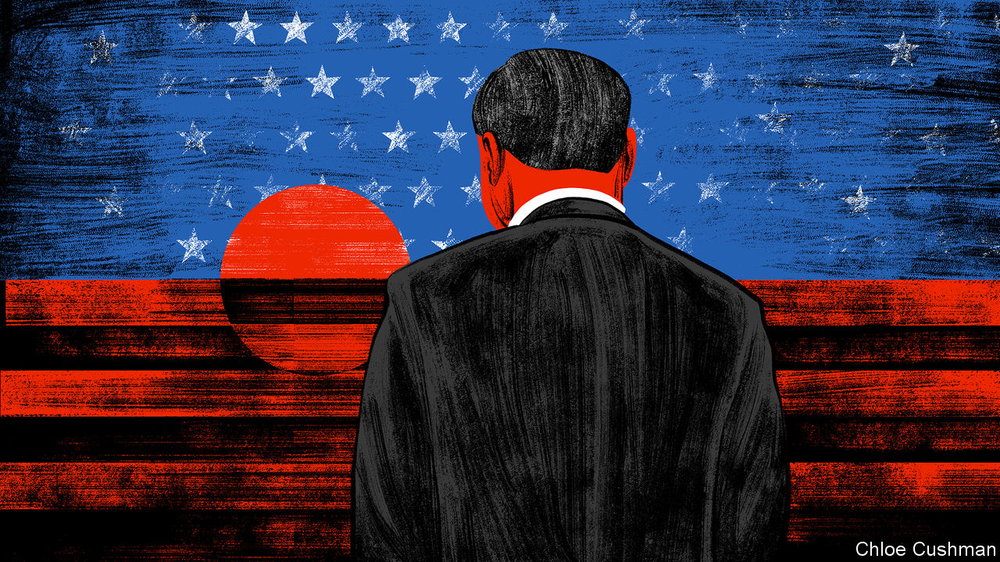

###### Chaguan

# Xi Jinping looks abroad for confidence 

##### The West’s wobbles have China feeling vindicated 

 

> Jan 25th 2024 

When Xi Jinping looks out at the world, he seems to see history’s arc bending his way. As war in Ukraine slides towards a frozen stalemate, and intensifying horrors stalk the Middle East, Communist Party leaders sound confident that they know how to solve such crises, and that most of the world agrees with them. China puts its trust in interests coldly weighed and balanced, and in economic development. It declines to judge even the most blood-soaked tyrants and denies that universal values exist, calling them a ploy to stigmatise non-Western civilisations.

In the telling of Mr Xi’s chief diplomats, events are now vindicating that chilly realism. Pragmatic, predictable China, they assert, understands what is needed to bring peace and enjoys growing respect in the developing world. They draw a contrast with Western governments that bluster about upholding moral principles, then leave poor countries to pay the price as conflicts drive millions from their homes or as sanctions cause food and fuel prices to spike. Seen from Beijing, liberal democracies are being torn apart by political arguments. America, China’s still-fearsome rival, seems ever more tempted by isolationism, starting in Ukraine. Moreover, Western unity is being sorely tested by the American government’s support for Israel in its war with Hamas, and would be shattered by Donald Trump’s return to the White House.

Lately, China’s geopolitical swagger has been on display. In December Mr Xi addressed an agenda-setting party conference on foreign affairs. As explained this month by the party’s top diplomat, Wang Yi, the speech showed how Mr Xi, using “head-of-state diplomacy”, is charting the right course for a “profoundly changing” world. In Mr Wang’s words, Mr Xi is guided by his “extraordinary political wisdom” and his ability, as the leader of a Marxist party, to spot deep historical forces at work. As often with the party, bland-sounding slogans conceal some large ambitions. Mr Wang talks of China promoting “universal security”. That is code for opposing American-led defence alliances such as NATO (because in China’s view, alliances leave members more secure than non-members, destabilising the world). “True multilateralism” is jargon for China’s preferred world order, in which the five permanent members of the UN Security Council, namely America, Britain, China, France and Russia, must consent to all interventions by the international community. It also involves developing countries, led by China, having more say generally. 

A large majority of countries welcome Mr Xi’s calls for “an equal and orderly multipolar world and a universally beneficial and inclusive economic globalisation,” says Mr Wang. As an astute, Beijing-based diplomat notes, that chewy mouthful is actually a pre-emptive attack on a second Trump administration. Ahead of the American presidential election in November, China is presenting itself to the world as a champion of equality and order, in opposition to America First selfishness and chaos. It is also casting itself as an advocate of free-flowing commerce, determined to battle Trumpian trade barriers and export controls (never mind that China jealously guards access to its own markets).

In recent summit meetings with foreign leaders, diplomatic eyewitnesses report, Mr Xi has conveyed, or sought to convey, the confidence of a man who believes that destiny is on his side. Barely glancing at his prepared talking points, a serene-sounding Mr Xi has offered history lessons to visitors. In one meeting, he recalled the crisis in the 1960s when Soviet experts left Mao-era China, taking their know-how (including nuclear expertise) with them. That turned out to be an “opportunity”, Mr Xi averred. It obliged China to build its own industries. American export curbs will be an opportunity for the same reason, he predicted.

Since Russia first invaded Ukraine in 2022, Chinese officials have scoffed that Western unity over the war would not last. Now, with American aid in the balance, a well-connected scholar contrasts China’s cool-headed analysis of the conflict with the “emotional” approach of European politicians. China is not motivated by deep trust in Mr Putin, says the scholar. Instead, it has all along been seeking to “lay down a marker” that the West cannot pursue its own interests without limit, for example by enlarging NATO, and expect a great power such as Russia to accommodate it.

As for the Middle East, party leaders call China a “reliable mediator” in that region, thanks to its emphasis on trade and security, and its non-judgmental way of letting each government seek its own independent path to prosperity. Mr Wang contrasts this “Chinese way” with selfish actors (he means America) who believe in “force being omnipotent”.

Swagger’s harder without swag

There are principled reasons to fear the illiberal, interests-based order that Mr Xi seeks. It would offer aggressors like Mr Putin impunity and a veto over his neighbours’ security. China, for that matter, has its own destabilising regional ambitions. But a slowing economy might impose its own constraints. At his first foreign-affairs work conference as party chief, in 2014, Mr Xi explicitly linked diplomatic success abroad with ambitious targets for China’s GDP growth and rising incomes at home. Reports of the latest conclave on foreign affairs mention no economic promises.

A painful question looms. In 2020, during the covid-19 pandemic, Mr Xi reportedly urged officials to grasp the trend that “the East is rising while the West is declining”, contrasting China’s orderly virus controls with chaos abroad. The phrase is still in use. The , the party’s official mouthpiece, cited it on January 18th. Just now China is cocky about the second half, involving Western decline. But the first half about a rising East should induce anxiety. China faces economic headwinds. To date the party’s response is policy drift. Will Mr Xi be able to bestride the world, taking advantage of American introspection, if his economy stalls at home? As Marxists should know, history’s arc can bend back. ■


