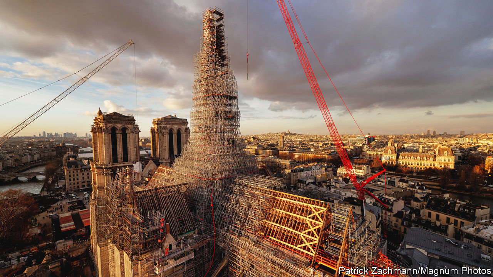
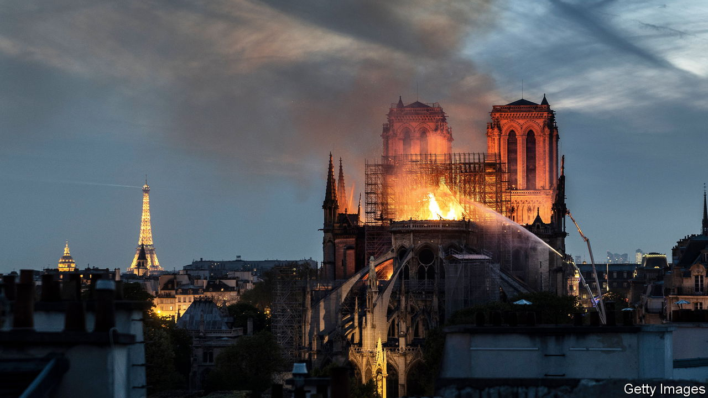

###### After the fire

# Against the odds, Notre Dame cathedral will reopen this year 

##### The rebuilding of the famous monument prompted a debate about how much should change 

 

> Jan 25th 2024 

On an icy January morning, perched at a dizzying height of nearly 100 metres above the ground, specialist roofers are covering the rebuilt oak spire of Notre Dame cathedral with layers of lead sheeting. Working on platforms reached by a perilous flight of narrow steps that cling to the soaring spire, they are putting the final touches on a 1,000-piece, solid-oak structure that will soon restore the cathedral’s familiar silhouette. 

Designed in 1859 by Eugène Viollet-le-Duc, an architect, and felled by the devastating fire of 2019, the new  remains hidden behind dense scaffolding. But five years after the world watched aghast as the gothic cathedral roof was , the project to rebuild Notre Dame is, astonishingly, on schedule. The cathedral doors are due to reopen in December. (Visitors for the Olympics, which Paris will host starting in late July, must wait to glimpse inside.) 

 


The rebuilding of Notre Dame is one of the most complex and ambitious reconstruction projects that France has ever undertaken on a historic monument. Fire engulfed the entire wooden latticework that made up the medieval roof, before melting its lead casing and toppling the spire. The cathedral’s nave, choir and transepts were mostly untouched by flames, thanks to the craftsmanship of the 12th- and 13th-century stonemasons. So were the 8,000-tube great organ and stained-glass windows. 

However, molten lead and charred oak beams crashed through the roof, spreading embers and lead particles. Religious artefacts, paintings and sculptures had to be rescued and cleaned; the organ and 39 stained-glass windows were dismantled and washed. It took two years to stabilise the cathedral’s stone structure.

When a grave-looking President Emmanuel Macron stood outside Notre Dame on the night of the fire, he described it as “the epicentre of our lives”. The cathedral , he vowed, within five years. That promise may have sounded “a bit mad”, concedes Philippe Jost, who runs the public body in charge of the reconstruction project. But, he adds, it gave everyone a clear objective. 

That the project is on track is also partly due to the commanding style of General Jean-Louis Georgelin, who ran it like a military operation until his death last August. A light management team, freed from bureaucratic excess has helped, too.  from rich French industrialists—the Arnault, Bettencourt and Pinault families—as well as 340,000 smaller individual donations from around the world amounted to €846m ($921m). Unlike the usual French , this one is costing the public purse almost nothing.


Today the cramped site on the Île de la Cité, an island in the River Seine, is a veritable construction village, complete with a canteen, shower block, offices and sculpture-restoration workshop. Last summer the first eight triangular oak trusses, crafted for the new transept roof, arrived by river. Passers-by watched in awe as, one by one, each seven-tonne truss was hoisted by crane from a barge and lowered into place.

The craftsmen working on the project are specialist artisans, drawn from dozens of small firms from around France. Rather than contract the rebuilding to one company, over 140 separate tenders were put out, in order to support traditional craftsmanship. The demands were unusually high: a decision was taken to restore the cathedral to its former splendour while remaining faithful both to its original designs and the construction techniques of the time. 

For the roof above the medieval nave and choir, 1,200 oak logs were individually selected from forestry plantations in France and hewn by hand into square timber beams. Craftsmen used hand-forged axes, based on late 12th- and early 13th-century models. On the curved apse roof, finished on January 12th, wooden dowel pegs hold the trusses together without a single industrial metal piece. “The idea was to work with tools that are as close as possible to those used in the Middle Ages in order to give the wood the aspect of the time,” says Valentin Pontarollo, a carpenter from Ateliers Perrault, a firm in western France. One of the joys this brought was that there was often “no machinery noise, just the sound of the axe”, he says.

Inside the on-site restoration workshop, sculptors and stonemasons are also working by hand, with chisels and brushes. On the floor stand some of the near-finished new stone chimeras, the grotesque and menacing beasts installed in the 19th century that look down from the cathedral façade and towers. More than a dozen gargoyles, 80 fleurons, 70 small chimeras and more than 750 crockets (decorative stone hooks) are being entirely rebuilt, as are three cathedral gables. At 96 metres above ground level, a new gilt-covered copper rooster tops the needle of the spire, hoisted into place by a crane in December. It replaces the one that miraculously survived the fire, falling to the ground beneath one of the flying buttresses. (The original is on display at a museum.) 

 


Inevitably some modernists decry the project’s conservatism. After the fire, various architects lobbied for an audacious contemporary flourish: a plate-glass spire or roof planted with vegetation. Notre Dame, after all, is an architectural hybrid, the product of different centuries, ransacked during the wars of religion and looted during the revolution. Viollet-le-Duc’s spire was added only in the 19th century, not long after ’s novel, “The Hunchback of Notre Dame”, revived respect for what was then an unloved gothic masterpiece. 

Today a public debate pits those who contest the authenticity of reconstruction against those who argue that authenticity is guaranteed by respect for the original, with its irregularities as well as its durability. “This is not a monument like any other, and deserves not being distorted,” says Mr Jost: “We are restoring a cathedral that is 860 years old so that it can last for at least another 860 years.”

Notre Dame’s overseers are trying to strike a balance. The pristine, newly cleaned cathedral may take some visitors by surprise. Inside the nave, where much of the scaffolding has come down, the freshly blond stone of the pillars and vaults, as it would have appeared in medieval times, is breathtaking—and a startling contrast to their previous darkened, partly pitted form. 

 


But the cathedral has not rejected modernity altogether. The Archbishop of Paris has chosen two contemporary French designers for the furniture. Guillaume Bardet is making the liturgical furnishings, including the altar, with dark bronze, and Ionna Vautrin the new 1,500 solid-oak congregation seats, which will have slatted backs to suggest openness and light.

The rebuilding of Notre Dame is both a test and a showcase for France: of its ability to meet an ambitious deadline, to satisfy the demanding global gaze of both secularists and spiritualists and to flaunt French craftsmanship. Finishing in time is a matter of “French pride”, says Mr Jost. 

For the artisans, completion will be poignant. Emile-Armand Benoit, an ornamental roofer on the cathedral’s highest point, says that they are working as quickly as possible so that the scaffolding can come down and the city “can once again see the spire reaching into the sky”. Halfway down, the carpenters contemplate the newly finished roof. “It’s a bit heartbreaking to leave,” says Mr Pontarollo, “We’ll never have a project like this again.” ■


