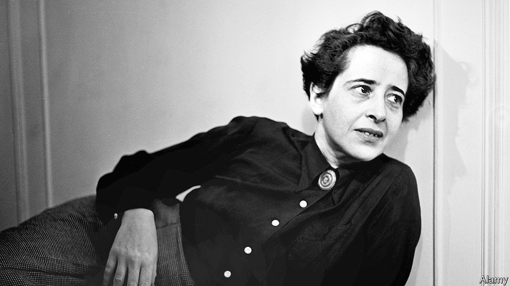

###### Anti-totalitarianism

# Hannah Arendt’s message on freethinking is as relevant as ever 

##### Thoughtlessness creates the conditions for evil 

 

> Jan 25th 2024 

By Lyndsey Stonebridge. 

IN 1975 A young senator named Joe Biden heard of a lecture that  had recently given at Faneuil Hall in Boston, on America’s need for a reckoning after the Vietnam war, now that the “big lie” about the extent of the country’s powers had been exposed by a humiliating defeat. He wrote to her saying that, as a member of the Senate Foreign Relations Committee, he would be most keen to receive a copy of her paper. Such interest says something about the future president’s curiosity—and a lot about the then 68-year-old Arendt’s formidable reputation as a public intellectual. 

Arendt was said to be someone you could actually  thinking. Lyndsey Stonebridge, in an absorbing new biography, conjures up the image of Arendt forming her body “into a single question-mark incarnate”. And the questions she asked were big ones: why did the great evil of the 20th century come about; how could totalitarianism have happened; how can freedom and plurality be protected?

They are also relevant today, as politics too often threatens to descend again into post-truth madness, even in the democratic West. Might totalitarianism’s horrors return? Exploring the mind of one of the past century’s great thinkers on these matters has, sadly, become a topical enterprise.

Ms Stonebridge, a professor of humanities and human rights at Birmingham University, does an admirable job. She has been reading Arendt for over 30 years, she says, but her approach is not merely bookish. She imagines her way into Arendt’s life, in places literally retracing her subject’s footsteps, sensing the climate and smelling the (typically smoke-filled) air in an effort of understanding. 

She follows Arendt to Hanover, where she was born. She pictures the young Hannah crossing the bridges of Königsberg (now Kaliningrad) and proudly responding to the boys calling her “Jewess!”. She wanders through the university town of Marburg, where as a student Arendt began an affair with her philosophy teacher : the combination of Heidegger’s “narcissism with his Nazism” would drive them apart, Ms Stonebridge writes, though their intellectual friendship resumed after the war. 

The author visits the bleak camp in south-west France where Arendt was interned for several weeks (until she escaped); the narrow streets of Montauban, where Arendt ran into the familiar figure of Heinrich Blücher, who became her husband; and the “fantastic beauty” of Portbou, near the Spanish border, where Arendt tried to find the grave of her friend Walter Benjamin, a Jewish philosopher who had committed suicide, before she headed on to Lisbon and left the chaos of Europe for a new life in America. 

The physical places illuminate the journey of the mind. At the National Archaeological Museum in Athens, for example, Ms Stonebridge marvels, as Arendt did, at its collection of ancient gravestones. The sculptures helped Arendt think the world anew, after being immersed in the gloom of her great work, “The Origins of Totalitarianism” (a survivor’s narrative that Ms Stonebridge affectionately describes as “an act of love disguised as scholarship”). 

Arendt’s most testing journey was to Jerusalem, as a dogged observer of the trial of Adolf Eichmann, one of the main architects of the  of the Jews. In “Eichmann in Jerusalem” she stressed “the banality of evil”, which some interpreted as belittling it. The ensuing backlash (not least among Arendt’s  of New York Jewish intellectuals) was fierce. 

To this day, observes Ms Stonebridge, “the Eichmann affair hangs like a brown cloud” over Arendt’s writing and reputation. Ms Stonebridge is more sympathetic. She reserves her criticism for Arendt’s failure to adequately take on board the racial violence of America’s history. 

The core and enduring message, however, is on thinking. In “The Human Condition” Arendt begins with a simple proposition: “it is nothing more than to think what we are doing.” Thoughtlessness, she concluded towards the end of her life, creates the conditions for evil. “There are no dangerous thoughts,” she famously wrote. “Thinking itself is dangerous.” It is what makes people “free to change the world”. And it is as true today as it ever was. ■


