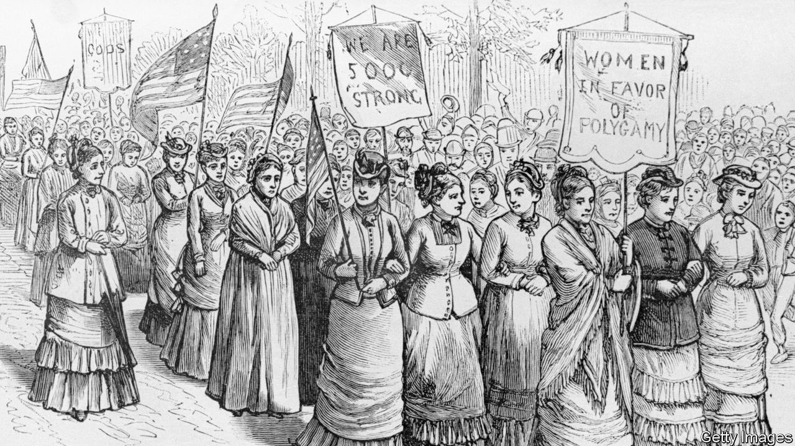

###### The gates of Salt Lake

# Mormonism is America’s homegrown religion 

##### Yet the Christian denomination long defined itself in opposition to the country that spawned it 

 

> Jan 25th 2024 

By Benjamin Park. 

JOSEPH SMITH, like so many Americans in the 19th century, looked west. Mormonism’s founder and prophet led his followers through New York, Ohio, Missouri and Illinois. They sought Zion: a place where the faithful could be safe and sovereign. Their ultimate destination, , became the promised land. 

That may sound a little too star-spangled and modern to be properly biblical. But as Benjamin Park, the author of “American Zion”, a new history of Mormonism, argues, that is the point. The Church of Jesus Christ of Latter-day Saints, as it is, has long defined itself simultaneously as a product—and an opponent—of America. 

Mr Park, a historian at Sam Houston State University in Texas and a Mormon himself, traces the faith from its roots in New York in the 1820s to 2022, when TikTokers exposed racist and homophobic attitudes at Brigham Young University (BYU). He argues that Mormonism flourished in the mid-19th century at a time of “religious disruption”. The young country’s individualistic ideals made space for believers, such as Smith, to cultivate their own spiritual visions and seek salvation outside established institutions. 

Yet Mormonism’s take on Christianity proved too “weird”, even at a moment of religious innovation. The Book of Mormon “sacralised American soil”, writes Mr Park, “by making it a Christian land long before European colonisation”. To many this belief, and Smith’s personal revelations, were heretical. But no part of Mormonism was as controversial as polygamy, which was seen as central to eternal salvation. 

By the mid-19th century Mormons had come to believe that America’s promise of religious liberty was a false one. After a mob murdered Smith in Illinois, Mormons sought a new home beyond the reaches of the American government. When Brigham Young succeeded Smith as prophet and decided to build Zion in the Salt Lake Valley,  was not yet an American territory. Largely because of the persistence of polygamy, the state would not join the union for nearly 50 years. 

The history of Mormonism, much like America’s, is one of tepid progress followed by retrenchment. When Mormonism was new, and its members were outcasts, some black believers found a home in the church and women held positions of power in the Relief Society, a church charity. Later, as the church sought acceptance among other American Christians, women and blacks were marginalised. 

But church leaders may find it hard to change tack, even if they wanted to. Mr Park argues that the church’s conservatism helped it achieve wider acceptance. Mormons’ devotion to family values aligned them with the religious right. In 2012 they even had one of their own as a Republican standard-bearer: , the former governor of Massachusetts and presidential candidate. Christians today see Mormons not as outsiders but as allies in the culture war against liberals and atheists. Not even Donald Trump, a thrice-married reality-TV star, could shake Mormons’ commitment to the Republican Party. In 2020 white Mormons were about as likely to support Mr Trump as white . 

Still, Mr Park argues, Mormons’ subsumption into the religious right belies fissures within the faith. Challenges to its white, male hierarchy sprang up during the civil-rights movement, second-wave feminism and protests at BYU in 2022. Gay saints struggle for acceptance within the church. The nation is reckoning with similar questions as the country diversifies. America, and the religion it inspired, remain ever intertwined. ■


