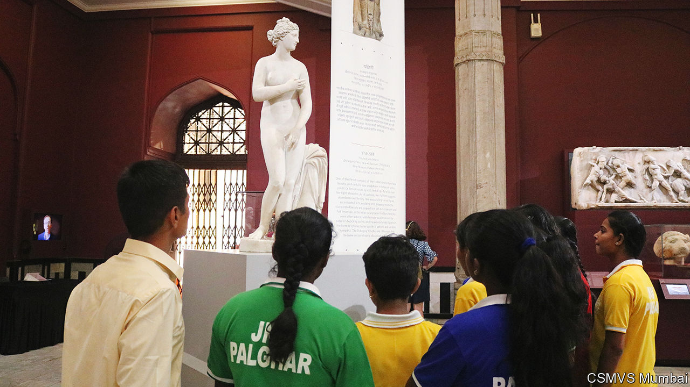

###### Oh, gods

# The modern relevance of 3,000-year-old religious sculptures 

##### India’s leading museum is hosting a fascinating show, with global support 

 

> Jan 25th 2024 

Look around, and marvel at the heavenly matches. Flawless Dionysus, the Greek god of  and general good-time chap (his nude marble body setting unrealistic beauty standards long before the invention of Instagram) stands next to a tall banner of Bodhisattva Maitreya, the future Buddha, his gaze serene, features sharp, body supple: a perfect man. 

Across the rotunda is a diptych of vengeful leonine goddesses: there, in three-millennia-old mottled rock, is Sekhmet, the fierce lion-headed Egyptian goddess, eye of Ra, the  god, and destroyer of his enemies. Hanging beside her is the lion-headed Narasimhi, ferocious consort of Vishnu, the Hindu god of preservation.

There are many similarities between the masterpieces on display at the Chhatrapati Shivaji Maharaj Vastu Sangrahalaya (CSMVS) museum in Mumbai, as well as important differences. Why, some onlookers have wondered, do Dionysus and other European gods look away from the worshipper when Indian deities stare directly at onlookers? And why are they all naked? Should Western gods not be draped in jewels and gold and the finest fabrics, like India’s? How, visitors have asked the curators, can you even tell that this nude body over here is a god at all?

CSMVS has mounted “Ancient Sculptures: India, Egypt, Assyria, Greece, Rome” to draw attention to the echoes between great ancient civilisations—and to give rise to new ways of looking at them. The exhibition,  with the British Museum in London, Berlin State Museums and Getty Museum in Los Angeles (all of which provided works on long-term loan), will run until October. 

The objective of the exhibition is two-fold. The first is to bring to an Indian audience, and especially students, great works of antiquity from European museums that are otherwise inaccessible to the vast majority of locals due to borders, labyrinthine visa processes and pricey plane tickets. The second is to foster acceptance and respect for other cultures by emphasising the rich connections and cultural exchange that have existed since ancient times, says Sabyasachi Mukherjee, the director of CSMVS. 

This is something that is even more noteworthy in an era of increasing fragmentation or “slowbalisation”. A Greek poem from the fifth century BC imagined Dionysus conquering India—a textual attempt to integrate the subcontinent with the Mediterranean world, perhaps. The sculpture of Buddha from the second century BC, crafted in what is now Pakistan, is probably a product of artistic influences shaped by the invasion of India by  two centuries earlier.

An unstated undercurrent of the exhibition is the unforgiving  of the ruling Bharatiya Janata Party, which has spread to the country’s cultural institutions. The party’s propagandists are busy painting India as a “world teacher”, with historical achievements that range from being the “mother of democracy” to inventing nuclear weapons in antiquity. 

A regrettable, if integral, part of pumping up Hindu pride has been the degrading of all foreign cultures as inferior. An exhibition that reminds Indians that they are a part of the global community, in which India both influenced and was influenced by other cultures, is a powerful counter. 

The museum in Mumbai, rare among Indian institutions for being autonomous and non-state-funded, and therefore less likely to produce propaganda, is ideally positioned to mount such a project. It is the first choice for collaborations in India, according to Western curators.

This is a chance to look afresh at much-analysed objects, too. The study of antiquity has long been dominated by Europeans and Americans, seen from the perspective of Greece and Rome—with India as an afterthought. But “if you start from the Indian end” it changes the way you might see Western sculpture, says Neil MacGregor, a former director of the British Museum who advised on the project. Many of the visitors’ questions, including why ancient Greek and Roman gods were portrayed as naked, were so novel that they left the organisers flummoxed. According to Mr MacGregor, “A lot of the curators in London and Berlin weren’t able to quickly answer [them]—or at all.”

In gods we trust

The organisers also hope the global co-curation effort will provide a new model for the sharing of art across borders. CSMVS plans to follow up the exhibition with a second, more ambitious project: an “Ancient World Gallery” with more than 100 objects from around the world, opening in 2025 and running for three years. 

For all the talk of novelty—new connections between sculptures and juxtapositions—there is one way in which the exhibition is a return to older traditions. As the West secularised, ancient gods transitioned from deities to artefacts: they became towering achievements of art, symbols of power and prosperity, but no longer figures of devotion. However, bring those objects to India and put them alongside gods still actively worshipped by a billion people—it is not uncommon for visitors to CSMVS’s galleries to remove their footwear before sculptures of Hindu gods, or to touch their feet in ritual devotion—and suddenly Dionysus and Sekhmet and other gods of various pantheons are imbued with renewed spiritual power. ■


