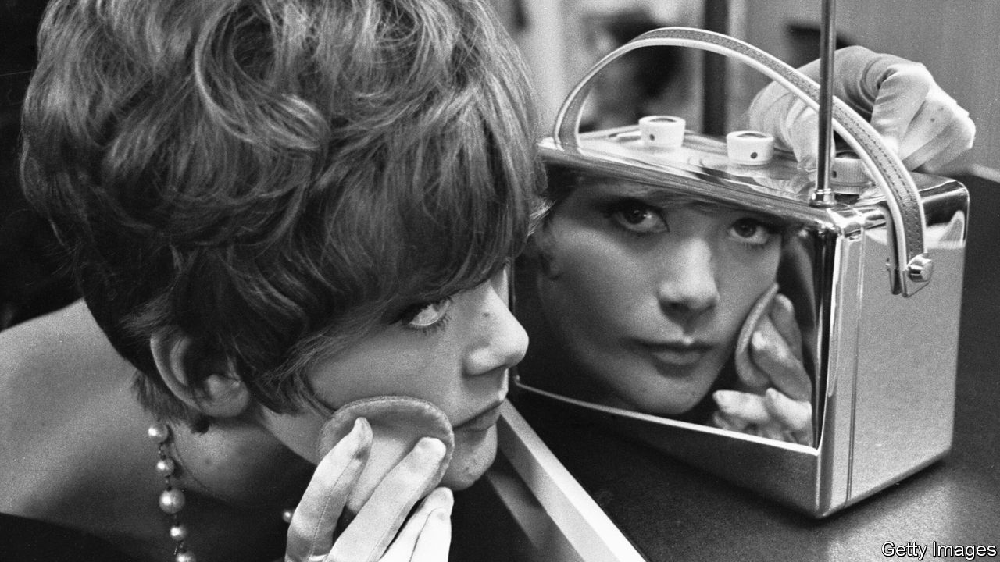

###### The comeback kid

# Which colour and material is most in vogue in 2024? 

##### It is enjoying a resurgence in design and fashion 

 

> Jan 19th 2024 

AFTER years in the doldrums, brightly reflective chrome finishes are back, gleaming in the spotlight. Pinterest, a pictorial social-media network, noted an appetite for “cool silver tones and bold chrome” in its annual trend report, “Pinterest Predicts”.  and Kaiyo, an online second-hand furniture marketplace, all foresee a renewed interest in chrome in interiors.

In popular culture, shiny metallic finishes are key to the punkish retro-futurist aesthetics of the  film series and “Fallout”, a popular, post-apocalyptic game series, both of which have adaptations coming out in 2024. (“Furiosa: A Mad Max Saga”, arrives in cinemas in May; “Fallout”, on Amazon Prime in April.) The revival is also under way in fashion.  sported high-shine silver costumes and accessories by Boss, Lanvin and Mugler during her gold mine of a tour in 2023. Wide-brimmed chrome hats worn by the singer and her dancers during the performance of the song “Formation” were pivotal props, obscuring and illuminating body parts. 

Chrome became popular in the 1920s, with the rise of the Modernist and Art Deco movements. On the one hand, its bright, reflective surface made it feel glamorous, futuristic and fresh in the wake of the heavy, dark interiors popular in the late 19th and early 20th centuries. It was used by Syrie Maugham, a British interior designer who was influential in the 1920s and 1930s. She popularised white rooms layered with reflective surfaces like chrome lamps and mirrored screens. 

On the other hand, chrome has an industrial edge, particularly when applied to metal tubes. According to Deborah Sugg Ryan, professor of design history at the University of Portsmouth, this dovetailed perfectly with the idea of a house as a machine for living in, a philosophy espoused by , an architect. Chrome was a natural choice for  designers including Eileen Gray, Marcel Breuer and Mies van der Rohe, who lavished it on furniture, lighting and interior fixtures. As Ms Sugg Ryan points out, it was just as popular on the mass market, giving everything from cigarette lighters to picture frames a burst of Hollywood éclat. 

From the 1950s, Harley Earl, head of design at General Motors, an automobile company, drove chrome to prominence once again. According to Earl’s biographer, Stephen Bayley, he believed the average American consumer wanted big, flashy cars that reflected confidence. He developed an entire language of design that not only applied to GM’s Chevrolets, Oldsmobiles and Pontiacs but came to influence all kinds of unrelated consumer goods, from radios and cigarette cases to bar stools. An apprentice who worked with Earl in the 1950s recalls him advising GM’s designers to “lay on chrome with a trowel”. But consumers grew sick of surfeit. By the mid-1960s chrome lost its shine and became decidedly déclassé until a brief, spirited revival in the 1980s. 

Trends in design tend to be cyclical, so chrome’s re-emergence after years of brass, bronze and rose gold is perhaps no surprise. However, the world is rather different from what it was during the first “chrome rush” a century ago, when a glitzy taste for the colour reflected a booming economy in America and optimism about the future. Today there are wars in the ,  and  and unease about the climate, politics and inflation. The world’s mood is sombre and grey. 

The current taste for chrome could be due to pragmatic considerations. Both fashion and interiors are in the midst of a boom in upcycling and buying second-hand, which is more environmentally friendly. And while mid-century modern furniture has become highly sought after and more expensive, prices for furniture from the Art Deco period and 1980s remain more affordable. Chrome also reflects a lot of light, which is useful when living in smaller spaces. 

Still, it is impossible to dismiss the idea that chrome’s return in design is also about nostalgia, escapism and fantasy. Dreams of a brighter tomorrow, like chrome, never entirely lose their lustre. ■


