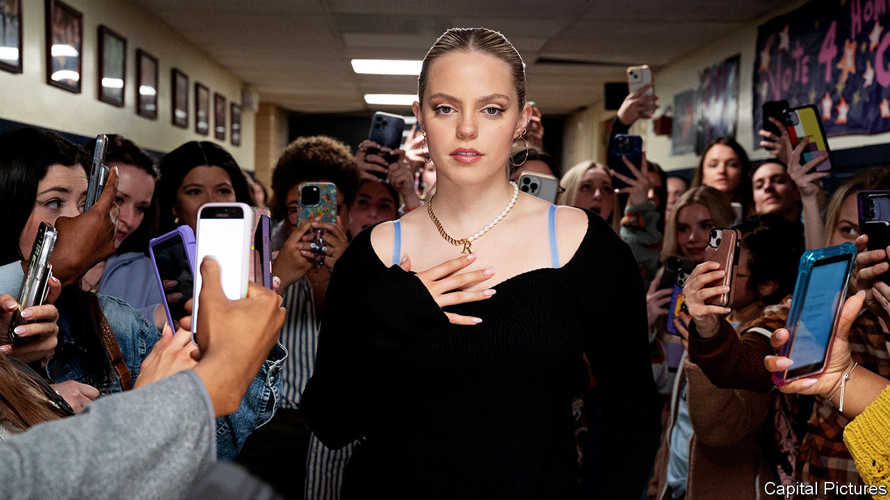

###### Sing it again

# “Mean Girls” and the rise of the film-turned-musical-turned-remake 

##### Musical films are hitting a high note 

 

> Jan 22nd 2024 

“Mean Girls” became a hit film in 2004 by showing how hard it is to be popular. But the remake of the film, now out in cinemas, is itself part of the in-crowd: it is one of a spate of films that became a stage musical and is now a musical film. 

“The Color Purple”, based on Alice Walker’s Pulitzer-prizewinning novel, is also out in cinemas. The book was adapted into a film in 1985 and became a stage musical in 2004. “Wicked”, a musical that follows two witches from “The Wizard of Oz” (1939), has been seen by more than 65m theatregoers. The first instalment in a two-part film adaptation will be released in November. 

Tina Fey, an actress who wrote both scripts for “Mean Girls”, is following Mel Brooks’s lead. He turned “The Producers” (1967)—his Oscar-winning satirical film about the , aptly enough—into an acclaimed stage show in 2001, then into a middling film in 2005. Roald Dahl’s  also jumped from screen (1996) to stage (2010) to screen again (2022), with the most recent instance accompanied by music and uplifting choreography. 

These films are a reflection of Hollywood’s interest in safe bets. Something like “Mean Girls” offered assurance to financial backers, who could count on attracting new viewers as well as people who had seen the original film and musical. But there is more to the trend than financial calculation. As with of 20th-century cartoons, retellings offer an opportunity to update a story according to the mores of the moment. When “Mean Girls” was first released in 2004,  was just three months old; gossip spread by word of mouth back then, not direct message. In her new version, Ms Fey grapples with  and . 

Whether the trend continues depends, of course, on how the current clutch performs at the box office. If the films succeed, there are lots of musical hopefuls waiting in the wings. It may not be long before “Groundhog Day”, “Pretty Woman” and  make their cinematic encores. ■


