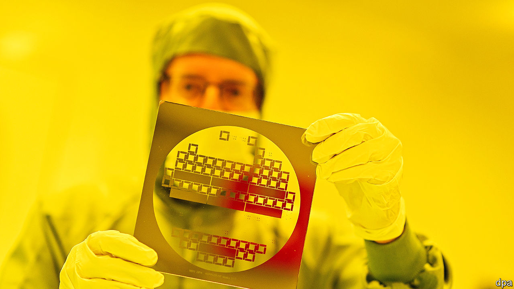
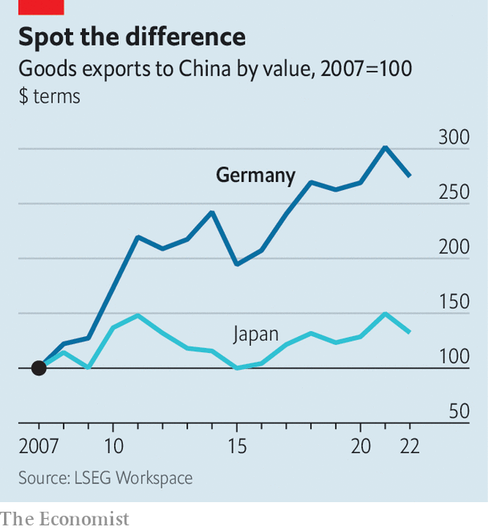

###### Learning from the east

# Europe’s new plan to safeguard its economy 

##### But finding consensus is hard 

 

> Jan 24th 2024 

As the Chinese proverb almost says, a journey of a thousand miles begins with a single white paper. That, at least, is how a lot of EU policy is made. On January 24th the European Commission published a series of such papers and proposals on how to monitor and restrict exports of sensitive technology and investment in these sectors abroad (read: China). It also presented legislation on screening investment by foreign firms in Europe. 

Those hoping for sweeping change will be disappointed. The package is a lot less ambitious than an outline strategy published last June had suggested. And it hardly matches America’s punchiness or a joint statement by President Joe Biden and Ursula von der Leyen, the commission president, in March 2023, which envisaged the EU and America working hand-in-hand. That is perhaps because doing things bluntly and expensively, American-style, may be the wrong yardstick for the EU. It might be more realistic for it to emulate Japan’s carefully thought-through approach. 

The first step is to understand where Europe’s true strategic interests lie. For a while the EU was simply dragged into American efforts to counter China. The Netherlands had the most forceful such experience, after America leaned heavily on it to ban exports of advanced lithography machines by ASML, a Dutch tech company. Each EU country is now reviewing its own vulnerabilities. That is a start.

But EU countries have quickly discovered how hard that is. Many member states are simply too small to have the analytical capabilities to do it thoroughly. “On Russian sanctions, we voted with the Germans in the hope that they had done the analysis,” says the representative of one midsized member state. The various risk assessments that the commission in October recommended that member states conduct are still going on. In February the commission plans to report on security risks for the most critical four tech industries: advanced semiconductors, AI, quantum computing and biotech. Reports on other risks—the resilience of supply chains, the safety of critical infrastructure, and exposure to economic coercion—and more sectors, such as energy technologies and advanced materials, will follow.

Once those are all done, the next step is to find common ground among 27 countries with very different views. Autocratic Hungary is increasingly siding with Russia and China inside the bloc. Large member states have little trust in the commission itself. In contrast, Japan’s strength in economic security lies in unity of purpose, argues Mathieu Duchâtel of the Institut Montaigne, a Paris think-tank. 

To find more Japan-style unity, the commission wants the question of economic security to be moved to a higher political level. Take its new white paper on export controls. The commission wants to set up a high-level political co-ordination group to agree on the next steps. In 2021 Japan went a step further, raising export controls to a ministerial level by creating a cabinet minister for economic security. “What we really need in Europe is a Barnier of economic security,” says Tobias Gehrke of the European Council on Foreign Relations, a think-tank. That refers to Michel Barnier, the French politician who negotiated Brexit on behalf of the EU member states. But so far, the members are unwilling to pool that much sovereignty. 

In part, that is because such work requires a ton of sensitive economic data that countries are unwilling to share. The EU institutions hold little of it, and national business ministries are as used to competing against one another as they are to co-operating, say insiders. In Japan, by contrast, information flows between companies and the government are a constant feature, both formally and informally. At METI, Japan’s ministry of trade and industry, staff really understand the companies they are working with, say observers. 

How far the intermingling between state and firms will go in Europe is uncertain. Japan is actively taking stakes in strategically important firms and delisting them from stock markets; an example is JSR, a materials firm that supplies semiconductor producers. Such an approach would remain a last resort in the EU. 

A farsighted example

Japan has also identified goods that are essential to the survival of its people, such as medical supplies, and pays firms that are willing to diversify their imports. A key part of its strategy, so far underdeveloped in Europe, is to make itself indispensable to the world, which requires limited industrial policy aimed at a few key high-tech sectors, analysts argue.

 


Europe also needs to make faster progress on diversification through trade agreements. Japan is party to a multitude of recent free-trade agreements, which cover more than 80% of its trade. The country’s exports to China have not grown as much as, say, Germany’s (see chart). The EU has made some progress on trade talks, but its agreement with Mercosur in South America is still not ratified, and big deals with India and Indonesia are stuck. 

Maybe the comparison with Japan is unfair. “We have had early experience with economic coercion and understand the difficulties,” says Kazuto Suzuki from the Institute of Geoeconomics in Tokyo. “Japan did economic security before it became a buzzword.” Europe has to catch up, one white paper at a time. ■


