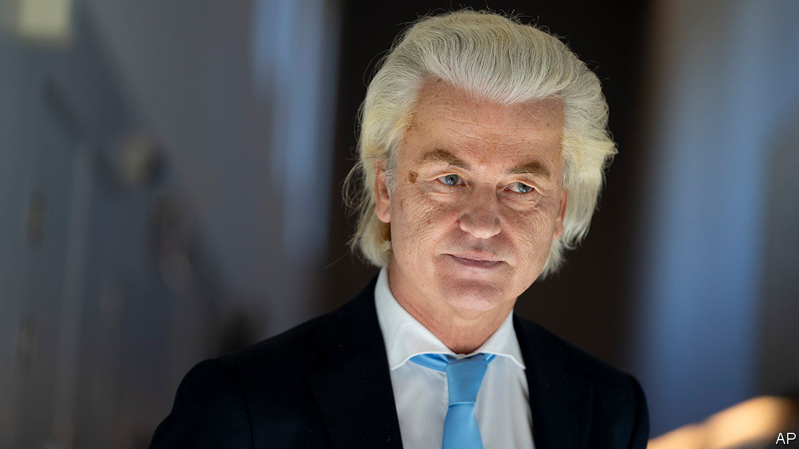

###### Constitutional horse-trading

# Geert Wilders makes a show of respecting the law 

##### Muslims, and other politicians, worry that it will last only until the Dutch populist enters government 

 

> Jan 25th 2024 

FOR MOST European parties, forgoing an effort to ban the Koran would not count as a big concession. But Geert Wilders, whose Party for Freedom (PVV) came first in the Netherlands’ election last November with 24% of the vote, wants it to be seen that way. Mr Wilders, a veteran among Europe’s rising hard-right populists, has a history of bashing Islam, the EU and the courts. He is negotiating to form a coalition with three other parties, who worry about his commitment to the constitution. Mr Wilders now says he wants to be a prime minister “for all Dutch” regardless of religion. To prove it the PVV on January 8th withdrew three longstanding proposals for unconstitutional laws, including a ban on Muslim religious expression.

It was an empty gesture: the laws had no chance of passing. But there are signs that the coalition talks, held in secrecy, are progressing. Mr Wilders is negotiating with the centre-right Liberals (VVD), who have led the country for the past 13 years, and with two upstart parties on the right: the New Social Contract (NSC) and the smaller Farmer-Citizen Movement. The VVD’s leader, Dilan Yesilgoz, has said her party will not join a PVV-led government but could back one in a confidence-and-supply deal. Pieter Omtzigt, who founded the NSC last summer, is a self-proclaimed stickler for the rule of law. 

The first phase of the negotiations is supposed to establish guarantees that Mr Wilders will respect the constitution. The Netherlands is unlikely to go the way of Hungary or Poland, where hard-right populists took over the courts and crippled democracy. The Dutch judiciary and civil service are strong and independent. With at least four parties needed for a majority, the PVV would surely struggle to make any earth-shaking changes. 

But the country has vulnerabilities. Its courts cannot strike down laws for conflicting with the constitution (curiously, the constitution bars them from doing so). The Council of Europe has called this out, and Mr Omtzigt wants to change it. A big scandal under the previous government over false accusations of child-benefits fraud showed that Dutch bureaucracies can ride roughshod over citizens’ rights, which in populist hands could be scary. Dutch should be wary of “leaning back and arguing that the Netherlands will be different,” says Ronald Tinnevelt, a law professor at the Radboud University in Nijmegen.

One common desire among the four parties is limiting immigration. But this week the VVD split over how to handle refugees. Against Ms Yesilgoz’s wishes, the party’s senators helped to pass a law that forces all municipalities to share the unpopular burden of housing asylum-seekers. The Netherlands’ only reception centre for them is overflowing; getting conservative towns to accept any has proved so hard that it brought down the previous government. The issue pits the VVD’s anti-immigrant wing, which is eager to govern with the PVV, against its centrists, who are not. All of the PVV’s potential allies face such tensions between populism and pragmatism.

Meanwhile, the country has a caretaker government under Mark Rutte, the outgoing prime minister. Ministers who get better job offers are leaving one by one. On January 24th Mr Wilders posted on X, formerly Twitter, denouncing the VVD for the “horrible law” on asylum housing—not a promising sign of collegiality or respect for the rule of law. Dutch Muslims, too, have their doubts. “You can’t say one thing for 20 years and then suddenly claim to want something else,” says Mustafa Hamurcu, chairman of the Dutch branch of Milli Gorus, a Turkish Islamic organisation. “The Muslim community doesn’t believe it.” ■


