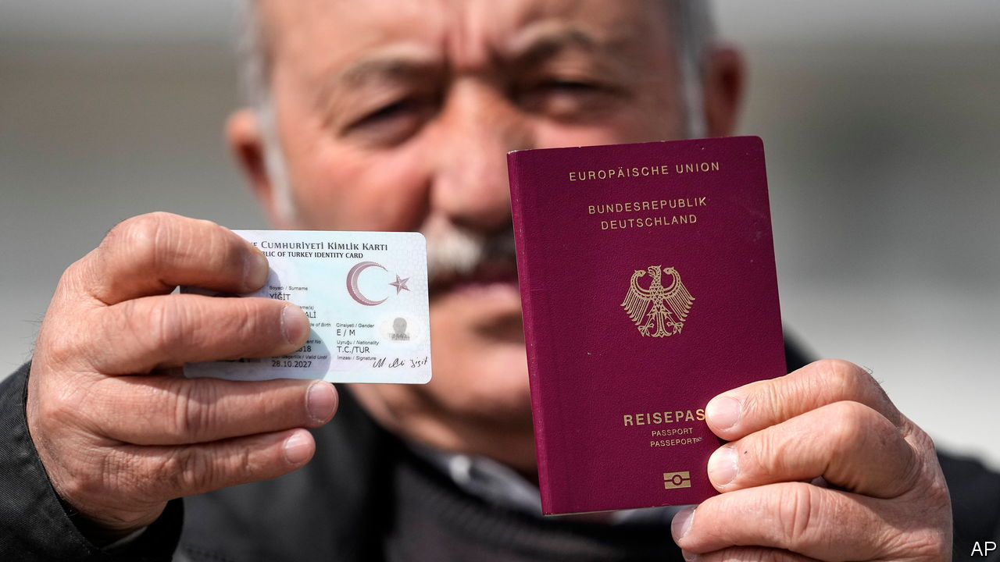

###### Fresh Bürger

# Germany strikes a brave new deal on immigration 

##### A new citizenship law is followed by huge protests against far-right xenophobia 

 

> Jan 21st 2024 

GERMANY’S DEBATE over migration sometimes seems divorced from reality. The country’s low birth rate and shrinking workforce imply a pressing need to import manpower. Yet much political talk is concerned with how to keep immigrants out. The anti-immigration right is . Even otherwise liberal folk are increasingly prone to say that “certain kinds” of immigrants are alien to the , a fuzzy concept of Germanness. 

Yet the past week has seen a turn. Earlier this month German media exposed the proceedings of a recent private conclave of  at a posh hotel near Berlin, where participants discussed expelling millions of aliens. That scandal woke up the left, which has organised a series of big “anti-fascist” demonstrations across the country, numbering over a million people during a weekend of protests in scores of towns on January 20th-21st.

Meanwhile, the governing centre-left coalition has injected some sense into the immigration debate, passing two immigration bills in the Bundestag. The first, pleasing to conservatives, will make it easier to expel asylum-seekers with dubious cases, whose numbers have soared since the end of the pandemic. The second, more significant law will make it easier for legitimate immigrants to gain German nationality. 

An extraordinary 13.4m of Germany’s 84m residents do not hold citizenship. More than 5m of these have lived in the country longer than ten years. In some cities the proportion is far higher: 45% of the population of Offenbach, a big satellite of Frankfurt, are foreigners, as well as a third of Munich’s and a quarter of Berlin’s. This number has shot up in the past decade, partly because Germany has failed to naturalise those already there. 

Germany’s “naturalisation rate”—the percentage of resident foreigners granted nationality every year—was just 1.2% in 2021, well behind the European average of 2.2%. Sweden did far better at 10%. The number Germany naturalised rose from 130,000 in 2021 to 168,000 in 2022, the highest in two decades. But the backlog still grew, because of a range of obstacles: restrictions on dual nationality, long residency requirements, tough tests to prove language skills and gainful employment, and a clogged bureaucracy. 

On average, Turkish immigrants who acquire German citizenship have already been in the country for 24 years. Yet nearly half of Germany’s 3m people of Turkish background—easily the largest immigrant group—remain non-citizens. Among the hundreds of thousands of Turkish  (guest workers) who arrived in the 1960s and 1970s, many assumed they would return to Turkey, so did not apply to become German. 

The new law should help tackle the backlog. It shortens the residency requirement for most applicants from eight to five years. In special cases the wait can now be as short as three. Children who are born in Germany with at least one parent who has lived in Germany for five years will automatically become citizens. Dual citizenship is now generally allowed. New citizens will have to promise to uphold democratic freedoms and accept Germany’s “special historical responsibility” for Nazism and the need to protect Jewish life.

Some 5m resident non-Germans are EU citizens who already enjoy nearly all the rights of natives, so may not see the need to add another nationality. Of the remaining 8m foreigners, including around 1m Ukrainian refugees, it is unclear how many will rush for a German passport. 

Some estimates suggest that 2m or more Germans could be added to electoral rolls in the next few years. The far-right Alternative for Germany party attacked the new law as a “coup d’état through a forced restructuring of voter demography”.■


