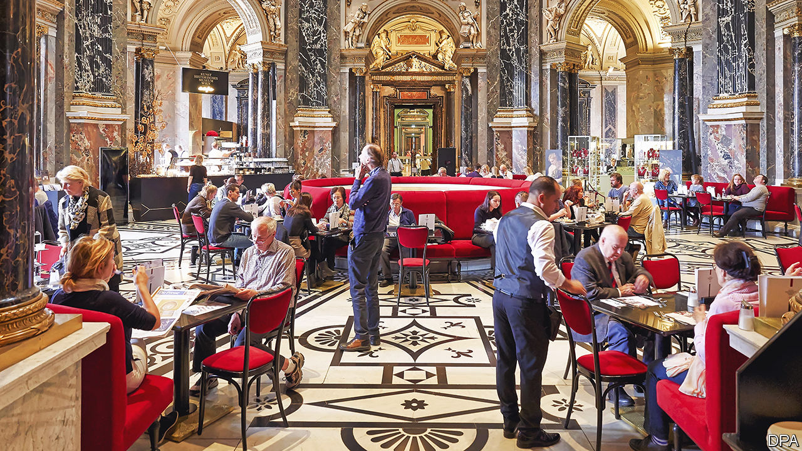

###### Happy Austrians, glum Germans

# Many Austrians feel their way of life is under threat 

##### The Viennese are still waltzing, but they fret that the music may soon be stopping 

 

> Jan 25th 2024 

Una Isola felice, a happy island, is how Pope Paul VI called Austria in 1971 during a visit of the country’s then president to the Vatican. In later years the pope’s dictum became  , the island of the blessed, to describe the picturesque Alpine republic that is garlanded with a generous welfare state, the Habsburg empire’s rich cultural heritage, and other scrumptious foods, and some of the finest classical music in the world. 

The inexorable rise of Austria’s far-right Freedom Party which, the polls say, is now the country’s strongest party by a long chalk, suggests that a sizeable chunk of Austrians fear that their way of life, prosperity and safety are under threat. Yet Austrians remain the most smugly satisfied with life in the European Union (eu), whereas their big German neighbours are the second-saddest, according to a newly published survey by Eurostat, the EU’s statistics agency. Austrians rated their satisfaction with life in 2022 on average at 7.9 on a scale of one to ten, compared with just 6.5 for their big German neighbours and 5.6 for Bulgarians, the gloomiest of the lot. Poles, Romanians and Finns, with a score of 7.7, are joint second-jolliest after Austria.

Austrians and Germans face the same big challenges, including the cost-of-living crisis, an ageing population, illegal immigration and increasing social polarisation. Yet Austria is doing better on several counts that lift the national mood. Its national railways are efficient and affordable compared with the overcrowded, chronically unpunctual disaster that is Deutsche Bahn. Big chunks of Austria’s public administration, including its health service, have been digitised, while Germany is far behind. Austria’s economy is forecast to grow this year, whereas Germany’s is forecast to remain in recession. And in November Austria beat Germany at football.

Vienna is a symbol of the country’s post-war rebirth as a prosperous, welcoming place, whereas Berlin is edgier and dirtier than the rest of Germany. In an annual index by the Economist Intelligence Unit, a sister company of , Vienna retained its crown in 2023 as the world’s most liveable city. Ranking 173 of them in a range of categories, including health care, culture, environment, education and infrastructure, the index gave Vienna nearly full marks, with 98.4 out of 100. No German city made the top ten. Berlin shared 17th place with Frankfurt. ■


