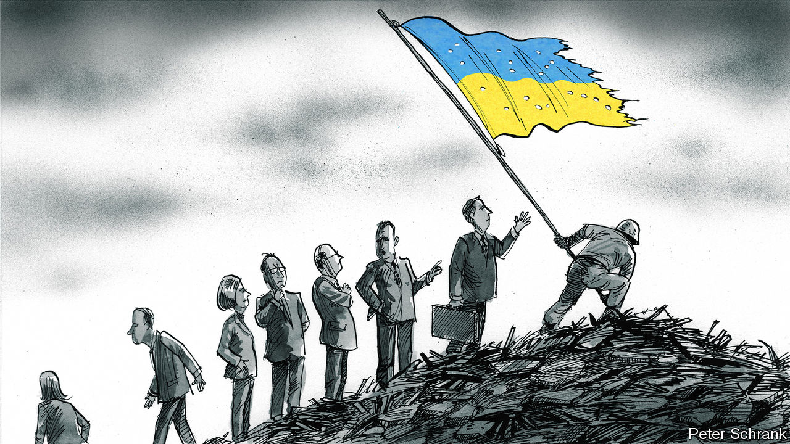

###### Charlemagne

# The EU’s €50bn package to Ukraine is a far cry from its rhetoric 

##### Its promised help is no match for the challenge 

 

> Jan 25th 2024 


As Yugoslavia threatened to descend into bloodshed in 1991, its neighbours flew in to offer help. “This is the hour of Europe,” declared Jacques Poos, the Luxembourgish foreign minister dispatched to Belgrade by the European institutions in Brussels to stop all-out war from erupting. It was not. Savage fighting ensued, ultimately brought to an end mostly by America, proving Mr Poos wrong. Three decades on, the hour of Europe has come again. On February 1st, at a summit of the EU’s 27 national leaders in Brussels, politicians will emerge bleary-eyed from into-the-night talks to announce—if all goes well—a package of €50bn ($55bn) in support of Ukraine. Amid the self-congratulation and soaring press-conference guff about standing shoulder-to-shoulder with an embattled neighbour, it will be considered impolite to note the package is to be spread out over four years and amounts to around 0.08% of the GDP of the union in that period. 

As in the time of the hapless Mr Poos, a gap exists between how Europe describes the situation and the means it is putting up to tackle it. Listen to politicians and things sound dire enough. French officials describe Europe as needing to shift to a “war economy”, fully mobilised to thwart the Kremlin’s imperial ambitions. Central Europeans say Russian victory in Ukraine would lead to further wars of conquest, and justifiably worry they might be next. Such anxious tones will be familiar to veterans of other crises that have befallen the continent, whether it be covid-19, an imploding euro or the prospect of climate change. To face up to those challenges, finding money was no object. Taboos were broken to fight the pandemic, including a €750bn jointly borrowed recovery fund. Keeping up the green transition will cost over €1trn a year. And a decade ago the European Central Bank promised to do “whatever it takes” to save the single currency. When it comes to Ukraine, Europeans are content to commit a sum of money that represents a mere rounding error in their national accounts. 


Is the prospect of a revanchist Russia not worse than a pandemic, even? It is not that the EU has done nothing for Ukraine: refugees have been welcomed, sanctions imposed, and Ukraine offered the prospect of joining the club. Contrast that with America, which started off by providing lots of military kit but has for now ended shipments as its own $61bn assistance package is caught in partisan gridlock. Nor is the €50bn to be agreed next week the only help EU members are proffering. Some countries, notably Germany, are still sending lots of military and financial aid bilaterally. Non-EU Europeans, whether from Britain or Norway, have pledged large amounts of weapons and cash too.

But the multi-year package has all but replaced fresh offers of short-term aid: this is what Ukraine will have to make do with for the moment, according to diplomats from EU countries. Europe’s purse-strings have been kept tight by three factors. One is that some politicians, notably in western Europe, may have silently been fine with Ukraine getting a trickle of money—enough for it not to lose but not to win too comprehensively either, lest that humiliate Russia. That may have been the case in the war’s early stages, but feels out of date now. Still, keeping the authorities in Kyiv on a short leash has its advantages, for example if Ukraine one day needs to be pushed towards the negotiating table.

The second is that assistance to Ukraine often comes not in the form of cash, but of military equipment. There is not much left in national armouries to send east, so shells and cannons need to be made instead. Some countries, notably France, want to ensure the weapons are manufactured in Europe (ie France, often). The aim is not for local firms to profit, though that doesn’t hurt, but for arms-making capacity to be built up as part of plans for Europe to bolster its “strategic autonomy”. Alas combining the aim of helping Ukraine with that of industrial policy has not worked well. Last spring the EU promised that it would send 1m shells to Ukraine within a year; yet by late December only 300,000 had been delivered, and few think the target realistic. Meanwhile, North Korea alone (GDP: 1/500th of the EU) has managed to send Russia over 1m shells, say South Korean spooks. Russia is closer to becoming a “war economy”, pushing defence spending to over 6% of GDP.

The third reason for Europe’s stinginess is that Ukraine has been caught in the EU’s internal wrangling. The mooted €50bn has been sourced through the bloc’s institutions in Brussels, whose annual budget is itself tiny, at just 1% or so of the 27 members’ GDP. Because the aid to Ukraine is tied to a review of overall EU spending, it has taken seven months to unblock the amount. Changes to the union budget need to be agreed unanimously, which gave undue leverage to Viktor Orban, Hungary’s prime minister and chum to the Kremlin. An expert blackmailer, he blocked the €50bn deal at a summit in December, forcing his fellow leaders back to Brussels. He may do so again, though he now has a new source of blackmail: after Turkey’s parliament signed off on Sweden’s accession to NATO on January 23rd, Hungary is the only hold-out.

Show me the money

Amid the haggling and the summiteering, some simple facts seem to have been overlooked. Europe is a rich place. It would be far worse off if Ukraine lost the war. Proper funding would help Ukraine, which faces a budget shortfall just this year of over $40bn. A far more generous offer would be in Europe’s interest. Kaja Kallas, the Estonian prime minister, has suggested Ukraine’s allies should pony up 0.25% of their GDP per year. That is about one-third of what countries are meant to spend on development aid, and one-eighth of NATO defence-spending targets. Such an allowance, roughly triple what is on offer now, would allow the government in Kyiv to plan for victory, and for Russian defeat. Either Europeans are spewing nonsense about how tied their fates are to Ukraine’s, or they are being short-sighted. Either way, they are not putting their money where their mouths are. ■


