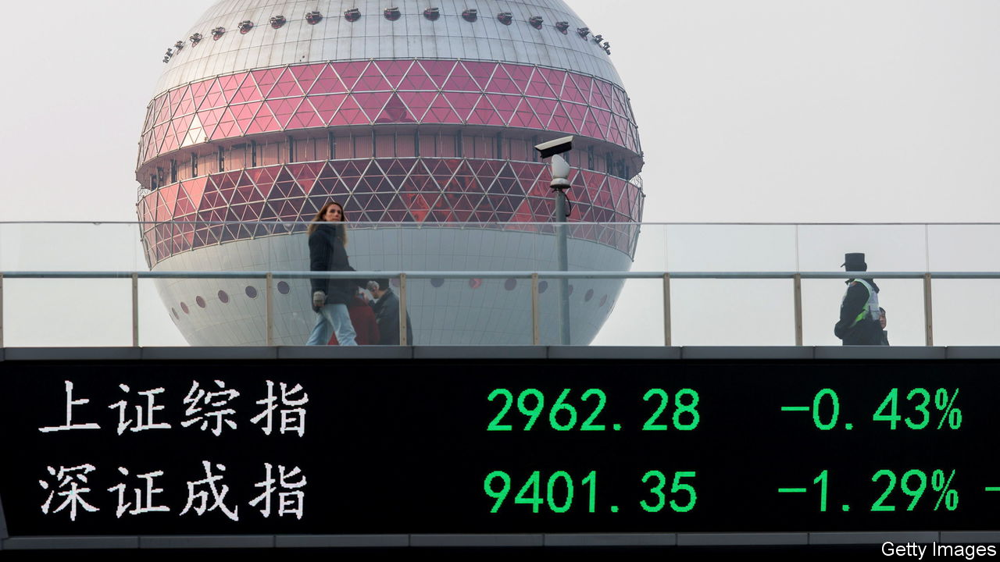
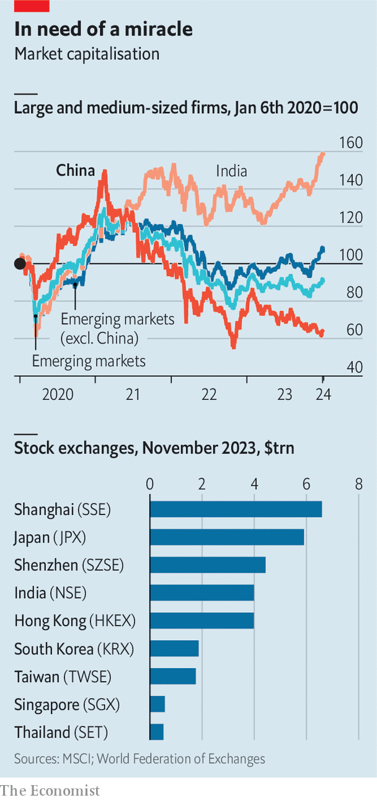

###### Escaping the dragon

# As China’s markets suffer, what alternatives do investors have? 

##### Optimism about the world’s second-largest stockmarket is a distant memory 

 

> Jan 22nd 2024 

Some  investors in China are most worried by the country’s  with the West. Others fret about the unprecedented slump in its . Many are simply tired of losing money. Rumours that officials are considering steps to stabilise the country’s markets may have brought respite in recent days, but over the past year the CSI 300 index of Chinese shares has fallen by 22% and Hong Kong’s Hang Seng index by 30%.

As such, optimism about China Inc is an increasingly distant memory. Just five years ago, though, investors clamoured for exposure to the country’s growth miracle and sought diversification from rich-world markets, which often move in sync. Providers of the world’s big stock indices were making adjustments accordingly. Between 2018 and 2020 Chinese stocks listed onshore, known as A-shares, were added to the benchmark emerging-markets index. 

 


At their peak in 2020 Chinese firms made up more than 40% of the MSCI emerging-market index by value. In 2022 foreigners owned $1.2trn-worth of stocks, or 5-10% of the total, in mainland China and Hong Kong. One financier describes the challenge of investing in emerging markets while avoiding China as like investing in developed markets while avoiding America. But that is not stopping investors from assessing their options.

Some financial firms are eager to help. Jupiter Asset Management, Putnam Investments and Vontobel all launched actively managed “ex-China” funds in 2023. An emerging-market, ex-China, exchange-traded fund (etf) issued by BlackRock is now the fifth-largest emerging-market equity etf, with $8.7bn in assets under management, up from $5.7bn in July. 

A handful of emerging stockmarkets are benefiting. Money has poured into India, South Korea and Taiwan, whose shares together make up over 60% of ex-China emerging-market stocks. These markets received $16bn from foreign investors in the final three months of 2023. Squint and the countries together look a little like China: a fast-growing middle-income country with potential for huge consumption growth (India) and two that are home to advanced industry (Taiwan and South Korea). 

Western investors looking for exposure to China’s industrial stocks are also turning to Japan, encouraged by its corporate-governance reforms. Last year foreign investors ploughed ¥3trn ($20bn) into Japanese equity funds, the most in a decade. For those with broad mandates, different asset classes are an option. Asia-focused funds investing in real assets, including infrastructure, have grown in popularity.

Yet these various alternatives have flaws of their own. Unlike China’s offerings, Indian stocks are expensive. They have higher price-to-earnings ratios than those in other big emerging markets. Although Japan’s stocks look relatively cheap, they make an odd choice for investors seeking rapid income growth. Likewise, Taiwanese and South Korean stocks are included among emerging markets because of the relative illiquidity and inaccessibility of their exchanges, but both economies are mature high-income ones.

Size is a problem, too. Many places benefiting as supply chains move away from China are home to puny public markets. Even after fast growth, India’s total market capitalisation is just $4trn—not even a third of Hong Kong, Shanghai and Shenzhen combined. When MSCI released its emerging-market index in 1988, Malaysia accounted for a third of its stocks by value. It now represents less than 2%. Brazil, Chile and Mexico together made up another third; today they make up less than 10%. 

And whereas returns on Chinese investments tend to follow their own logic, smaller economies are more exposed to the vagaries of the dollar and American interest rates. According to research by UBS Asset Management, Chinese stocks had a correlation of 0.56 with those in the rich world between December 2008 and July 2023 (a score of one suggests the stocks rise and fall in tandem; zero suggests no correlation). By contrast, stocks from emerging markets excluding China had a correlation of 0.84 with rich-world equities.

The emergence and growth of funds that pledge to cut out China will make life easier for investors who wish to avoid the world’s second-largest stockmarket. Without a turnaround in the country’s economic fortunes, or a sustained cooling of tensions between Beijing and Washington, interest in such strategies will grow. They will not, however, evoke the sort of enthusiasm investors once felt about China. ■


