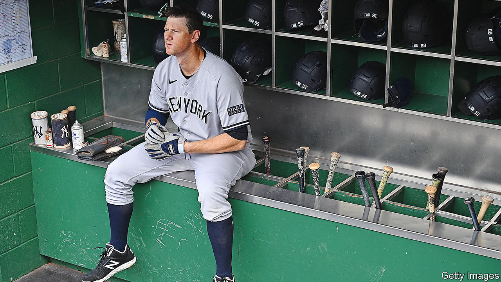

###### Ballpark figures

# How American states squeeze athletes (and remote workers) 

##### The public loves jock taxes; baseball players do not 

 

> Jan 25th 2024 

Sports are big business in America. The country’s four largest professional leagues generate about $45bn in revenues a year, more than half of the total produced by leagues worldwide. That makes for plenty of richly paid stars—and income-generating opportunities for governments. Enter the “jock tax”, an attempt by states and cities to stake a claim to the earnings of visiting athletes.

Jock taxes gained attention in 1991 when Michael Jordan’s Chicago Bulls defeated the Los Angeles Lakers in the finals of the National Basketball Association—and California taxed them for their efforts. Illinois followed up with “Michael Jordan’s revenge” tax. Other states soon got in on the act, too. The public was pleased: not only were states taxing the rich, they were hitting the despised rivals of much-loved home teams.

But a recent ruling in Pennsylvania may mark the end of the most egregious jock taxes. The city of Pittsburgh had charged non-resident athletes a 3% fee for using its baseball, football and ice-hockey facilities. Resident athletes, by contrast, pay only a 1% income tax to the city. On January 10th a court struck down the levy, finding that it violated the state’s constitution, which calls for uniform taxes. Similar taxes have been revoked in Ohio and Tennessee, among others. Stephen Kidder of Hemenway &amp; Barnes, a law firm, has represented players in such cases and says Pittsburgh was the last true outlier in slapping discriminatory taxes on athletes.

The ruling does not, however, mean the end of jock taxes more generally. State income taxes apply to any income earned in-state, including by non-residents. In practice, authorities rarely keep tabs on people when they move around for a few days of work here and there. Not so for athletes, whose schedules are publicised. California, for instance, is estimated to bring in more than $200m a year from taxes on non-resident athletes. “Athletes definitely get singled out in a way that is unfair,” says Mr Kidder.

Taxation based on location of work rather than residence does not constitute an extra levy, but a more complex filing process. So long as athletes come from a state with an income tax, they would have had to pay these taxes anyway—the question is to which government. Professional baseball players may need to file two dozen separate tax returns.

In an era of remote work, the plight of athletes is becoming more familiar. Workers who straddle locations should file multiple tax returns, even if many do not. “The burden for athletes is a magnified version of what many taxpayers face now,” says Jared Walczak of the Tax Foundation, a think-tank. To simplify things, some states have introduced tax-filing thresholds. For instance, Montana exempts non-residents if they work there for less than 30 days. But it still charges athletes and entertainers for a single day of work within its borders. As Mr Walczak notes: “It doesn’t seem likely that pro athletes will get a break anytime soon.”■


