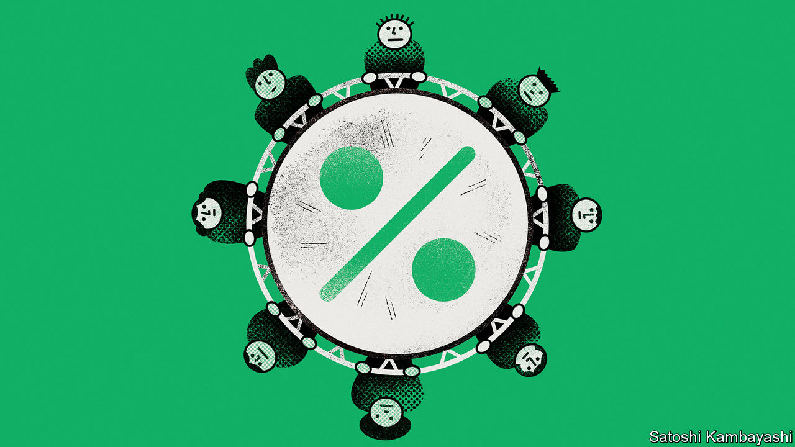
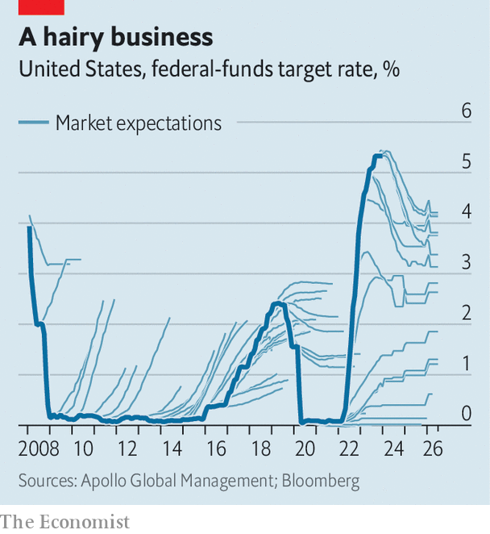

###### Buttonwood

# Investors may be getting the Federal Reserve wrong, again 

##### Why expectations of imminent interest-rate cuts could be misplaced 

 

> Jan 24th 2024 

The interest-rate market has a dirty secret, which practitioners call “the hairy chart”. Its main body is the  rate, plotted as a thick line against time on the x-axis. Branching out from this trunk are hairs: fainter lines showing the future path for interest rates that the market, in aggregate, expects at each moment in time. The chart leaves you with two thoughts. The first is that someone has asked a  to draw a sea monster. The second is that the collective wisdom of some of the world’s most sophisticated investors and traders is absolutely dreadful at predicting where  will go.

Since inflation began to surge in 2021, these predictions have mostly been wrong in the same direction. They have either underestimated the Fed’s willingness to raise rates or overestimated how quickly it will start cutting them. So what to make of the fact that, once again, the interest-rate market is pricing in a rapid loosening of monetary policy?

 


This time is different, and in an important way. A year ago investors betting that rates would soon be cut were fighting the Fed, whose rate-setters envisaged no such thing. Then, in December, the central bank pivoted. Rate cuts were now being discussed, announced Jerome Powell, its chairman, while officials forecast three of them (or 0.75 percentage points’ worth) in 2024. The market has gone further, pricing in five or six before the year is out. It is, though, now moving with the Fed, rather than against it. Mr Powell, in turn, is free to make doveish noises because inflation has fallen a lot. Consumer prices rose by just 3.4% in the year to December, compared with 6.5% in the year before that.

Yet the past few years have shown how eager investors are to believe that cuts are coming, and how frequently they have been wrong. And so it is worth considering whether they are making the same mistake all over again. As it turns out, a world in which rates stay higher for longer is still all too easy to imagine.

Begin with the causes of disinflation to date. There is little doubt that rapidly rising interest rates played a role, but the fading of the supply shocks that pushed up prices in the first place was probably more important. Snarled supply chains were untangled, locked-down workers rejoined the labour force and soaring energy prices fell back to earth. In other words, negative supply shocks gave way to positive ones, cooling inflation even as economic growth rebounded.

Yet these positive shocks are now themselves fading. Supply chains, once untangled, cannot become any more so. America’s participation rate—the proportion of people in its labour force—increased from 60% in April 2020 to 63% last August, but has since stopped rising. Meanwhile, energy prices stopped falling early last year. And escalating violence in the Middle East, where America and Israel risk being drawn ever further into conflict with proxies and allies of oil-producing Iran, could yet cause prices to start rising again. All of this leaves monetary policy with more work to do if inflation is to keep falling.

At the same time as America’s participation rate has stopped rising, wages have continued to climb. According to the Atlanta Fed, in the fourth quarter of 2023 median hourly earnings were 5.2% higher than a year before. After adjusting for inflation, this is well above the long-run annual growth rate for workers’ productivity, which has been a little over 1% since the global financial crisis of 2007-09. A gap between wage and productivity growth will, all else equal, continue to force up prices. For the Fed, this makes rate cuts harder to justify.

The case that rates may stay high is therefore plausible even if you ignore the political backdrop. In an election year, that is a luxury which central bankers do not have. The danger of easing monetary policy too early and allowing inflation to come back, as happened in the 1970s, already looms over the Fed. During a presidential campaign featuring Donald Trump, cutting rates too quickly could have even graver consequences. The cry would inevitably go up that officials had abandoned their mandate in an attempt to juice the economy, please voters and keep Mr Trump out of office.

And Mr Trump may well win, in which case he will probably pursue deficit-funded tax cuts, driving inflationary pressure yet higher and forcing the Fed to raise rates. Such a scenario is still, just about, speculative fiction. It is certainly not what investors expect. But when you look at their predictive record, that is hardly a comfort.■


