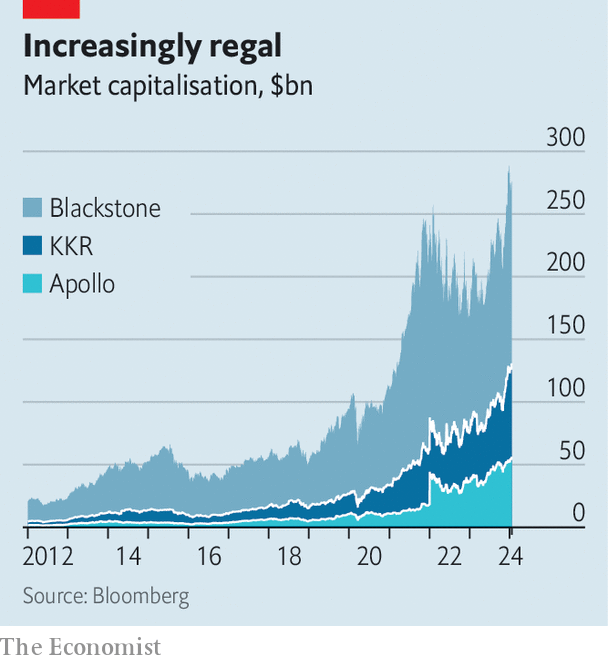
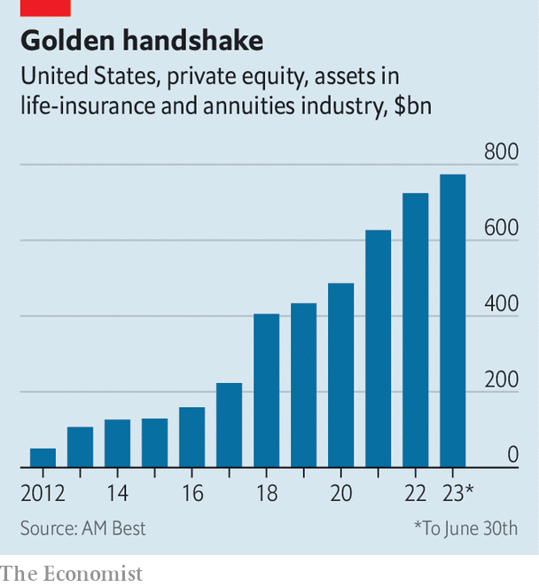

###### Going for broke

# Wall Street titans are betting big on insurers. What could go wrong? 

##### How private-markets giants are overhauling the financial system 

 

> Jan 23rd 2024 

Blackstone listed on the New York Stock Exchange during the summer of 2007. Doing so just before the global financial crisis was hardly auspicious, and come early 2009 the firm’s shares had lost almost 90% of their value. By the time the two other members of America’s private-markets troika rang the bell, Wall Street had been battered. KKR listed on July 15th 2010, the same day Congress passed the Dodd-Frank Act, overhauling bank regulation. Apollo followed eight months later. Each firm told investors a similar story: private equity, the business of buying companies with debt, was their speciality.

Yet as the economy recovered, private-markets firms flourished—emerging as the new kings of Wall Street. The biggest put more and more money into credit, infrastructure and property. By 2022 total assets under management had reached $12trn. Those at Apollo, Blackstone and KKR have risen from $420bn to $2.2trn over the past decade. Thanks to the firms’ diversification, their shares rose by 67% on average during 2023, even as higher interest rates caused buy-outs to grind to a halt. Private equity has plenty of critics, but the model of raising and investing funds—whether to buy companies or lend to them—seldom worries regulators. If things go wrong, losses are shouldered by a fund’s institutional investors and humiliated fund managers struggle to raise money again. There is little threat to financial stability.

 


The latest development in the industry is upending this dynamic. Private-markets giants are buying and partnering with insurers on an unprecedented scale, which is transforming their business models, as they expand their lending operations and sometimes their balance-sheets. America’s $1.1trn market for fixed annuities, a type of retirement-savings product offered by life insurers, has been the focus so far. But Morgan Stanley, a bank, reckons that asset managers could eventually pursue insurance assets worth $30trn worldwide. Regulators worry that this is making the insurance industry riskier, exposing policymakers and perhaps even the wider financial system. Is the expansion by private-markets giants a land-grab by fast-and-loose investors in an important corner of finance? Or is it the intended consequence of a more tightly policed banking system?

Apollo, which has a well-deserved reputation for financial acrobatics, is leading the way. In 2009 it invested in Athene, a newly formed reinsurance business based in Bermuda. By 2022, when Apollo merged with Athene, the operation had grown to sell more fixed annuities than any other insurer in America. Today Apollo manages more than $300bn on behalf of its insurance business. During the first three quarters of 2023, the firm’s “spread-related earnings”, the money it earned investing policyholders’ premiums, came to $2.4bn, or nearly two-thirds of total earnings.

Imitation can be a profitable form of flattery. KKR’s tie-up with Global Atlantic, an insurer it finished buying this month, resembles Apollo’s bet. Blackstone, meanwhile, prefers to take minority stakes. It now manages $178bn of insurance assets, collecting handsome fees. Brookfield and Carlyle have backed large Bermuda-based reinsurance outfits. TPG is discussing partnerships. Smaller investment firms are also involved. All told, life insurers owned by investment firms have amassed assets of nearly $800bn. And the traffic has not been entirely one-way. In November Manulife, a Canadian insurer, announced a deal to buy CQS, a private-credit investor. 

 


Some see such tie-ups as a win-win. In the rich world, a retirement crisis is looming. Defined-benefit pensions, where firms guarantee incomes for retirees, have been in decline for decades. Annuities allow individuals to plan for the future. It is a business that life insurers are happy to hand off to a throng of private-markets buyers. Sales and reinsurance deals free life insurers’ balance-sheets for share buy-backs or other, less capital-intensive insurance activities that are better regarded by their investors. At the same time, private-markets firms acquire boatloads of assets and stable fees for managing them.

But there could be risks to both policyholders and financial stability. The American insurance industry is mainly regulated by individual states, which lack the speed and smarts of the private-markets giants. Important standards, such as the capital that insurers must hold, are set by the National Association of Insurance Commissioners (NAIC), a body of state regulators. In 2022 the NAIC adopted a plan to investigate 13 regulatory considerations about private-equity-owned life insurers, including their investments in private debt and taste for offshore reinsurance deals. 

Others have joined the chorus of concern. In December the imf urged lawmakers to remove opportunities for regulatory arbitrage by adopting consistent rules on capital standards, and to monitor systemic risks in the industry. Researchers at the Federal Reserve have argued that life insurers’ tie-ups with asset managers have made the industry more vulnerable to a shock. The researchers even compared insurers’ lending activities to banking before the financial crisis. Bankers, who frequently complain that they are over-regulated by comparison, might be inclined to agree.

Unlike bank deposits, annuities cannot be withdrawn quickly or cheaply by policyholders. Surrender fees payable for early withdrawals make a “run” on a life insurer unlikely, but not impossible. Private-markets bosses reckon that this makes insurers ideal buyers of less liquid assets with higher yields. As such, they are shifting insurers’ portfolios away from freely traded government and corporate bonds, which make up most of America’s debt market, and towards “structured” credit, so-called because it is backed by pools of loans. 

Excluding government-backed property debt, America’s structured-credit market totals $3trn in paper promises, backed in roughly equal proportions by real-estate borrowing and other assets, including corporate loans bundled together to form collateralised-loan obligations (CLos). The logic of this securitisation is simple: the lower the expected correlation of defaults between risky loans, the more investment-grade credit can be created for investors. 

According to the NAIC, at the end of 2022 some 29% of bonds on the balance-sheets of private-equity-owned insurers were structured securities, against the industry average of 11%. These assets would not just be harder to sell in a panic; they are harder to value, too. Fitch, a rating agency, analysed the share of assets valued using “level 3” accounting, which is employed for assets without clear market values. The average share for ten insurers owned by investment firms was 19%, around four times higher than the broader sector.

And the biggest asset managers do not just buy private debt, they create it. Some have greatly expanded their lending activities to fill their affiliated insurers’ balance-sheets. Nearly half of Athene’s invested assets were originated by Apollo, which has scooped up 16 firms, ranging from an industrial lender based in Blackburn, in north-west England, to an aircraft-finance operation formerly owned by General Electric, an American conglomerate. KKR’s tie-up with Global Atlantic has driven a seven-fold rise in the size of its structured-credit operation since 2020. The role of private-markets firms in securitisation could grow if new banking rules, known as the “Basel III endgame”, increase capital requirements that banks face for these activities.

One worry is about how this debt would perform during a prolonged period of financial distress. Ratings downgrades would mean increased capital charges. High-profile defaults could lead to policyholder withdrawals. Although the market expects interest-rate cuts in 2024, many floating-rate borrowers, not least those in commercial property, are still reeling from the effects of higher payments. 

The market for structured credit is simpler than before the financial crisis (structured securities backed by other structured securities are, for instance, a thing of the past). Insurers also typically buy investment-grade tranches created by a securitisation, meaning losses would first be felt by those further down the “waterfall” of cash flows. But not everyone is reassured. Craig Siegenthaler of Bank of America says that investors cannot come to a firm conclusion on these approaches until they have endured a proper stress test. Sceptics also note that regulation struggles to adjust to financial innovation. Under current rules, the amount of capital insurers must hold after buying every tranche of a CLO can be less than if they had bought the underlying risky loans, which encourages investments in complex, illiquid products.

The special one

Some firms’ investments look astonishingly illiquid. Consider Security Benefit, an American life insurer established in Kansas in 1892. In 2017 it was acquired by Eldridge, an investment firm run by Todd Boehly, whose other properties include Chelsea Football Club. In September nearly 60% of the $46bn of financial assets held on Security Benefit’s balance-sheet were valued at “level 3”. According to data from S&amp;P Global, the firm’s $26bn bond portfolio contains just $11m of Treasuries.

Like other insurers, Security Benefit has bought bonds from an affiliated asset manager. Its holdings include several CLOs created by Panagram, an asset manager owned by Eldridge. Security Benefit’s largest such holding is a CLO backed by $916m of risky loans. After securitisation, this pot yielded over $800m of investment-grade debt for the insurer’s balance-sheet. (The firm says its “long-dated liabilities include built-in features such as surrender charges, market-value adjustments and lifetime withdrawal benefits that significantly protect against material adverse cash outflows relative to expectations”, and that it has several billions of dollars of liquidity available via institutional sources.)

Across the insurance industry as a whole, assessing the risks posed by investments is made harder by the proliferation of offshore reinsurance. According to Moody’s, another rating agency, by the end of 2022 almost $800bn in offshore reinsurance deals had been struck. These involve an insurer transferring risk to another based abroad (sometimes to a “captive” insurer that it owns). Bermuda, which offers looser capital requirements, is by far the most popular location for such deals, which disproportionately involve insurers affiliated with private-equity firms. 

Last year saw a number of blockbuster reinsurance deals, where life insurers partnered with private-equity-backed reinsurers. In May Lincoln National announced a $28bn deal with Fortitude Re, a Carlyle-backed Bermuda outfit. The same month MetLife, another big insurer, announced a $19bn deal with KKR’s Global Atlantic. Such is the demand for offshore reinsurance that in September Warburg Pincus, another big private-equity firm, announced that it would launch its own operation on the island backed by Prudential, an insurer.

In a letter to the NAIC, Northwestern Mutual, a large life insurer, warned that offshore reinsurance transactions could decrease transparency and diminish the capital strength of the industry. Regulators seem to agree, and Bermuda has faced international pressure to tighten its rules. In November British officials proposed new rules that could limit offshore reinsurance. The month after, Marc Rowan, boss of Apollo, admitted that some of the industry’s offshoring was a concern. With Bermuda tightening its restrictions, he worried that some firms would simply move to the Cayman Islands in order to preserve the opportunity for regulatory arbitrage.

Yet it is Italy, not Bermuda, which has furnished regulators with their most worrying case study. Beginning in 2015 Cinven, a British private-equity firm, acquired and merged a number of Italian life insurers. Cinven’s Italian super-group, called Eurovita, had assets of €20bn ($23bn) by the end of 2021. Rising interest rates then caused the value of its bond portfolio to fall and customers to surrender their policies in search of higher-yielding investments. A capital shortfall meant that in March 2023 Eurovita was placed into special administration by Italian regulators before some of its policies were transferred to a new firm.

Eurovita’s woes stemmed from poor asset-liability management rather than investments in private debt. It had especially weak protections to stop policyholders withdrawing money, and Cinven’s investment was made through a classic private-equity fund, not the partnerships, reinsurance transactions or balance-sheet deals undertaken by the biggest asset managers. Nevertheless, according to Andrew Crean of Autonomous, a research firm, there has been a palpable chilling of European regulators’ attitudes to private equity in the insurance industry after the debacle.

Should more blow-ups be expected? The speed of the life-insurance industry’s marriage with private capital makes them hard to rule out. Competition for assets may tempt some private-markets firms to move beyond annuities to liabilities less suited to their strategies. Should an insurer collapse, the reverberations could be felt throughout financial markets. Although private markets have reinvigorated the insurance industry, regulators have reason to worry they are also making it less safe. ■


