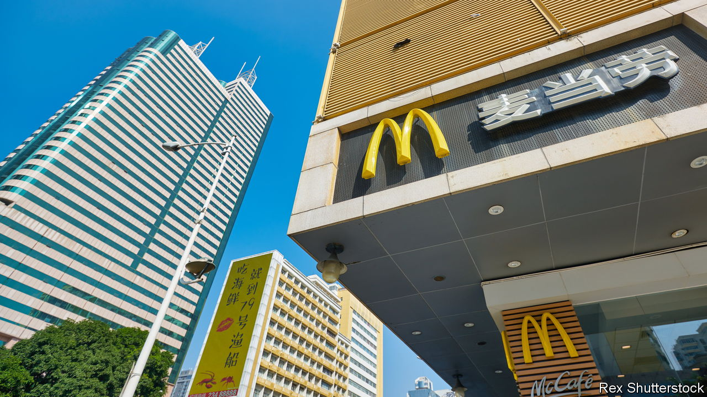
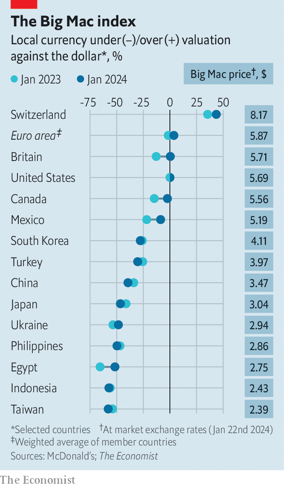

###### Burger prices

# What Donald Trump can learn from the Big Mac index 

##### Should the presidential candidate go on another crusade against the yuan? 

 

> Jan 25th 2024 

Little is more symbolic of globalisation than a McDonald’s hamburger. The American fast-food chain opened its first Chinese branch in 1990. The outlet was in Shenzhen, a small town just across the border from Hong Kong, which was home to the country’s original “Special Economic Zone”—an area where the Chinese government could try market liberalisation before rolling it out to the rest of the country. The Big Mac was a little piece of American capitalism in a communist country.

We started publishing our —a tongue-in-cheek way to value currencies—a few years earlier, in 1986. Our latest update shows that the Chinese yuan is the most undervalued it has been against the dollar since shortly after the global financial crisis of 2007-09. Back then American politicians argued that China’s leaders were deliberately undervaluing their currency in order to get an unfair advantage, and boost exports. Do they have reason to be suspicious this time around?

 


The index demonstrates the concept of purchasing power parity (PPP), which maintains that the real value of a currency is the amount of goods and services that you can buy with it, rather than the number on a trader’s terminal. Over a long enough time frame, however, the two values should converge: the relative cost of buying the same bundle of goods and services in two different countries should roughly equal the nominal exchange rate. Otherwise savvy traders could consistently make a risk-free profit by selling goods across borders. Admittedly, the theory works better for some products than others. Shipping a burger from Shenzen to Seattle might be inadvisable.

Yet PPP conversion factors, which aim to show the gap in relative prices between two countries, and are produced by international bodies such as the World Bank, have to contend with something difficult. People buy different goods in different countries. Chinese branches of McDonald’s sell things such as boba tea and congee, for instance, and these delicacies are unavailable to American consumers. Fortunately, though, the Big Mac is a standardised product. Consumers in China enjoy the same meat patties as those in America. Comparing the price of the burger in different countries with their exchange rates gives a rough idea of whether their currencies are undervalued or overvalued.

A Chinese Big Mac cost 25 yuan in December 2023, whereas the American version came to $5.69. Divide one by the other and the Big Mac index gives a dollar-to-yuan exchange rate of 4.39. That compares with a nominal exchange rate of 7.20 yuan per dollar. It therefore suggests that the yuan is undervalued by 39%. 

Perhaps the Big Mac index will provoke Donald Trump. During his successful presidential campaign, Mr Trump promised to label China a “currency manipulator” on his first day in office. At the time, the country’s currency was 37% undervalued according to our burger index. America did belatedly label China a currency manipulator in 2019, despite Chinese leaders intervening to support the yuan, only to then reverse the decision in 2020.

Mr Trump would be well-advised to hold off this time, however, for the undervaluation of the yuan is not unusual. Although the dollar has weakened against the currencies of some richer economies, such as Britain and Canada, it has strengthened against all but a few poorer ones. Moreover, low inflation in Asia, compared with America and Europe, has led to relatively cheaper Big Macs: Japan, South Korea and Taiwan have also seen their currencies become more undervalued. If the appearance of burgers indicates the arrival of globalisation, their staying power (and good value) is testament to American capitalism’s continued success. ■


