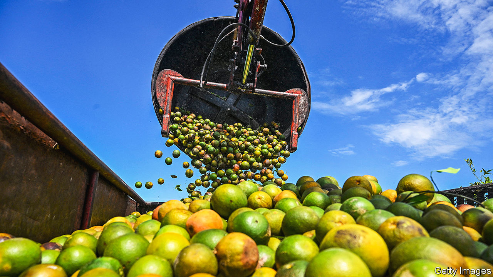
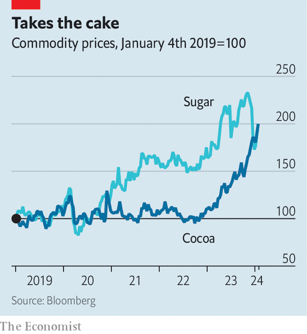

###### Gourmet commodities

# Why sweet treats are increasingly expensive 

##### For the sake of your wallet, it might be time to rethink your diet 

 

> Jan 25th 2024 

When Russia invaded Ukraine in 2022, the arrival of war in one of the world’s breadbaskets sent the price of foodstuffs soaring—with one exception, sugar. But last year was worse for folk with a sweet tooth. As grain prices fell, sugar prices jumped (see chart).

Although they have fallen more recently, they remain high. So do prices of a varied class of non-essential agricultural materials we dub “gourmet commodities”. The price of cocoa, up by 82% in 12 months, is at a 46-year high. The wholesale price of olive oil, at €9,000 ($9,800) a tonne, has reached an all-time record (the previous peak was $6,200 in 2006). In New York “OJ” contracts, for future deliveries of frozen concentrated orange juice, are being traded at $3.07 a pound, some 50% higher than in January last year. The coffee market is sleepier, but prices for Arabica beans—the finer kind—are still up by 44% since 2021. 

 


The reason for surging prices is not that consumers have a sudden taste for Coca-Cola and KitKats, but a litany of problems in regions where gourmet commodities are produced. El Niño, a climate pattern, has caused droughts in Australia, India and Thailand, three of the four biggest exporters of sugar. Torrential rain in Brazil, the largest, has complicated shipping.

A heatwave in Spain, which produces half of the world’s olive crop, has kept last year’s harvest on a par with the one in 2022, which was the worst in a decade. Hurricanes have wiped out about 10% of orange trees in Florida, where nine in ten American oranges are grown. Heavy rain through the summer months allowed the dreaded black-pod disease and swollen-shoot virus to spread in Ghana and Ivory Coast, the world’s two largest cocoa producers. 

Elevated prices for gourmet commodities are already feeding through into those of finished goods. The cost of sugar and sweets rose by almost 9% in America in 2023, and several confectionery giants have warned that such goods are likely to become still more expensive over the coming year. In theory, this should depress demand. Yet there is little sign of higher prices denting consumer appetite so far. 

Cake fans have little choice but to hope that prices will fall when El Niño fades, as is expected in June, and that farmers will start to plant more in response to existing prices. Any respite will probably prove short-lived, however. The EU’s “Deforestation-free Regulation”—tough new rules for exports into the bloc, which cover cocoa, coffee and palm oil—will come into force at the end of 2024. Increased compliance costs and uncertainty regarding enforcement may prompt European importers to stockpile before the deadline. Since Europe typically accounts for a third of global cocoa and coffee imports, such a rush for supply would give global markets a jolt. 

More worrying still are longer-lasting phenomena. In Ghana and Ivory Coast the prices at which farmers sell to wholesalers, which are fixed by the state, remain too low; something Paul Joule of Rabobank, a Dutch lender, says discourages new planting despite sky-high global prices. He does not expect policies to change soon. And as climate change makes extreme weather more frequent, the risk that several crucial production regions suffer at the same time—and that the world’s biggest producers curb exports in response—only rises. 

Thus consumers will have to pay up. Farmers will keep missing out. And the middlemen who feed on price swings will grab an ever greater slice of the pie. ■


