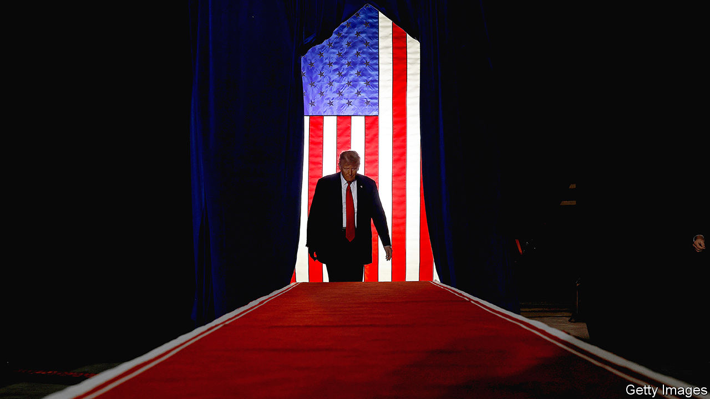
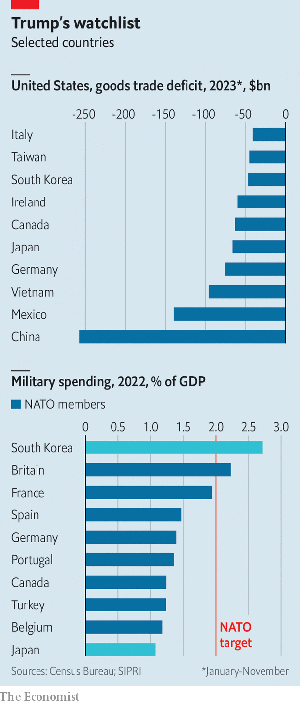

###### Isolationist America

# The world is bracing for Donald Trump’s possible return 

##### He could split countries into users, bruisers and losers 

 

> Jan 22nd 2024 

After donald trump cruised to victory in Iowa and New Hampshire, his odds of returning to the White House look shorter. That prospect directed much of the chatter at this year’s gathering of the World Economic Forum. One American lawmaker engaged in background diplomacy to calm allies fretted that foreign governments “are freaked out by what they see on social media about American democracy”. 

The presidential election is ten months away and the world is starting to prepare for the consequences of a . As best one can tell, they include tariffs, the possible abandonment of Ukraine and Taiwan, a transactional approach to other allies, bartering with enemies and a further decay of global rules. 


All American administration changes create discontinuities in foreign policy. Yet a shift from a Biden administration to a Trump one would be especially large because of the gulf between their policy positions and the chaotic global circumstances in which a switch would take place. The number of state-based conflicts, at over 50, is near its highest level since 1946, according to the Peace Research Institute Oslo.

The Biden administration has tried to reinvent America’s role for the 2020s and beyond. It envisioned a superpower that is still globally engaged and close to its allies. At the same time, it is more selfish on trade, more cautious on economic security and more selective about deploying military force. Its achievements include a re-galvanising of alliances in Asia and the coalition to support Ukraine. Even so, global disorder has grown.

As the clock ticks down to a tight election, the effectiveness of the Biden doctrine may decline. It will become hard to make commitments extending beyond 2024, including on a two-state solution in Israel-Palestine. So governments around the world are developing alternative plans for a Trump-run America. A second Trump presidency would differ from the first both because the world is messier and because Mr Trump is less likely to tolerate official obstruction of his agenda. An across-the-board 10% tariff is said to be likely, as is a suspension of “permanent normal trade relations” with China, meaning higher levies for the country than exist today.

For some politicians and countries, with whom Mr Trump is ideologically aligned, his presidency would be good news. In Israel Binyamin Netanyahu, if he can cling on to power until 2025, could expect fulsome support and the dismissal of Palestinian aspirations for their own state. Soulmates such as Viktor Orban in Hungary can expect a warm reception in the Oval Office. Mr Trump also has a soft spot for Saudi Arabia. Narendra Modi, India’s prime minister, has strong relations with Mr Trump and so India expects continuity in policy and less criticism on civil liberties. Even some liberal democratic Western allies seem relaxed. “There’s nothing to be troubled about there,” insists Scott Morrison, Australia’s conservative former prime minister, who says that Mr Trump helped the world “wake up” to the threat from China. “When Australia stood up to China, they were immensely supportive. And that mattered a hell of a lot.”

With friends like these

Beyond this Mr Trump’s chaotic style and unstable personality make predictions difficult. Nonetheless it is possible, and probably essential, to try to sketch out what the approach of this most transactional of presidents might be to those he may deem “users” (supposedly ungrateful allies), “bruisers” (nasty adversaries) and “losers” (countries he doesn’t care about). 

 


Most allies will be seen as users by Mr Trump. They can expect unsentimental treatment: an assessment of the extent to which they “freeload” off America, for example by running a trade imbalance with it or spending paltry amounts on their armed forces. The scrutiny could get uncomfortable (see chart). We calculate that of 38 American allies in the North Atlantic Treaty Organisation (NATO) or Asia, America had trade deficits with 26 in 2023, and 26 spent less than 2% of GDP on defence in the last year for which figures exist, thus scoring badly on two key Trumpian yardsticks.

Some countries are already trying to boost their appeal on these measures. A German government official describes the provisional pitch it will make to any Trump administration: Germany’s defence spending is set to soar following the creation of a $109bn special military fund; it is now spending $14bn on American F-35 jets; and the country has switched from piped Russian gas to importing liquefied natural gas, much of it from American suppliers. 

Users that are unable to make a case on these grounds may find themselves under pressure. They are more likely to be subject to threats on tariffs or have security commitments withdrawn. Mexico might be one such. Since the Trump administration replaced the North American Free Trade Agreement with its own deal, in force since 2020, the trade deficit has actually gone up.

 In response some users are considering unorthodox diplomacy to win favour instead. One Western leader explains that, based on the experience of Mr Trump’s first term, the easiest way to sway him is by showering him with attention from a country’s royal family and sports stars. France wowed Mr Trump with a military parade on Bastille Day; Britain offered up a state visit hosted by the late Queen.

A pair of allies are especially vulnerable to the way Mr Trump thinks about suspected freeloaders. Taiwan, for its size, runs a large trade surplus with America, amounting to $45bn between January and November 2023. Although it has raised defence spending to 2.5% of GDP it still relies on a vast American military presence in Asia to deter a possible invasion by China. It has just elected a president who defies China, William Lai Ching-te, but Mr Trump may question whether Americans should bankroll its defence or die for that cause. Last year he complained that Taiwan “took our business away”. 

The other vulnerable ally is Ukraine. Objectively American support to Ukraine is a superb deal: with cumulative American aid for the war standing at below 10% of the annual US defence budget and no American casualties, America ties down Russia’s army and impairs its economy. Most of the money spent on weapons for Ukraine remains in America. Still, Mr Trump may see the war as a drain on valuable American resources and so try to push Ukraine into striking a peace deal with Russia. 

Abandoning Taiwan and Ukraine would have profound consequences for America’s alliances. A failure to defend Taiwan would set a precedent for other Asian allies such as Japan and South Korea and, because it forms part of an “island chain” around China, frustrate regional defence plans. Betraying Ukraine would leave both Russia and its leader, Vladimir Putin, in strengthened positions. A top official in the European Union recently claimed that in 2020 Mr Trump told Ursula von der Leyen, the head of the EU Commission, that America would not come to Europe’s aid if the continent came under attack, adding: “By the way, NATO is dead, and we will leave, we will quit NATO.”

What about those Mr Trump may perceive as bruisers? America’s enemies and adversaries probably expect threats in order to win concessions and also periodic openness to striking transformative “deals”. Think of Mr Trump in 2019 stepping across the border into North Korea—which he had earlier threatened to incinerate. Among the bruisers, Russia can look forward to the friendliest treatment given Mr Trump’s admiration for Mr Putin. China will have lower expectations as previous negotiations with Mr Trump disappointed and because mutual hostility is now baked into both countries’ polities. 

During the first Trump administration Iran faced “maximum pressure” sanctions and America’s killing of Qassem Suleimani, a key commander. Yet Mr Trump failed to respond when Iran attacked Saudi Arabian oil installations. The most likely outcome now, given the mayhem Iran is causing in the Middle East, is aggressive sanctions on the regime, which may be tempted to keep up its proxy wars across the region. 

Best frenemies

Mr Trump’s approach to bruisers is disruptive, which creates opportunities: it is conceivable, for example, that he might try to draw Iran and its proxies into a regional peace deal—after all his administration managed to broker the Abraham Accords between Israel and several Arab states in 2020, defying accepted wisdom. Yet that same disruptive quality increases the chance of miscalculations in negotiations. There is a risk that Mr Trump is outmanoeuvred. “My biggest fear is that Putin and Xi are way smarter than Trump,” says a European official. 

The third group of countries is the biggest: places that are neither close American allies nor adversaries. Mr Trump could write them off as losers. The Biden administration has encountered more aggressive behaviours from America’s foes in Europe and the Middle East but remained selective in its use of American power. Its withdrawal from Afghanistan illustrated as much. And conflicts in places America has little interest in have flared up wildly. Consider the civil war in Sudan; a new “coup belt” across sub-Saharan Africa; and a new Armenia-Azerbaijan war. The same anarchic quality has created opportunities, too: think of the rewiring of the global energy system and the boom in the illicit oil trade. 

A Trump presidency is likely to see a further erosion of global rules on everything from trade to human rights, worsening matters. For the poorest countries with weak domestic institutions, that may mean a higher prospect of conflict. Global organisations could hardly bridge the gap. 

If Mr Trump were to win the 2024 race he would be inaugurated almost exactly a year from now. The period until then is much too short for the Biden administration easily to make binding commitments, meaning its credibility and agency over global events may fade during this year. The situation is vastly worsened by Republican intransigence, as demonstrated in the senseless obstruction of aid to Ukraine. At the very least Mr Trump could create a vacuum as America withdraws from its responsibilities. Around the world it is dawning on countries that 12 months do not provide enough time to fill it. ■

