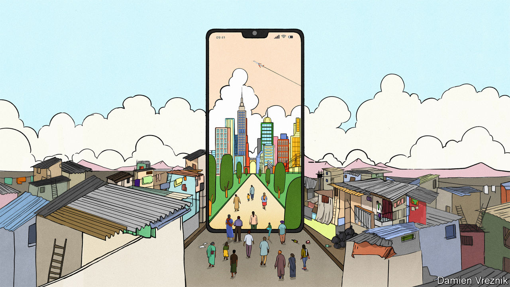

###### AI for all

# AI holds tantalising promise for the emerging world 

##### It could help boost human capital, and ultimately growth 

 

> Jan 25th 2024 

New technology brings with it both the sweet hope of greater prosperity and the cruel fear of missing out. Satya Nadella, the boss of Microsoft, says he is haunted by the fact that the Industrial Revolution left behind India, his country of birth. (Indian manufacturers hardly enjoyed a level playing-field—Britain was then both their rival and their ruler.) Many technologies, such as online-education courses, have generated more hype than economic growth in the emerging world. Some people worry that generative  (ai), too, will disappoint the global south. The big winners so far seem to be a bunch of Western early adopters, as well as startups in San Francisco and America’s “magnificent seven” tech firms, which include Microsoft and have together added an astonishing $4.6trn to their market value since Chatgpt’s launch in November 2022.

Yet ai stands to transform lives in the emerging world, too. As it spreads, the technology could raise productivity and shrink gaps in human capital faster than many before it. People in developing countries need not be passive recipients of AI, but can shape it to suit their own needs. Most exciting of all, it could help income levels catch up with those in the rich world.

The promise of AI in developing countries is tantalising. As in the West, it will be a useful all-purpose tool for consumers and workers, making it easier to obtain and interpret information. Some jobs will go, but new ones will be created. Because emerging countries have fewer white-collar workers, the disruption and the gain to existing firms may be smaller than in the West. The imf says that a fifth to a quarter of workers there are most exposed to replacement, compared with a third in rich countries. 

But a potentially transformative benefit may come from better and more accessible public services. Developing economies have long been held back by a lack of educated, healthy workers. Primary-school teachers in India have twice as many pupils as their American counterparts, but are ill-equipped for the struggle. Doctors in Africa are scarce; properly trained ones are scarcer. Whole generations of children grow up badly schooled, in poor health and unable to fulfil their potential in an increasingly global labour market.

As  this week sets out, policymakers and entrepreneurs around the world are exploring ways that ai can help. India is combining large language models with speech-recognition software to enable illiterate farmers to ask a bot how to apply for government loans. Pupils in Kenya will soon be asking a chatbot questions about their homework, and the chatbot will be tweaking and improving its lessons in response. Researchers in Brazil are testing a medical ai that helps undertrained primary-care workers treat patients. Medical data collected worldwide and fed into AIs could help improve diagnosis. If AI can make people in poorer countries healthier and better educated, it should in time also help them catch up with the rich world. 

Pleasingly, these benefits could spread faster than earlier waves of technology. New technologies invented in the early 20th century took more than 50 years to reach most countries. By contrast, AI will spread through the gadget that many people across the emerging world already have, and many more soon will: the phone in their pockets. In time, chatbots will become much cheaper to provide and acquire. 

Moreover, the technology can be tailored to local needs. So far there is little sign that AI is ruled by the winner-takes-all effects that benefited America’s social-media and internet-search firms. That means a variety of approaches could prosper. Some developers in India are already taking Western models and fine-tuning them with local data to provide a whizzy , avoiding the heavy capital costs of model-building.

Another idea that is also taking off in the West is to build smaller, cheaper models of your own. A narrower set of capabilities, rather than the ability to get every bit of information under the sun, can suit specific needs just fine. A medical ai is unlikely to need to generate amusing limericks in the style of William Shakespeare, as ChatGPT does so successfully. This still requires computing power and bespoke data sets. But it could help adapt ai in more varied and useful ways. 

Some countries are already harnessing ai. China’s prowess is second only to America’s, thanks to its tech know-how and the deep pockets of its internet giants. India’s outsourcing industry could be disrupted, as some back-office tasks are taken on by generative ai. But it is home to a vibrant startup scene, as well as millions of tech developers and a government that is keen to use ai to improve its digital infrastructure. These leave it well-placed to innovate and adapt. Countries in the Gulf, such as the United Arab Emirates and Saudi Arabia, are determined to build an ai industry as they shift from oil. They already have the capital and are importing the talent. 

Each country will shape the technology in its own way. Chinese chatbots have been trained to keep off the subject of Xi Jinping; India’s developers are focused on lowering language barriers; the Gulf is building an Arabic large language model. Though the global south will not dislodge America’s crown, it could benefit widely from all this expertise.

Teaching AId

Plenty could yet go wrong, obviously. The technology is still evolving. Computing power could become too expensive; local data will need to be gathered and stored. Some practitioners may lack the ability to take advantage of the knowledge at their fingertips, or the incentive to try new things. Although countries in sub-Saharan Africa stand to gain the most from improvements to human capital and government services, the technology will spread more slowly there than elsewhere without better connectivity, governance and regulation.

The good news is that investments to speed ai’s diffusion will be richly rewarded. Much about the ai revolution is still uncertain, but there is no doubt that the technology will have many uses and that it will only get better. Emerging countries have suffered disappointments before. This time they have a wonderful opportunity—and the power to seize it. ■


