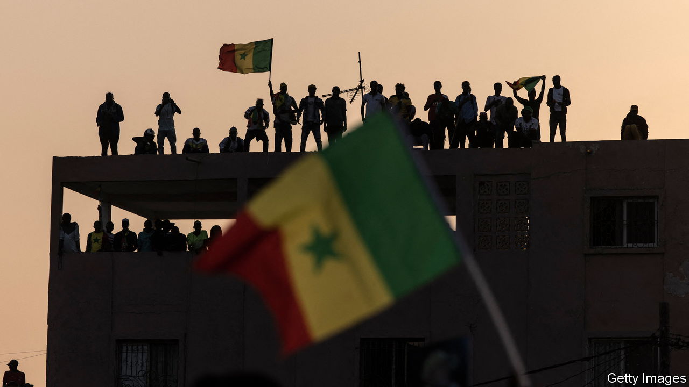

###### Electoral lawfare

# African governments are using courts to sway elections 

##### The abuse of judiciaries is harming democracy. Here’s how to stop it 

 

> Jan 25th 2024 

ELECTION MONITORS across the world will soon be packing their sunhats, “observer” vests and, if they are energetic, surfboards in preparation for Senegal’s presidential elections on February 25th. Yet for all their good intentions they will arrive too late to ensure that this election is free and fair. With the help of the courts, the incumbent party’s candidate, Amadou Ba, already has the upper hand. 

On January 20th the Constitutional Council, a judicial body that deals with electoral issues, disqualified several of the leading candidates who had applied to stand against Mr Ba. Among those excluded is the main leader of the opposition, Ousmane Sonko, who was barred from running because he had accused a government minister of corruption. In Senegal defamation is a crime; Mr Sonko was convicted of it last year, and this was enough to make him ineligible to stand. 

The authorities have also locked up his deputy, the party’s back-up presidential candidate, for criticising officials. In all perhaps 1,000 opposition members and activists have been arrested over roughly the past three years, according to civil-society groups and opposition parties cited by Human Rights Watch, an international monitor.

These shenanigans cast a pall over Senegal, which had been seen as one of west Africa’s healthiest democracies. And the country is far from unique. Across much of Africa, from Benin to Zambia, courts have increasingly been used to  by hobbling opposition candidates and parties. 

The increase in electoral lawfare in Africa is, paradoxically, a sign of progress. During the cold war, when rival superpowers backed autocratic rulers, hardly any Africans were able to vote. Since 1990, however, almost all African countries have held regular elections. Initially many of these were shamelessly rigged. But parallel vote counts and better monitoring of elections by civil-society groups and foreign observers have made it harder to stuff ballot boxes or fix the count. Instead ruling parties are adapting. Many are trying to rig races in advance by using the courts to block serious opposition candidates. 

Foreign diplomats and rights groups are generally reluctant to question a court’s findings unless they have had observers present throughout the trial, which typically they have not. In any case, incumbent candidates and parties are often seen as offering stability, so why rock the boat?

But kicking the opposition off the ballot does not make its support disappear. Instead it can lead to protests and instability, and may contribute to declining support for democracy. On average, across several sub-Saharan countries, the share of people that said they prefer democracy to any other form of government fell from 75% in 2012 to 66% last year. It also weakens the rule of law; trust in the courts has fallen by 12 percentage points over roughly the same period. That cannot be good for investment or economic growth.

To counter electoral lawfare, outsiders need to start by being more sceptical of legal rulings with big political consequences. Within African countries pro-democracy activists will also need to adapt. Having had some success in cleaning up the election day itself, they now need to shift their focus to ensuring that there is no funny business in the months and years leading up to the poll. 

This will not be easy or quick work—it involves the long, grinding process of judicial reform. In too many countries judges are appointed by the president or ruling party based on loyalty, rather than by a cross-party or apolitical body based on merit. And in too few countries do judges have the security of tenure that would allow them to rule impartially. Western countries and donors can help with training and funding. Judicial reform may not be as exciting as hunting for stuffed ballot boxes, but improving the rule of law is good for democracy—not to mention prosperity and peace. ■

