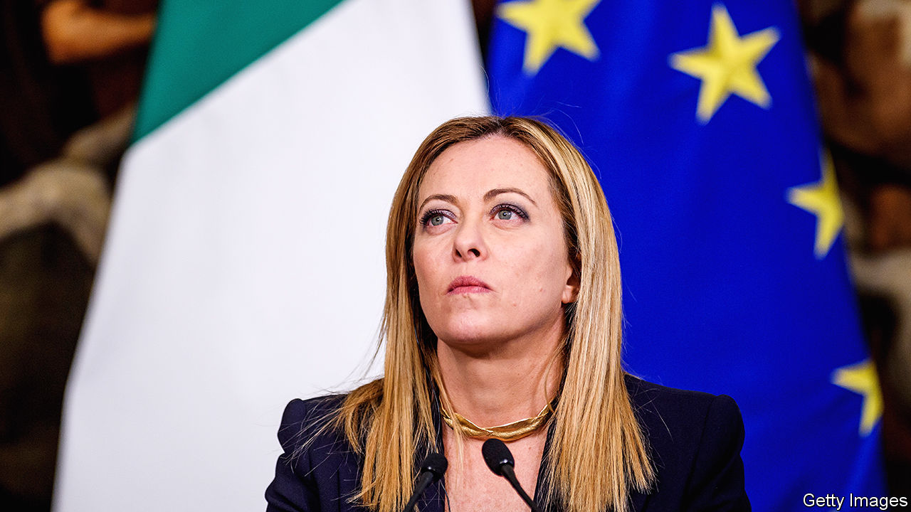

###### Mainstream Meloni

# Giorgia Meloni’s not-so-scary right-wing government 

##### Liberal fears have so far proved overblown 

 

> Jan 24th 2024 

People like labels, and it has always been easy to attach them to Giorgia Meloni, prime minister of Italy since October 2022. She has routinely been dubbed a neo-fascist by her political enemies in Italy and by alarmed liberals across Europe. It doesn’t help that her party, the Brothers of Italy, descends in part from a post-war neo-fascist group, or that its party symbol includes a tricolour flame with questionable antecedents. In the run-up to the election she won, the spread between Italian and German government debt widened, owing to fears that she would pick fights with Brussels and maybe even destabilise the euro itself. She might, critics feared, team up with Hungary’s strongman, Viktor Orban, the nationalist right in Poland and Marine Le Pen in France to cause all sorts of trouble. But 15 months in, Ms Meloni seems to be conventional rather than a wrecker.

Consider, first, all the things that have not happened. Social policy has remained unaltered, despite the Brothers’ hostility to abortion and gay civil unions. It is true that there has been no progress towards gay marriage or same-sex adoption; but neither has there been any backsliding, despite this being Italy’s most right-wing government since the second world war. Italy’s first female prime minister does not profess to be a feminist, but she is a tough single mother who unceremoniously dumped her partner for propositioning his female colleagues.

Nor has Ms Meloni been a thorn in the flesh of her fellow European leaders or the legions of bureaucrats in Brussels whose job it is to worry about the stability of the euro and indeed the European Union itself. has shrunk back to around 1.5 percentage points, and the markets show no sign of jitters, despite Italy’s feeble growth. She has not teamed up with Mr Orban or other populists to block EU decision-making, nor attracted the censure of the EU’s rule-of-law watchdogs. On Ukraine she has been admirable, sending money and arms despite Italy’s traditional ties to Russia. Fears that Italy would take a nasty turn towards xenophobia have proved unfounded, despite a sharp rise in the number of asylum-seekers arriving by boat.

Could Ms Meloni be a sign that the populist right is not always so bad once in office? True, Mr Orban has never changed his autocratic spots, and neither did Poland’s Law and Justice party, which voters  It would also be rash to assume that a President Le Pen or, in the Netherlands, a Prime Minister Geert Wilders (a more imminent prospect) would cleave to the mainstream as Ms Meloni has. And yet the Sweden Democrats, an anti-immigrant party, have not done anything terrible since lending support to the ruling bloc in Stockholm. All in all, Ms Meloni makes an encouraging data point: the  in Europe can turn out in office to behave like run-of-the-mill conservatives.

That does not mean everything is sunny in the land of . Ms Meloni has some bad ideas about constitutional changes that would bolster the power of the prime minister—though those are still for the future. There are also worrying signs that she is at heart no , unlike her predecessor, Mario Draghi. Italy’s growth problems are systemic. The new government has shown little interest in promoting competition, played with the idea of a big windfall tax on the banks before dropping it and is seeking to diminish the role of foreign investors on Italian boards. The deficit is ballooning, and the OECD this week warned that spending cuts and tax rises will be needed, a call that will fall on deaf ears. That is disappointing, but resistance to reform in Italy is long-standing. In this, too, Ms Meloni belongs to her country’s mainstream. ■

