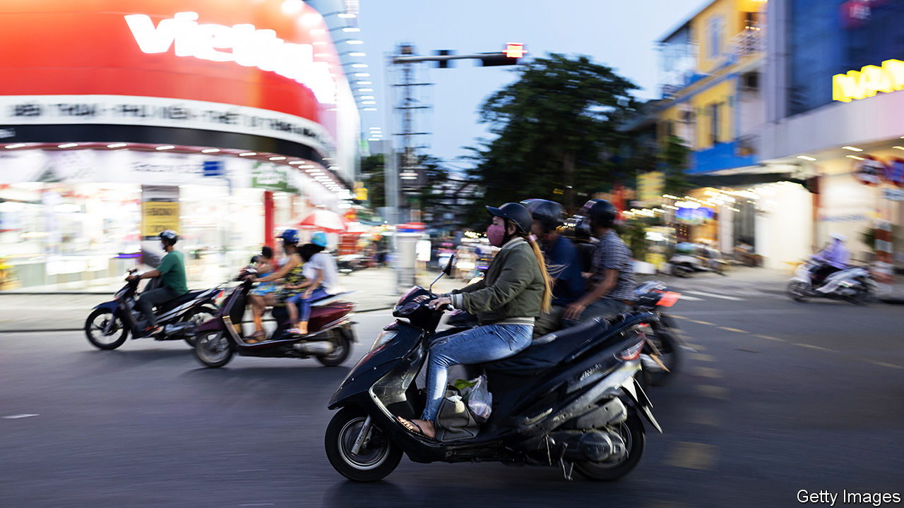

###### Unchaining a tiger

# Vietnam needs a new leader 

##### Doubts about the health of Nguyen Phu Trong have become a political liability 

 

> Jan 25th 2024 

Most Asian countries look on growing competition between America and China with trepidation. Vietnam sees opportunity. The country of 100m is friendly with both superpowers. And, because of its strategic location on China’s southern border and its 3,000km coastline, both are . Last year it was the only country to receive both Xi Jinping and Joe Biden on state visits. It marked this by upgrading its ties with America, which has supplied Vietnam with coastguard vessels, to the same status it affords China and Russia.

This is an adroit balancing act, from which the country stands to gain both politically and economically. America’s effort to decouple its economy from China’s is leading foreign investors in China to move some of their  And Vietnam is benefiting more from this form of de-risking (known as “China +1”) than any other Asian country.

Its hunger for foreign investment and its low labour costs make it seem like China 20 years ago—only with less bullying and less pilfering of intellectual property. Yet its strong ties with China make the shift look less like a challenge to the Asian giant than a regional win-win, partly because manufacturers based in Vietnam rely heavily on Chinese components. In the first three quarters of 2023, Vietnam attracted twice as much foreign direct investment, as a share of GDP, as Indonesia, the Philippines or Thailand.

They should learn from Vietnam’s example, which builds on 40 years of opening. When its Leninist ruling party ditched collectivism in the mid-1980s the Vietnamese people were starving. Their annual income per person has since grown six-fold, to $3,700, as trade and investment have soared. Even before Sino-American relations soured, Vietnam was attracting investors put off by China’s rising labour costs. More recent arrivals, including big brands such as Apple and Samsung, are helping it climb the value chain. Its biggest exports to America are no longer textiles but high-tech products such as iPhones. The country’s ruling party, now communist only in name and opacity, plausibly aspires to make Vietnam a rich country by 2045.

That leaves little room for missteps, however. And there are big risks to Vietnam’s tigerish emergence. Its geopolitical sweet spot may not last—especially if Donald Trump returns to power and takes exception to the size of America’s bilateral trade deficit with it. Its coastline and southern delta region are vulnerable to climate change. The beneficial demography underlying its growth is weakening; in a little over a decade its working-age population is predicted to start declining. And, for all its rulers’ pragmatism, their resistance to political reform is a growing handicap.

That was highlighted earlier this month when the party’s 79-year-old general secretary and paramount leader, Nguyen Phu Trong, disappeared from public view. Social media lit up with rumours that he was dead and with speculation about his successor. Mr Trong has reappeared yet uncertainty over his health and succession will continue. Investors were already complaining of a slowdown in project approvals owing to the effects of an anti-corruption drive, which last year led to the sacking of the country’s president, who was number three in the hierarchy. As senior apparatchiks fret over a post-Trong future, decision-making could grind to a halt.

Mr Trong, whose position is not up for review until 2026, should end the uncertainty. The party would ideally introduce internal democracy, as a step towards the real thing. That may be too much to ask. Yet the general secretary should recognise the risk he has become to Vietnam’s prospects. He should step aside and allow the party to select a pragmatic successor. ■ 

