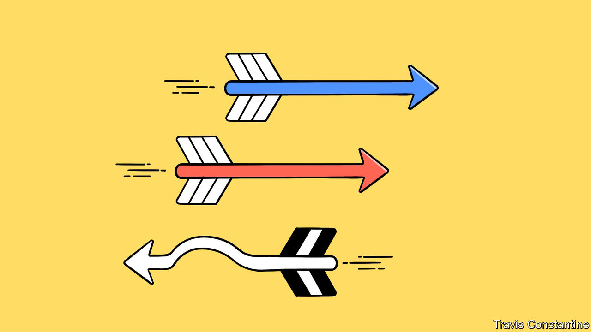
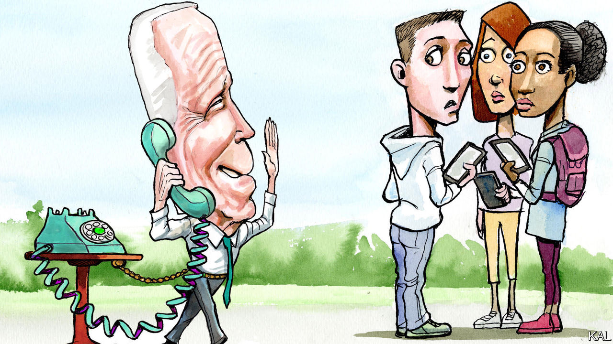
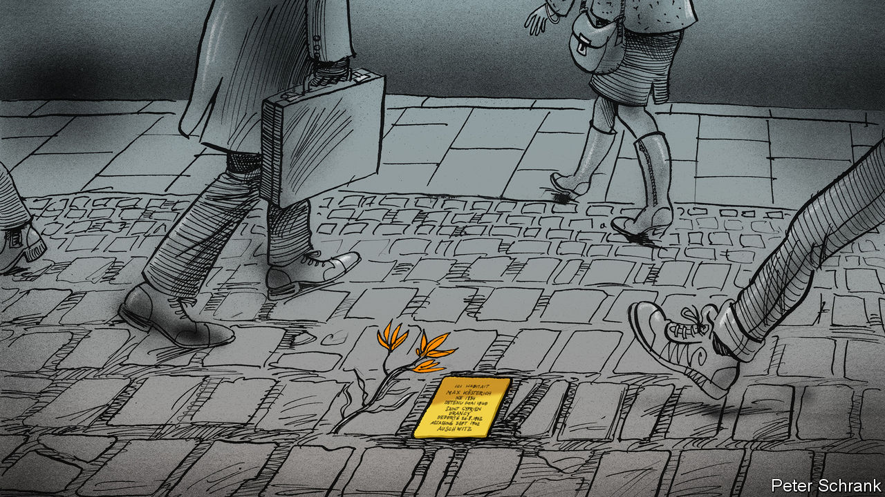

###### On diversity, equity and inclusion, Chinese cars, presidential hats, Holocaust victims, Norse sagas, movies

# Letters to the editor 

##### A selection of correspondence 

 

> Jan 25th 2024 


The problems with DEI

Your leader on diversity, equity and inclusion assumes that conservatives make a mistake by ignoring the “real benefits” of such programmes, and that businesses should want to hire the “most able people” (“”, January 13th). You helpfully suggest that companies consider larger shortlists from overlooked groups that they feel might otherwise develop into better employees.

But surely if companies had overlooked the necessity of hiring the most able people then smarter competition would have closed them down. No one needs a head of diversity to tell them that. 

Tim Hill


As a psychologist and chief human-resources officer I struggled with DEI for decades. My concerns are not about the need, but about the methods. Much of what is being done in the name of DEI oversimplifies the problem of bias and lacks a fundamental understanding of human behaviour. This has led to unrealistic expectations about what it should or can accomplish.

Bias is hardwired into the human brain. Evolution has made us prefer what is similar, known and familiar (in other words safe) and to be cautious about what is different (or perhaps unsafe). Our bias for the familiar extends beyond people. Our brains automatically and unconsciously pull our attention towards perspectives, ideas, data, music, food, literature, and so on, that are similar and familiar, and away from the very same things when they are different and unfamiliar. 

As practised today, DEI promotes a mistaken belief that setting noble expectations, creating awareness, making conscious behavioural decisions and rebuking those who don’t change can flip a switch to produce unbiased brains. DEI thinks bias is a matter of will, which runs counter to the past 50 years of social-science research. If changing our behaviour were that easy, people would exercise regularly, never experience marital conflict, retire with robust pensions and still be reading the only diet book ever published.

There are real issues to be addressed: companies do need more diversity of perspective and underrepresented groups do need more opportunities. But organisations must rethink their methods by drawing more on social science and less on social activism. No amount of social idealism will rewire millions of years of neural evolution. 

Scott Simmons


 


It’s not just about the car

The idea that the West should welcome a huge influx of Chinese electric vehicles is mind boggling (“”, January 13th). The opening of trade with China in the late 1980s was justified by the expectation that an emerging Chinese middle class would demand democracy and throw off the shackles of the Communist Party. Instead, Chinese affluence driven by Western investment and consumption has facilitated the Chinese government’s efforts to centralise power, acquire the West’s technologies, build more military capabilities, ruthlessly repress any opposition and build alliances with dictatorships. Far from becoming more democratic and open, China’s leadership now represents one of the most severe long-term threats to world security, if not the future of Western civilisation.

Your argument seems to be that we should increase our trade with China, which would thereby encourage, if not accelerate, these dangerous trends. You identified only one risk to buying EVs from China—competition to Western carmakers—and even then characterised this risk as “overblown”.

If, or more likely when, China dominates the world militarily and politically a few decades from now, financed by Western consumption, I wonder how astute this view will look. It would be better to ask how does the West stop funding China’s march towards global hegemony without suffering politically unacceptable economic costs?

Michael P. Wells


In the West we talk of saving the planet, and yet when one of the planet’s nations offers us a way out, at a low cost, we become anxious about owning a vehicle made in China. We talk of markets, innovation, and capitalism, and yet when someone shows us up, we cringe and make excuses, or as in the case of Japan’s economic might in the 1980s, adopt policies to make the other fail. It is time for the West to realise that we are not in our ascendancy, but rather in a state of stagnation or decline in several spheres.

Seve Ghose


 


Hats off

Lexington repeated the common assertion that John Kennedy did not wear a hat during his inauguration (). Actually, Kennedy wore a top hat en route to his inauguration ceremony and to the evening balls. In a nod to tradition he reinstated the top hat after his predecessor, Dwight Eisenhower, wore a homburg to both of his inaugurations.

It is true that Kennedy took off his hat to take the oath of office and to make his inaugural address, but that was nothing new. Eisenhower doffed his homburg to do the same in 1953 and 1957, and Harry Truman shed his top hat for the oath of office and inaugural address in 1949. 

Taylor Hartstein


 


Holocaust stories

Charlemagne wrote about the Stolpersteine project, which commemorates the victims of Nazi atrocities by laying brass “stumbling stones” in the pavements in front of their homes (). As well as mainland Europe, one such stone is in London, dedicated to Ada van Dantzig, a Dutch restorer of paintings. She had returned to her family in Rotterdam after the outbreak of the war in 1939, was arrested in France in May 1943 and then murdered at Auschwitz. Her stone was laid in May 2022, and can be found at Golden Square, Soho. Other stumbling stones may well be laid in Britain to recognise victims of the Nazis like Ada van Dantzig.

Gillian Mawdsley


I hope that the Stolpersteine project will one day reflect the global reach of Nazi crimes. Some 350 American soldiers were subject to forced labour at Berga concentration camp, a subcamp of Buchenwald, and around 80 died before it was liberated. Somewhere in Egg Harbor, New Jersey, is the home of Morton Goldstein, a soldier who was captured at the Battle of the Bulge and murdered at Berga in March 1945. Perhaps it would be to the benefit of Americans to see these tiny bronze memorials in their own streets.

Matthew Taylor


Norse adventures

I am perplexed at the notion that anybody who has read the “The Sagas of Icelanders” could find them boring (“”, December 22nd). You get heroes, scoundrels, resourceful women, spiteful women, war, sorcery, murder, torture, loyalty, betrayal, revenge and poetry. The sagas have a trademark terse style, such as when one of the heroes remarks on the rising popularity of short stabbing spears after he is fatally stabbed at the door of his house. Boring?

Petr Dejmek


 


Rotten tomatoes

I found it interesting that before covid Americans on average were “going to the movies three and a half times a year” (‘”, January 6th). Was that because they walked out halfway through a terrible film, or fell asleep during a dull one and slept through into the middle of the next one?

Andrew Kean


