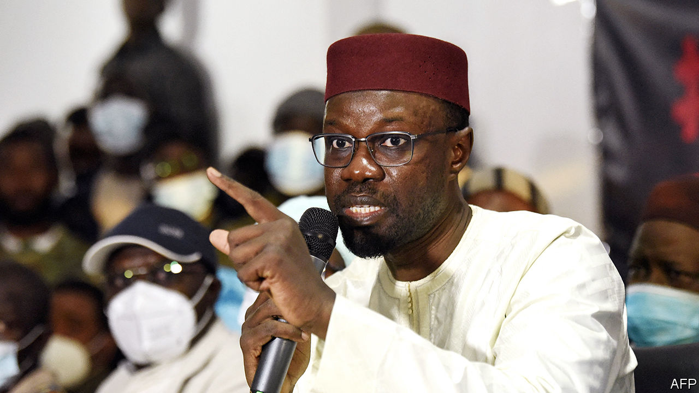

###### Putting the rule in rule of law

# How to nobble a political rival in Africa and get away with it 

##### Use the courts 

 

> Jan 25th 2024 

“THE MOST dangerous precedent in the political history of Senegal,” was how El Malick Ndiaye, a spokesman for Senegal’s main opposition party, described the decision. If that sounds like hyperbole, it should not. On January 20th Senegal’s Constitutional Council ruled that Ousmane Sonko, an opposition leader, could not stand in the presidential election in February because of a conviction for defamation. 

Mr Sonko, who is now in jail and whose party has been dissolved, has also been convicted of “corruption of youth”, which is defined as immoral behaviour with someone under the age of 21. He says these and fresh charges, including fomenting insurrection, are politically motivated. The government disagrees. 

The disqualification of Mr Sonko (pictured) and other serious contenders is a grim sign for Senegalese democracy, which was once seen as a bright light in a troubled region. It is also part of a wider trend in which a number of ruling parties in Africa appear to be using the courts to restrict political competition to cling to power, often by bringing criminal charges against opposition candidates. This is eroding faith in democracy and in the courts.

Politicians in Africa, like those elsewhere, tend to be a mix of saints, sinners and everything in between. Yet one could be forgiven for thinking opposition leaders are particularly dastardly, given how frequently they are accused of breaking the law. The charges brought against them tend to be serious. Terrorism is a popular one. In Benin an opposition leader, Reckya Madougou, has been sentenced to 20 years in prison—by a special court for economic crime and terrorism established by the president—on charges of financing it. In Tanzania Freeman Mbowe, the main opposition leader, spent seven months in prison on terrorism charges, which were dropped in 2022. In Tunisia Rached Ghannouchi, the leader of the opposition, was sentenced in absentia to a year in prison (which was later increased to 15 months) for a similar charge, which he has said was trumped up for political reasons.

Sexual-abuse charges are a powerful alternative, perhaps because journalists, diplomats and NGOs are rightly wary of simply dismissing them as fabricated because of the harm this can cause victims. Christopher Kayumba, a former journalist, launched a new political party in Rwanda in 2021. Shortly afterwards he was accused of rape and later arrested and convicted. In Niger Hama Amadou, a long-serving opposition leader, was convicted of child trafficking in 2017. This blocked him from running in presidential elections in 2020. 

Electoral lawfare can sometimes seem blatant. In Senegal Mr Sonko was convicted of defamation as a result a case brought by the tourism minister, Mame Mbaye Niang, after Mr Sonko had repeated previously reported claims that Mr Niang had embezzled money. Mr Niang says that he sued to clear his name, yet after he won, which ought to have served this purpose, he appealed to the court to impose a tougher sentence on Mr Sonko. Perhaps it was entirely coincidental that the initial two-month sentence (suspended) was not harsh enough to disqualify Mr Sonko from running—or that after the sentence was increased to six months after an appeal, Mr Niang’s lawyer gloated: “If this decision is final, Ousmane Sonko is definitively excluded from the race.” 

Elsewhere, perhaps because convictions risk sparking protests, governments use the courts to harass candidates and hamper their campaigns. Uganda’s leading opposition figure, Robert Kyagulanyi, known as Bobi Wine, was charged with treason in 2018 in a case that has dragged on for years. In Egypt the authorities arrested backers and relatives of Ahmed al-Tantawy, an opposition leader, ahead of the presidential poll last year.

Such intimidation can sometimes extend abroad. Succès Masra, long Chad’s leading opposition politician, was pursued in exile by an international arrest warrant accusing him of insurrection. The pressure told: late last year Mr Masra was allowed to return to Chad but was fully co-opted into the regime as prime minister under President Mahamat Idriss Déby.

If it is hard to build a case involving serious crimes, governments sometimes turn to more mundane legal matters. Questions over residency were enough to rule out the candidacy of Saviour Kasukuwere, a challenger in Zimbabwe’s presidential elections last year. Where dual citizenship disqualifies candidates, governments sometimes claim that opposition candidates have not renounced their second nationality in time. In Senegal the Constitutional Council barred another major presidential candidate, Karim Wade, on this basis even though it did not dispute that he is no longer French. (He and another leading candidate were also prevented from running in the presidential election in 2019 because of other legal troubles.) Though Amadou Ba, the ruling-party candidate, will not be running unopposed, he stands a far better chance of winning now. 

Although they are happy to wield the law against opponents, governments seem equally willing to ignore it when it does not serve their purposes. In Senegal, for instance, a court had previously ruled that Mr Sonko should be kept on the electoral roll, which entitled him to receive the forms needed to submit his candidacy to the Constitutional Council. But the agency for election logistics, under the interior ministry, still refused to give him the forms. “They were clearly in breach [of the law],” says Ousmane Diallo in the Senegal office of Amnesty International, a rights watchdog. When the electoral commission also said that Mr Sonko should be given the forms, the government suddenly replaced all the electoral commissioners.

Wrap them in red tape

Similarly, the treasury refused to provide a receipt for the 30m CFA francs ($49,800) he deposited as part of his candidacy application, though, according to his lawyers, it cashed the cheque. The missing receipt was the initial reason given by the Constitutional Council for barring him. After Mr Sonko appealed this decision, it cited his defamation conviction instead.

Mr Sonko’s deputy has been permitted to run, but he has been in jail since April for criticising officials. Human Rights Watch reckons that 1,000 opposition members and activists have been arrested, too, since March 2021. It says that state prosecutors and the courts misclassify offences so as to systematically deny bail and keep them in prolonged pre-trial detention.

Lawfare does not necessarily stop after the election. Last year in Zimbabwe the opposition Citizens Coalition for Change (CCC) won enough seats in parliament to deny the ruling Zanu-PF the two-thirds majority needed to change the constitution. Yet within months a hitherto unknown figure had emerged, claiming to be the party’s interim general-secretary and declaring that some of its MPs were no longer party members and should be recalled. Nelson Chamisa, the leader of the CcC, said he was a fake, but the speaker of parliament threw out the MPs anyway, triggering by-elections. The courts have since barred the deposed MPs from standing in them. 

Yet electoral lawfare is a dangerous game. Blocking the opposition encourages radicalisation. When the next coup strikes, many of the people rushing out to celebrate may well be supporters of a dubiously convicted opposition leader. ■

