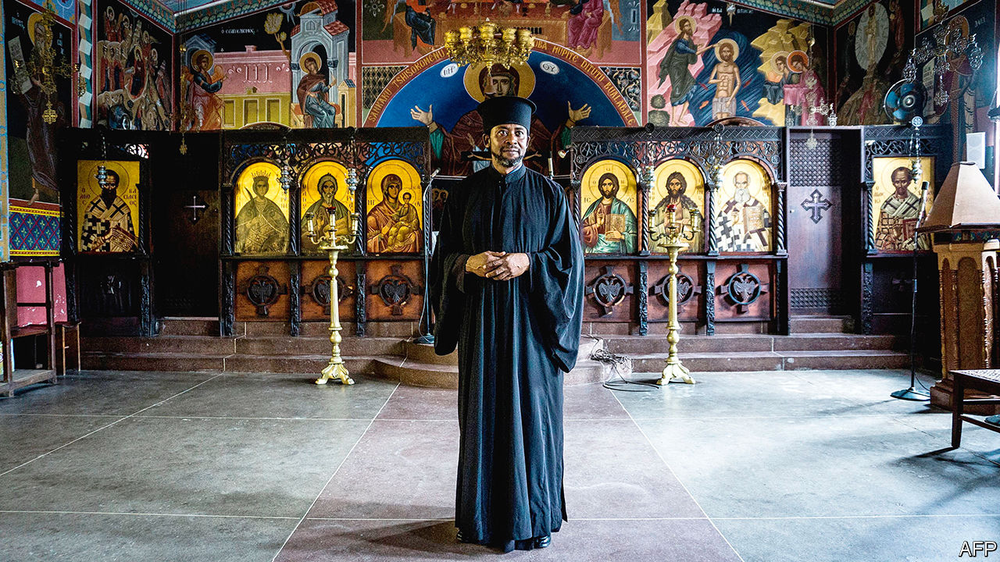

###### Holy split

# Russia’s plan to seduce Christians in Africa 

##### The Ukraine war has split Africa’s Orthodox church 

 

> Jan 25th 2024 

On a hillside in Kisii, western Kenya, the congregation of St Peter’s church convened for a special mass on January 7th. “In the Russian calendar…today is Christmas Day,” says Hezekiah Johnson Otara, the priest. To mark the occasion, Mr Otara picked four girls from the 70-odd worshippers and promised to pay their school fees for the coming year. 

Mr Otara is one of scores of African priests who have switched to Russia’s branch of Orthodox Christianity as the fallout from the Ukraine war has unexpected consequences across the world. He joined the Patriarchal Exarchate of Africa, which claims jurisdiction over more than 200 parishes in 25 African countries and plans to build schools, hospitals and cathedrals, including a huge “spiritual centre” opposite the presidential palace in Uganda.

One possible reason for the Russian church’s African adventure is to do down the Patriarchate of Alexandria, a branch of the Greek Orthodox Church. The Russian Orthodox Church considers all Ukrainian Orthodox churches to be under its authority. But in 2019 the Greek Orthodox patriarchs of Constantinople and then Alexandria recognised the independence of the newly formed Orthodox Church of Ukraine. Patriarch Kirill, the Russian church’s head, broke off relations with Alexandria and Constantinople, damning their support for Ukrainian “schismatics”.

In revenge the Russians are now muscling in on the Greek Orthodox Church, which claims exclusive jurisdiction over Africa and accuses the Russian church of trying to lure its priests away with money. “They want to humiliate us because of our connection with Ukraine,” says Archbishop Makarios of Nairobi.

Most of the Russian church’s priests in Africa, including Mr Otara, are Greek-trained clerics who have switched teams. In Kenya alone at least 90 have defected—nearly half the total number of African priests whose loyalty the Russian church now claims to command. Asked why he joined the Russians, Mr Otara cites the “schism” in Ukraine. He does not deny, however, that the move also brought some rather worldly benefits: they have doubled his salary, paid for his son to study nursing in Moscow and contributed money to the orphanage he also runs.

Russia may have more than ecclesiastical goals in mind. “Punishing the Alexandrian Patriarchate was just an excuse,” says Cyril Hovorun, a Ukrainian theologian. He believes the Russian church waded into Africa to spread propaganda and stoke hostility towards the West. The idea is less risible than it may at first seem. The Russian church’s favourite subject—“traditional values” and how the decadent West wants to pervert them—aligns with conservative religious views in Africa, where clerics tend to oppose homosexuality.

Yet the Russian foray seems half-hearted and poorly financed. Most of its churches are shacks like the one in Mr Otara’s parish. It appears to have built no schools or hospitals. Even evidence of a well-organised propaganda campaign is thin on the ground. The Russians might pay more, but many priests are still too busy making ends meet to rail against the West. “I normally do some side-hustling,” explains one of the church’s priests in western Kenya, who runs a shop in his spare time. “It’s for survival, and for my children.”

Many of the Russian church’s problems can be blamed on erratic leadership. Leonid Gorbachev, a former Bishop of Klin, was initially appointed to run the African outpost. Mr Hovorun, who knew him as a student in Athens during the early 2000s, says he was always more interested in “Russian [military] cannons than the canons of the church”. Mr Gorbachev later became a vocal supporter of Yevgeny Prigozhin, the late leader of the Wagner mercenary group. He was sacked shortly after Prigozhin’s failed mutiny last summer. 

The defenestration has thrown Russia’s African church into disarray. Its priests say they are facing funding cuts. Projects have been put on hold. Mr Hovorun believes the enterprise is winding down. Even if that is wishful thinking, Russia’s holy adventure looks more quixotic than menacing. ■

