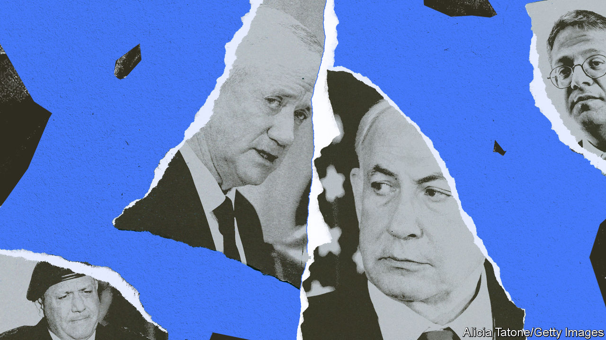

###### A region on fire

# The ever-expanding Middle East war 

##### Ten countries have now been dragged into the fighting 

 

> Jan 24th 2024 

IF YOU drew a diagram of who is shooting at whom in the Middle East, it would look increasingly like a bowl of spaghetti. What began in October as a war between Israel and Hamas has now drawn in militants from four other Arab states. In addition Iran, Israel and Jordan all bombed Syria this month. Iran also unexpectedly bombed Pakistan, which must have wondered how it got dragged into this mess.

Now nearing its fifth month, the war in Gaza seems far from an end—despite a growing sense in Israel that the fighting has got bogged down. The Israeli army has yet to find the top leaders of Hamas, or most of the Israeli hostages that the group is still holding. Israeli security officials worry that bargaining will undermine the military gains they have made.


Since October 7th the Middle East’s three strongest powers have all had to reassess their security doctrines. Israel’s military primacy was shaken. Iran’s proxies have become a liability for their patron. And America has been dragged back to a region it wanted to leave. None is sure how to proceed. As the Gaza war drags on, a messier regional conflict keeps expanding.

On January 20th Iranian-backed militias in Iraq fired a big volley of rockets and ballistic missiles at America’s al-Asad air base in western Iraq. Most were intercepted by Patriot air-defence batteries, but some hit the base and wounded Americans and Iraqis. The barrage followed days of Iranian attacks across the region: at alleged terrorists in Syria and Pakistan, and at a supposed Israeli spy base in Iraqi Kurdistan (killing a Kurdish businessman at home with his family). The strike on Pakistan invited a retaliatory attack on Iran, though both sides now seem keen to avoid further fighting.


These incidents signal deep unease within the Iranian regime. Israel is waging a not-so-secret war against it, assassinating members of its Islamic Revolutionary Guard Corps in Syria and commanders of Hizbullah, an Iranian-backed Shia militia, in Lebanon. At home, meanwhile, a series of terrorist attacks has rattled Iran’s government, among them a double suicide-bombing claimed by the jihadists of Islamic State that killed around 100 people.

For decades Iran has cultivated a network of proxy militias to project power across the region. Yet now it is struggling to deploy them while simultaneously keeping itself out of the conflict. It has tacitly accepted the battering of Hamas, which seems to have carried out its massacre in Israel without alerting its Iranian patrons. Iran has been loth to unleash Hizbullah, its most effective proxy, lest America or Israel hit Iran directly. Attacks on commercial shipping by Yemen’s Houthis have brought an American-led military coalition to the Red Sea. Iran would like to force Israel into a ceasefire in Gaza and drive American troops out of the region. Its proxies have so far achieved the opposite.

Yet America is also trying to find a balance. President Joe Biden has been cautious: he does not want to be drawn into another war in the Middle East, certainly not in an election year. In Iraq and Syria, American forces respond far less often than they are attacked. The American campaign against the Houthis began only after repeated warnings and a UN Security Council resolution condemning the group’s attacks on shipping. Mr Biden admits that strikes have not deterred the Houthis—but also says they will continue.

His best hope is that Israel will soon wind down its war in Gaza, which many of his allies have been demanding for months. Yisrael Katz, Israel’s foreign minister, met his European counterparts on January 22nd to discuss what happens after the war. Diplomats in Brussels said the two sides talked past each other. The Europeans wanted to talk about who would govern and rebuild Gaza, and how they might pursue a two-state solution between Israelis and Palestinians.

Mr Katz, however, touted a pet project to build an artificial island off Gaza’s coast that would serve as a seaport, something he promoted during a stint as transport minister in 2017. His interlocutors were stunned: “This didn’t have much to do with what we were discussing,” said Josep Borrell, the eu’s top diplomat.

Arab states, meanwhile, are quietly promoting their own plan to end the war. Saudi Arabia would agree to normalise relations with Israel in exchange for a commitment to create a Palestinian state. Gulf states are wary of being saddled with responsibility for a ruined Gaza but are willing to support the , which governs parts of the West Bank, if it resumes control in Gaza .

The plan is a long shot—not least because Binyamin Netanyahu, the Israeli prime minister, is a longtime opponent of Palestinian statehood. After Mr Biden spoke with him earlier this month, the president suggested Mr Netanyahu might be amenable to creating a demilitarised Palestine: “I think we’ll be able to work something out,” he said. Mr Netanyahu rushed to rebuff him, insisting that Israel would have to control everything west of the Jordan river, asserting that such a position was “contrary to a Palestinian state”.

Israel has withdrawn many of its troops from northern Gaza, leaving one division to search for tunnels and prevent Hamas from regaining a foothold there. A second division is holding the line between northern and southern Gaza, while a third has encircled Khan Younis, in southern Gaza, the site of heavy fighting in recent days. The Palestinian death toll has passed 25,000, the majority civilians, with probably thousands more yet to be counted. The un says one-fifth of children under five have diarrhoea.

But Mr Netanyahu’s battle for political survival is still dictating Israel’s strategy—and the fate of the hostages in Gaza. The first hostage deal between Israel and Hamas, which freed 110 Israeli and foreign captives at the end of November, was brokered by Qatar; Egypt played a supporting role. There are still 136 hostages, though Israel presumes at least 29 are dead. Now Egypt is leading the push to free them, largely out of economic self-interest.

The chaos in the Red Sea has caused only modest economic damage to Israel. Most of its sea trade goes through Mediterranean ports. Egypt has paid a bigger price: it has seen a 40% reduction in revenue from the Suez canal, a vital source of hard currency. That has added to fears of a possible default in a country struggling with dollar shortages and buried under a pile of government debt (93% of GDP). The Egyptian pound has dropped to around 60 to the dollar on the black market, down from 50 last month and 50% below the official rate.

Egypt does not think that American-led strikes on the Houthis will deter the group from its attacks on ships. For Abdel-Fattah al-Sisi, the country’s president, the only way to get his canal working again is a ceasefire in Gaza. To that end Egypt has taken the lead in indirect talks between Israel and Hamas, though the Qatari channel is still open as well.

The deal Egypt is promoting would come in two stages. First would be a “humanitarian” release of civilian hostages in return for a truce that could last several weeks, perhaps even a month or two. Israel would also free hundreds of Palestinian prisoners. The second stage would free captive Israeli soldiers in exchange for a full ceasefire, an Israeli withdrawal from Gaza and the release of even more Palestinians, probably thousands of them.

These conditions are dividing the Israeli government. Its more pragmatic wing, led by Benny Gantz, a former defence minister who joined the war cabinet in October, supports a lengthy truce to free the hostages. This group wants to pair that with negotiations for a new government in Gaza: leaving Hamas in power would be anathema to most Israelis. But Mr Netanyahu’s right-wing coalition partners adamantly oppose any ceasefire. Bezalel Smotrich, the finance minister, said on January 24th: “We cannot agree to stopping the war at this stage for such a long period.” 

Twisting and turning

Mr Netanyahu, as usual, is prevaricating while he tries to keep both parts of his government on board. In public he promises to “continue until total victory”. In private, he has allowed Israel’s representatives to continue negotiating. But he is unlikely to do anything that would drive away the far right, without whom he would not have returned to office in December 2022.

Hamas is also divided over the deal. Its political leaders, shuttling between Doha and Cairo for talks, are in favour of accepting the first stage of the agreement: they are aware that holding civilian hostages continues to damage their cause. But the leaders in Gaza want an Israeli withdrawal before another release of hostages. Their demand that Israel free Hamas terrorists who took part in the October massacre is another potential deal-breaker, since Israel is highly unlikely to accept that condition.

Mr Netanyahu may have to make a decision soon, though. In an interview broadcast on January 18th Gadi Eisenkot, a war-cabinet member and former army chief, hinted at a push for early elections. “We need, in the time range of months, to go back to the Israeli voter and renew trust,” he said. It is now a matter of time before the emergency war cabinet is dissolved. Protests in Israeli cities are growing. Many are led by the families of hostages calling for a ceasefire—and for Mr Netanyahu’s resignation. His centrist partners are likely to leave the coalition if they do not soon get an answer on a hostage deal and Israel’s post-war strategy. “Until then, it’s deadlock,” says an Israeli security man. “The political leadership won’t make a decision, and if they don’t, a lot of the gains we achieved at great cost will be eroded.” ■

