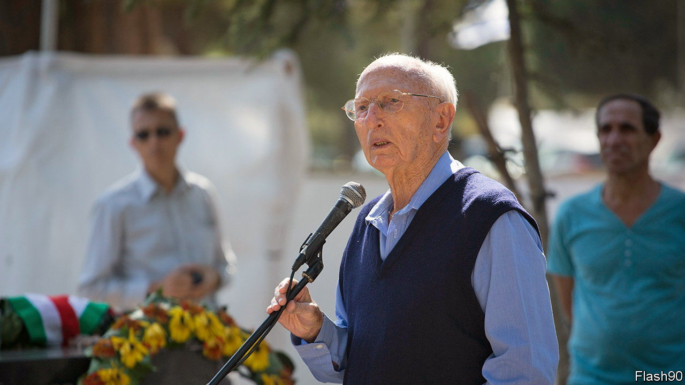

###### The wrath of God

# Zvi Zamir oversaw a programme of Israeli assassinations 

##### The former director of Mossad, who oversaw a programme of covert assassinations, died on January 2nd, aged 98 

 

> Jan 25th 2024 

He would never forget what he saw at Munich. Zvi Zamir had always been a details man. Even when he was head of Mossad, his reports were meticulous. He noted everything, success and failure alike. But particularly failure: that he felt keenly. And the 1972 Olympics, when some of the Israeli team were taken hostage, offered such terrible details, and so much failure. 

Such as the fact that the Germans had started their “rescue” shoot-out at night, with no lights. Useless. He could hardly believe that blunder. There were other memorable details, too. Such as the way the blood of the dead had pooled on the tarmac. And the way the screams of the captured Israelis could be heard, as the terrorists started shooting. And the way they had all, finally, fallen silent. Until the day he died, he would never forget Munich.

He hadn’t been intending to go to the games at all. Zamir was head of Mossad; he had other things to do. Besides, the games had hardly looked like a threat. The Munich Olympics were the biggest yet: 121 countries, 7,134 athletes, 80,000 spectators in the main stadium alone, all there to see humanity be faster, higher, stronger. But also, Germany hoped, better. It was now 30-odd years since the 1936 Berlin Olympics; these games would show the world how Germany had changed. The militarisation of the last games had gone: none of these guards carried guns; the perimeter fence didn’t even have barbed wire on it. These were “The Games of Peace and Joy”.

Though not everyone was joyful. Or peaceful. The Palestinian Liberation Organisation had sent a letter to the Olympic Committee asking for Palestinians to compete but no one had even replied. So they had decided to take part in their own way. During that long, hot July in the Libyan desert, the Palestinians had therefore also practised for the games: running, sprinting, jumping. Over fences. Off walls. Again and again. Faster, higher, stronger, until—athletes of assault—they too were ready for Munich. Until they were ready, above all, for the perimeter fence.

In the end, the fence wasn’t a problem at all. Later, Zamir would be caustic about the Germans. They were useless, he said, useless all the way—but it was Americans who had let the terrorists in first. A little after 4am, on the morning of September 5th, some drunk American athletes saw the Palestinians trying to climb the fence with their bags of guns, and had just helped them over. 

The mood at Munich had been like that: open, friendly, “wonderful”, as one Israeli athlete said. The Israeli team had relished the atmosphere; they’d loved speaking to people from all countries. As another Israeli, Andre Spitzer, had joyfully told his wife: this was what the games were all about. Spitzer would be one of the last of the Israelis to be shot. Machine-gunned by the Palestinians as he had sat, with his hands tied, unable to move. 

The first hostage was killed much more swiftly. A little after 4.10am, the Palestinians were in the Olympic camp. Shortly after 4.30am, they were in an Israeli apartment. By 5.30am, they had dumped the first Israeli body on the pavement outside. Then, fluttering down on pieces of paper from the window, they had announced their demands: the release of 234 prisoners in Israeli jails, or one hostage would be killed every hour. 

By 5.30am, Golda Meir, the prime minister of Israel, was awake; by 11am she had refused the demands: this was “blackmail of the worst kind”. If she gave in, “no Israeli anywhere in the world will feel that his life is safe.” The Israelis offered instead to send a team to help rescue the hostages; the Germans refused: they had this. That was when Meir told him to go to Munich. Zamir must be there to watch the Germans, she said. To see “how they rescue our team”. 

So he had gone. The Germans hadn’t been happy about it: his presence bothered them. They even tried to bar him from the Olympic village. But Zamir was not a man to be easily put off. He might be quiet, tight-lipped even, but he had been an elite military commander and he was now head of Mossad. And an effective one: it was he who would warn Israel that the Yom Kippur war was about to begin. He could handle Olympic officials. 

Finally, the Germans let him in and he started to watch. He watched as they laid a complicated rescue plan and then prepared for it, badly. Their intention was to pretend to allow the Palestinians to fly out—then to ambush them on the plane. He watched as the Israeli hostages were taken away to lay the trap. That was the moment that he never, ever forgot. Standing on German soil, and watching Jews, shackled, being led away. It was an appalling sight. 

And he kept watching, as first his belief in German efficiency died and then as all the hostages did. The so-called “plan” was a mess: the German snipers had no bulletproof vests, no helmets, no lights. Unbelievable: he would have had the field flooded with light. He watched, horrified, as it all went wrong: as the helicopter exploded, as the hostages were machine-gunned, as the blood pooled and, finally, silence fell. And he watched as, somehow, the wrong news was announced and news agencies reported that all the Israeli hostages had been freed. Then he telephoned a happy Golda Meir and said to her: “Golda…I have bad news.”

Munich changed everything. The time for watching was over. No longer, he said, would Israel sit idly by. Now the Israelis were “going to get the people who did this”. Meir echoed his determination: wherever a plot was being woven, wherever anyone was planning to murder Jews—that is where they must strike. “Operation Wrath of God”, as it would become known, had begun. Like the actual wrath of God, it was swift and it was terrible. There was a shooting in Rome, a bombing in Paris, another bomb in Cyprus. Meir was delighted.

Her critics were less pleased. Operation Wrath of God was, some said, as fierce and at times as inaccurate as its name implied. Though for others, such vengeance felt almost inevitable. As Meir herself said, if there was one thing that the “blood-drenched history” of the Jewish nation showed, it was that violence that began with the murder of Jews would spread “violence and danger to all people, in all nations”. There would, there could, be no escape. ■

