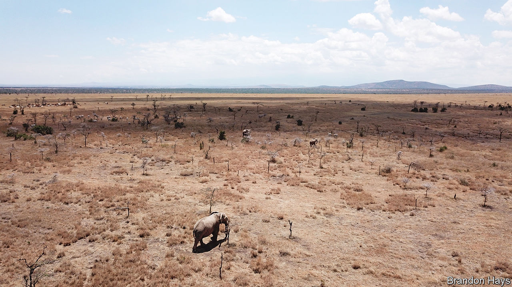

###### Aesop’s ecological fables

# How ants persuaded lions to eat buffalo 

##### A tale of elephants, thorn trees, and the sensitivity of ecosystems 

 

> Jan 25th 2024 

“The ant and the zebra” sounds like the title of one of Aesop’s fables. Like all good fables, this one has a moral, which is that tinkering with nature has unpredictable consequences. Unlike the Greek originals, though, which were allegories, this fable is real.

The story plays out in Laikipia county, Kenya, not far from the mountain which gave that country its name. The characters include big-headed ants (an invasive species of obscure origin), the native acacia ants these interlopers have gradually been replacing, the whistling-thorn trees in which both sorts of ants live, a cast of elephants, lions, zebras and buffalo, and Douglas Kamaru, a Kenyan biologist who currently has a berth at the University of Wyoming. As Mr Kamaru and his colleagues report this week in , the ant invasion has triggered a convoluted chain of consequences which has helped zebras at the expense of buffalo—thus neatly illustrating a phenomenon called “trophic cascade”.

It works like this. Whistling-thorns have co-evolved with the local ants. The trees provide the ants with shelter and food, in the form of large, hollow thorns into which they secrete nutritious nectar from special glands. The ants, meanwhile, protect the trees by seeing off the chief threat to them, the local elephants, which are not keen to browse trees crawling with biting insects. 

Acacia ant strongholds are thickly carpeted with whistling-thorns. Big-headed ants, however, are not so good at keeping the elephants at bay. The pachyderms move in and munch the trees, removing much of the area’s cover. That discombobulates the local lions, which often use this cover to hide when hunting zebra. To compensate, the lions switch to hunting buffalo, which are more dangerous, but less fleet of foot. 

Mr Kamaru has put numbers to the process, too. In invaded areas, elephants browse and break trees five to seven times as often as in uninvaded ones. And in those uninvaded places, zebra kills are almost three times as frequent as in the invaded ones. Indeed, between 2003 and 2020, as the big-headed ants have spread, the proportion of local lion kills where the victim was a zebra fell from 67% to 42%. Conversely, over the same period, the proportion of kills that were buffalo rose from zero to 42%. Whether the buffalo blame the ants for their misfortune, no one knows. ■


