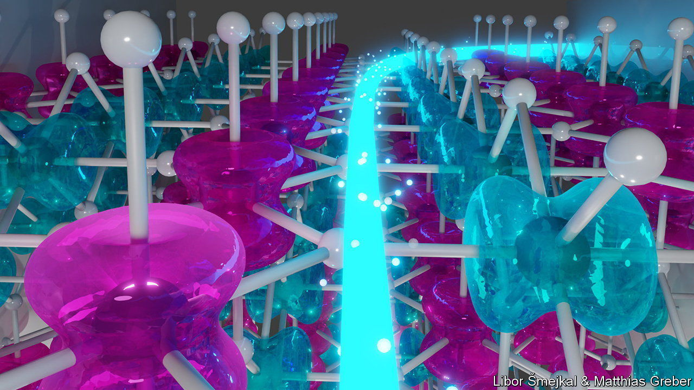
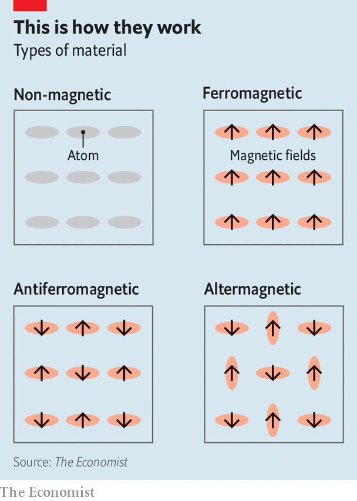

###### Magnets. This is how they work

# Scientists have found a new kind of magnetic material 

##### “Altermagnets” have been hiding in plain sight for 90 years 

 

> Jan 24th 2024 

“Magnets, how do they work?” asked Insane Clown Posse, a hip-hop duo, in their 2009 song “Miracles”. A flurry of recent papers suggests physicists did not quite have the full picture either. A new type of magnetic material may, it seems, have been hiding under their noses.

Most people are familiar with ferromagnets. These have a strong, permanent magnetic field. They are used in everything from fridge magnets and compasses to the motors in electric cars. 

A ferromagnet’s magnetic field arises from the electrons within its atoms. Just as electrons carry electric charge, a quantum-mechanical property called spin means each is also a tiny magnet. In most substances, the spins of the electrons in an individual atom cancel each other, such that the atom—and, by extension, the material built from those atoms—displays no overall magnetic field. 

Sometimes, though, as in the iron from which bar magnets are made, the maths works out differently. If these atomic-scale magnetic fields are strong enough, and if the atoms are closely packed, electrons can force their neighbours to align their fields in the same direction. Combining zillions of tiny fields produces one strong enough to stick the shopping list to the fridge.

 


In 1932 Louis Néel, a French physicist, discovered another way to organise things, in what he called “antiferromagnetic” materials. Like ferromagnets, atoms in such materials have fields of their own. And like ferromagnets, such materials display a rigid internal order—albeit one that produces no overall magnetic field at all. This is because the fields of atoms in an antiferromagnet material point in opposite directions to those of their neighbours, cancelling each other out perfectly (see diagram). 

And that, for a long time, was thought to be that—until Libor Smejkal, a physicist at the University of Mainz, got involved. Dr Smejkal was investigating something called the quantum Hall effect, and began by undertaking a methodical rethink of all possible magnetic states, working from first principles. By 2018, this had led him to a surprising conclusion. 

Magnetic fields within a material could, he argued, align in another way. Neighbouring atoms could end up with spins pointing in opposite directions if the atoms themselves were rotated by 90 degrees compared with their neighbours. (Although atoms are often represented as spheres, and thus indifferent to rotation, things are, in reality, slightly more complicated than that.) The result would be something similar to antiferromagnetism, but distinct enough to deserve a new name. Dr Smejkal has gone with “altermagnetism”.

Since August 2023, at least six papers have been published claiming to have observed altermagnetism in the lab. One, by Lee Suyoung of Seoul National University and her colleagues, and crediting Dr Smejkal as a co-author, was published last week in . They say they have observed altermagnetism in films of manganese telluride, a semiconductor long thought to be antiferromagnetic. Dr Smejkal expects to have more corroboration published in  next month. He also suspects that more than 200 other materials are altermagnets in disguise, based on data available in the literature. “I think it’s widely accepted in the community that this is a real phenomenon,” says Christopher Marrows, a condensed-matter physicist at the University of Leeds.

Applications may come in spintronics, which aims to represent data not as electrical charges, as most existing computers do, but as patterns of spin. The electrons within an altermagnet can be controlled from the outside, as they can in a ferromagnet. Those with one type of spin could be made to move in a different direction from those with another. But ferromagnets are awkward to use, since their magnetic fields interfere with those of their neighbours if they are packed too closely together. Altermagnets, without such a field, can be stacked more densely.

And this might not be the end of the story, says Dr Smejkal, who thinks yet more novel forms of magnetism may be lurking out there. As the Posse said: straight-up magic is what this is. ■


