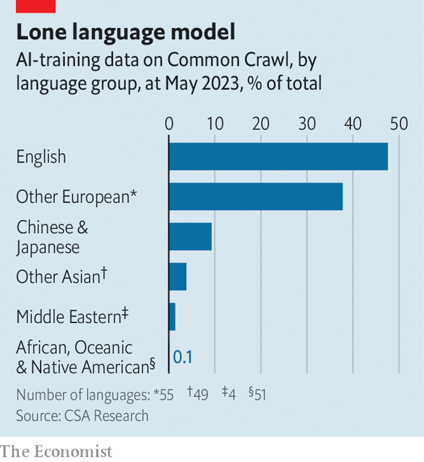

###### Polyglot machines

# Why AI needs to learn new languages 

##### Efforts are under way to make AI fluent in more than just English 

 

> Jan 24th 2024 

ChatGPT, a chatbot developed by OpenAI, an American firm, can give passable answers to questions on everything from nuclear engineering to Stoic philosophy. Or at least, it can in English. The latest version, ChatGPT-4, scored 85% on a common question-and-answer test. In other languages it is less impressive. When taking the test in Telugu, an Indian language spoken by nearly 100m people, for instance, it scored just 62%.

OpenAI has not revealed much about how ChatGPT-4 was built. But a look at its predecessor, ChatGPT-3, is suggestive. Large language models (LLMs) are trained on text scraped from the internet, on which English is the . Around 93% of ChatGPT-3’s training data was in English. In Common Crawl, just one of the datasets on which the model was trained, English makes up 47% of the corpus, with other (mostly related) European languages accounting for 38% more. Chinese and Japanese combined, by contrast, made up just 9%. Telugu was not even a rounding error.

 


An evaluation by Nathaniel Robinson, a researcher at Johns Hopkins University, and his colleagues finds that is not a problem limited to ChatGPT. All LLMs fare better with “high-resource” languages, for which training data are plentiful, than for “low-resource” ones for which they are scarce. That is a problem for those hoping to , in the hope it might improve everything from schools to health care. Researchers around the world are therefore working to make AI more multilingual. 

India’s government is particularly keen. Many of its public services are already digitised, and it is keen to fortify them with AI. In September, for instance, it launched a chatbot to help farmers get information about state benefits. 

The bot works by welding two sorts of language model together, says Shankar Maruwada of the EkStep Foundation, a non-profit that helped build it. Users can submit queries in their native tongues. (Eight are supported so far; five more are coming soon.) These are passed to a piece of machine-translation software developed at IIT Madras, an Indian academic institution, which translates them into English. The English version of the question is then fed to the LLM, and its response translated back into the user’s mother tongue. 

The system seems to work. But translating queries into an LLM’s preferred language is a rather clumsy workaround. After all, language is a vehicle for worldviews and culture as well as just meaning, notes the boss of one Indian AI firm. A paper by Rebecca Johnson, a researcher at the University of Sydney, published in 2022, found that ChatGPT-3 gave replies on topics such as gun control and refugee policy that aligned most with the values displayed by Americans in the World Values Survey, a global questionnaire of public opinion. 

Many researchers are therefore trying to make LLMs themselves more fluent in less widely spoken languages. One approach is to modify the tokeniser, the part of an LLM that chops words into smaller chunks for the rest of the model to manipulate. Text in Devanagari, a script used with Hindi, needs three to four times more tokens, when tokenised the standard way, than the same text in English. An Indian startup called Sarvam AI has written a tokeniser optimised for Hindi, which cuts that number substantially. Fewer tokens means fewer computations. Sarvam reckons that OpenHathi, its Devanagari-optimised LLM, can cut the cost of answering questions by around three-quarters.

Another is to improve the datasets on which LLMs are trained. Often this means digitising reams of pen-and-paper texts. In November a team of researchers at Mohamed bin Zayed University, in Abu Dhabi, released the latest version of an Arabic-speaking model called “Jais”. It has one-sixth as many parameters (one measure of a model’s size) as ChatGPT-3, but performs on par with it in Arabic. Timothy Baldwin, the university’s provost, notes that, because his team could only digitise so much Arabic text, the model also included some English. Some concepts, after all, are similar across all languages, and can be learned in any tongue. Data in a specific language are more important for teaching the model specific cultural ideas and quirks.

The third approach is to tweak models after they have been trained. Both Jais and OpenHathi have had some question-and-answer pairs hand crafted by humans. The same happens with Western chatbots, to stop them spreading what their makers see as disinformation. Ernie Bot, an LLM from Baidu, a big Chinese tech company, has been tweaked to try to stop it saying things to which the government might object. Models can also learn from human feedback, in which users rate an LLM’s answers. But that is hard to do for many poor-world languages, says Dr Baldwin, since it requires recruiting people literate enough to criticise the machine’s writing. 

How well all this will work remains to be seen. A quarter of India’s adults are illiterate, something that no amount of LLM tweaking will solve. Many Indians prefer using voice messages to communicate rather than text ones. AI can also turn speech into words, as India’s chatbot for farmers does. But that adds another step at which errors can creep in. 

And it is possible that builders of local LLMs may eventually be put out of business by the efforts of the Silicon Valley big boys. Although it is far from perfect, ChatGPT-4 is much better than ChatGPT-3 at answering questions in non-English languages. However it is done, teaching AI to speak more of the world’s 7,000-odd languages can only be a good thing. ■


