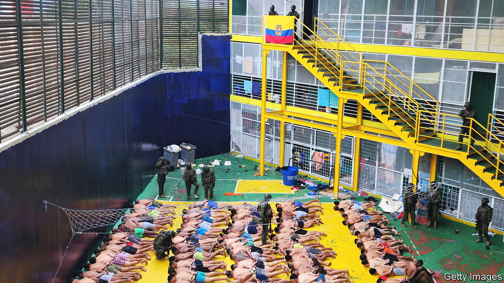

###### Narcojustice

# Can Ecuador free itself from the grasp of the drug lords? 

##### Prosecutors are facing murder and obstruction to clean up the rot in the state 

 

> Jan 25th 2024 

Not since Pablo Escobar’s tyrannical reign from Medellín has a South American country found itself so tightly in the grip of drug gangs. Ecuador is in a state of emergency. Its murder rate is the highest in Latin America. The army is on the streets after gangsters rioted in early January, setting off car-bombs and murdering prison guards. Over 2,500 people have been arrested in response. Laura Richardson, who commands the United States armed forces’ activities in Latin America, arrived on January 22nd in Quito, the capital, as part of a delegation offering assistance. 

Ecuador has been sliding into mayhem since 2019. Diana Salazar, the attorney-general, is attempting to halt that slide by uncovering links between drug gangs and the police, judges and politicians. The success of the operation she leads, Caso Metástasis, is part of what prompted the outburst of violence that captured the world’s attention earlier this month. Ecuador’s gangsters are worried. But that is making the work of bringing them to justice more dangerous. Most people interviewed about this by asked not to be named, for fear of retribution.

Ms Salazar’s investigation began in 2022, after a drug financier, Leandro Norero, was convicted of money laundering in May that year. Dozens of gold bars and over $6m in cash were found at his house. He was killed five months later in a prison battle between rival gangs. Prosecutors seized his 16 mobile phones, and began trawling through the vast trove of evidence.

The messages show police officers being offered cash and “women of good company” in exchange for evidence tampering, and laundered money being used to buy favourable rulings from judges. They also suggest that Mr Norero and his inner circle paid a judge $250,000 to set free Jorge Glas, a former vice-president who was in prison for corruption. They hoped this “little favour” would be repaid if Mr Glas became president (he is currently thought to be staying in the Mexican embassy in Quito). The chats also show that Mr Norero was watching Fernando Villaviciencio, the anti-corruption journalist who was assassinated while running for president last August. Mr Norero had asked his lawyer to find Mr Villaviciencio’s address so that he could “send the  [the lads]”. 

This information led to a spectacular operation on December 14th, when officials carried out 75 raids and arrested 31 people. The detainees included Wilman Terán, president of the judiciary council, the body that selects, promotes and punishes judges, and Pablo Ramírez, a former director of the prisons agency. 

Ms Salazar warned that gang violence would escalate in response to the operation. She was correct. On January 17th César Suárez, a prosecutor who was investigating the family of drug lord Adolfo Macías, was assassinated. He was at least the eighth prosecutor to be murdered since 2022. Many have taken to social media to demand more protection. Mr Suárez lacked a permanent police escort. Protection requests for judiciary staff soared from 55 in 2022 to 700 in 2023.

The government cannot afford all that extra security. One person told that prosecutors have had to pay for food and travel costs for their security escorts. Another said some prosecutors prefer to have no police protection in case an officer is turned against them. On January 12th Ecuador’s president, Daniel Noboa, announced a plan to increase VAT from 12% to 15% to pay for security. 

There are various ways Ms Salazar could protect her team. They may run trials by video conference, or conduct them abroad in Ecuadorean embassies. Another option is to conceal judges’ identities, telling them apart in court only by using numbers instead of names, or putting them behind screens to make them “faceless”. 

Security will be crucial if Caso Metástasis is to continue. Ms Salazar’s team is just getting started. They have to go through the rest of Mr Norero’s phones, as well as 624 new devices seized after the January riots. They have other problems, too. Ms Salazar issued 38 arrest warrants in December’s operation, but seven people managed initially to evade capture. There seems to have been a leak. On December 13th Rafael Correa, Ecuador’s president between 2007 and 2017 (and Mr Glas’s former boss), wrote on X, formerly Twitter, of “a major national raid” hours before the operation began. When agents arrived at the judiciary council’s building to arrest Mr Terán, they found that the lifts had been switched off.

The enemy within

This sabotage suggests long-standing links between gangs and the state. In the 2000s, when the drug trade was controlled by the FARC, a Colombian guerrilla group, high-ranking FARC members claimed to have financed Mr Correa’s presidential campaign. Mr Correa, who has lived in Belgium since 2017, and in 2020 was sentenced to eight years in prison for corruption by an Ecuadorean court, denies this. He claims that Ms Salazar is “a puppet”, and that Caso Metástasis is politically motivated. He points out that several drug bosses were inexplicably released from jail after he left office. 

Whoever is responsible, the corruption clearly runs deep. Another former president, Guillermo Lasso, resigned in 2023 after his brother-in-law was investigated for alleged ties to the Albanian mafia, which ships cocaine to Europe via Ecuadorean ports. The biggest obstacle to Ms Salazar and her team may not be the criminals on the street, but the crooks in the state.■

