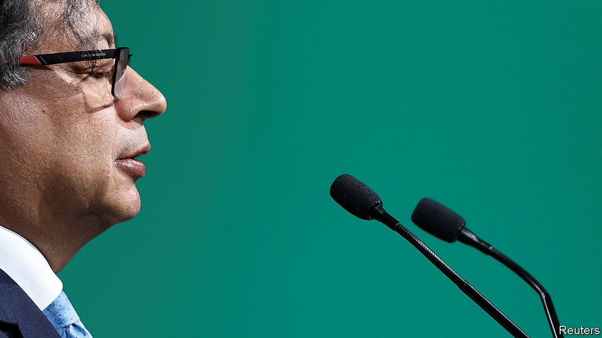

###### So, so, so scandalous

# Colombia’s first avowedly left-wing president is mired in scandal 

##### Gustavo Petro’s son, brother, and former chief of staff are all under investigation 

 

> Jan 25th 2024 

BACKPACKS full of cash, Caribbean condominiums and 1.1bn unexplained pesos ($281,000): these sound like details in a John le Carré novel, not the stuff of court papers. And yet all three appear in the evidence in a criminal case against Nicolás Petro, son of Gustavo Petro, Colombia’s first avowedly left-wing president. On January 11th Colombian prosecutors charged Mr Petro junior with illicit enrichment and money laundering. The court rejected his lawyer’s request to scrap the proceedings, and set a trial date for the end of April.

His son’s predicament is part of a constellation of scandals encumbering Mr Petro who, nearly 18 months into office, is facing an uphill battle to win support for his ambitious programme of reforms. As for Colombians, optimism about their leader’s “government of hope” is fading.

Sins of the son

The case against his son goes like this: according to prosecutors, Mr Petro junior, a former regional deputy, took bribes from notorious figures—including a former drug trafficker and the son of a businessman alleged to have links to paramilitary groups—in return for political favours. The crux of the issue is whether the dirty money helped propel his father to power in 2022. Mr Petro junior admitted he had accepted the funds, but says he kept them for himself. The elder Mr Petro has repeatedly denied any knowledge, which his son corroborates. The trial is likely to drag on. 

All this has sparked a probe into the government’s campaign finances, entangling Mr Petro’s brother and Ricardo Roa, his former campaign manager. Both deny any impropriety. Meanwhile Laura Sarabia, the president’s former chief of staff, was hauled before prosecutors last week in an offbeat case befitting a . It involves a lie detector, the alleged wiretapping of a nanny, and another bag of cash. Ms Sarabia also maintains her innocence. To top things off, Congress launched impeachment proceedings against Mr Petro in December, to which his son was recently called to testify. The Supreme Court also wants to hear from him, on yet another case about illicit enrichment. 

The scandals cast a “looming shadow” over the rest of Mr Petro’s term, says Sergio Guzmán of Colombia Risk Analysis, a consultancy in Bogotá, the capital. Mr Petro’s approval rating hit 33% in December, according to the consultancy’s aggregated polling data. He now lacks the political clout needed to push through reforms. These include expanding the state’s role in health care, pensions and education. 

What happens next depends on what evidence the prosecution presents at his son’s trial. Much also turns on who replaces the outgoing attorney-general, Francisco Barbosa, whose term ends next month. Mr Petro has presented a shortlist of three well-respected women to the Supreme Court. The appointee will oversee the case against Mr Petro junior, as well as others. Legal scrutiny may have compelled the president to offer up a set of nominees pure enough to put him beyond any suspicion of stacking the court in his favour.

Mr Petro’s troubles are not a patch on those of past presidents, however. Prosecutors are still going after former president Álvaro Uribe, for alleged links to paramilitary groups and witness tampering. He maintains his innocence. As long as most of the world continues to criminalise cocaine, the politics of producer countries such as Colombia will remain dirty. 

Still, the saga dents the credibility of a leader who in the past has vociferously criticised the ties between politicians and organised crime. Colombians elected him to put an end to the grubby dealings of the country’s political elite. A whiff of narco-cash in his campaign—proven or not—appears at odds with that goal, and weakens the president. Unless Mr Petro turns things around, his “Pacto Histórico” coalition will become just that: consigned to history.■ 

