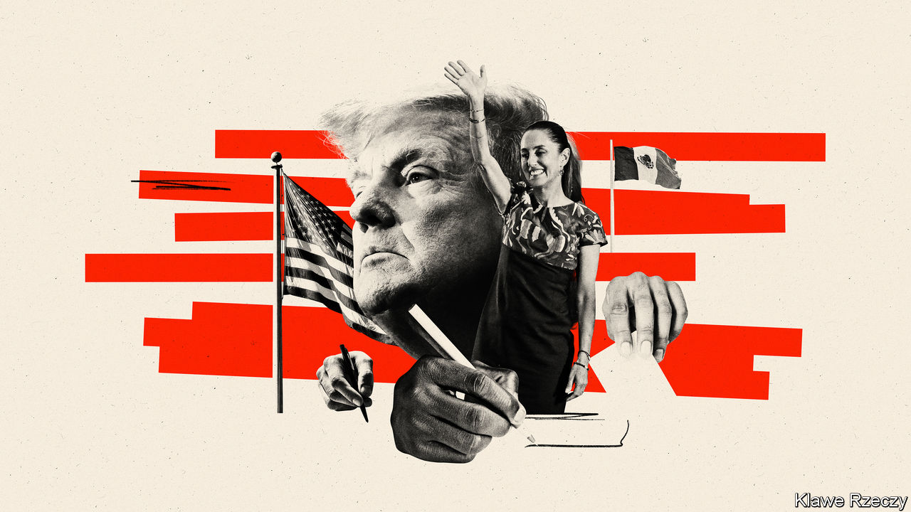
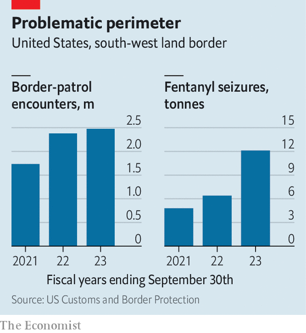

###### North American politics

# The prospect of a Trump presidency looms over Mexico’s elections 

##### Rows over drugs, migration and trade threaten to harm relations 

 

> Jan 23rd 2024 

Every 12 years the electoral cycles of Mexico (six-year presidential terms) and the United States (four-year terms) align. The last time, in 2012, few took notice; neither Barack Obama nor his running-mate Joe Biden mentioned Mexico during their televised debates.

Things will be different this year. Donald Trump, the likely Republican nominee, is a relentless Mexico-basher. The Mexican frontrunner,  of the ruling Morena party, is a protegée of the populist incumbent, Andrés Manuel López Obrador. Mexico figures prominently in its northern neighbour’s most divisive debates.  are at record levels, placing . The volume of , a deadly synthetic opioid, seized at the United States border is rising fast. On a less contentious matter, the United States is looking to Mexico to host supply chains which used to pass through China.

Political observers expect election-year rhetoric to be hotter than usual. There is little love lost between . Rather than a mere “political ”, Mexico is sometimes seen as “the enemy and a real threat to US national security”, says Rafael Fernández de Castro of the University of California at San Diego’s Centre for US-Mexican studies. Research by YouGov, a pollster, bears this out. Almost half of Republicans now see Mexico as an enemy, rather than an ally. 

Mr Biden’s presidency has improved Mexican views of the United States. Almost two-thirds of Mexicans now have a favourable opinion of their neighbour, says the Pew Research Centre, a think-tank. At the nadir of Mr Trump’s presidency, just 30% of Mexicans felt that way. 

The debate in the United States on may revive those tensions. Mr Trump has promised the “largest domestic deportation operation in American history”. That would upend the lives of many members of the Mexican diaspora by returning them to a country in which they have not set foot in years. 

Mexican officials fret that Mr Trump as president would reinstate the “Remain in Mexico” policy, which requires asylum-seekers hoping to enter the United States to wait in Mexico. He may also push Mexico to accept status as a safe country to which asylum-seekers may be returned, something it has resisted. Mexico would then be more heavily burdened by in-limbo migrants than it is today. 

The drugs trade breeds its own cross-border controversy. At least 80,000 people in the United States died of an opioid overdose in the 12 months to August 2023. Most of them had ingested fentanyl, much of it smuggled into the country across its southern border. When Mr Trump first mulled firing missiles into Mexico to disrupt the drugs trade in 2020, it seemed an isolated madcap notion. Now the idea of using force is widespread. Candidates for the Republican nomination, as well as members of Congress, have advocated sending special-operations troops into Mexico to go after the drug gangs. 

Bilateral trade has not yet become a campaign issue. Louise Blais, a Canadian former ambassador, says she expects the United States-Mexico-Canada Agreement (USMCA) which replaced NAFTA to be extended when it comes up for discussion in 2026. “It’s a no-brainer,” she says. The United States needs Mexico as it seeks regional investment to bring supply chains closer. Mexico recently overtook China to become the United States’ top source of imports. 

Ms Blais’s confidence is well placed, if Mr Biden wins. But the growth of imports from Mexico has exacerbated the kind of trade imbalance that Mr Trump abhors. The latest government data suggest that the United States imported goods from Mexico worth about $150bn more than those it exported to the country in 2023. 

 


Just because Mr Trump signed the USMCA doesn’t mean he won’t rip it up or change it, warns one Mexican official. As president Mr Trump did not hesitate to use trade threats to press Mexico to do his bidding on migration. He talks of a 10% import tariff on all goods from all countries. That would breach USMCA or require it to be scrapped. Mr Trump’s victory would herald a return to a transactional relationship, says Andrew Rudman of the Wilson Centre, a think-tank in Washington.

The presidential race in the United States casts a long shadow, but the outcome of the Mexican election matters too. The winner will take office on October 1st, a few months before her American counterpart. It is almost certain to be Ms Sheinbaum. Her closest rival, Xóchitl Gálvez, a former senator who leads a coalition of established parties, is behind in the polls. 

Both talk sensibly about bringing more supply chains to Mexico. Mr López Obrador has failed to make the most of the opportunity, in part because his state-first, fossil-fuel-powered energy policy has inhibited investment. Both candidates say they will pursue a transition to clean power. Mexico’s co-operation on migration is likely to continue under either leader, though the political costs are rising in step with the number of migrants. Neither has yet said much about how they might go about curbing fentanyl production. 

Still, it is the prospect of Mr Trump’s return that animates Arturo Sarukhán, a former Mexican ambassador to Washington. He worries that Mr Trump, more than Mr Biden, would happily turn a blind eye to any further erosion of democracy in Mexico. That might happen alongside the degradation of the bilateral relationship. The question is whether the deterioration will be confined to this dual-election year, or be the new norm for the next four.■

