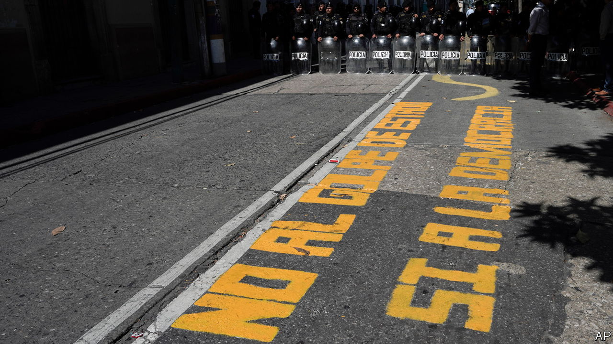

###### The Economist reads

# What to read to understand El Salvador and the Northern Triangle 

##### Six books about a small region that has a big impact on its neighbours 

 

> Jan 24th 2024 

THE THREE countries that make up the Northern Triangle—Guatemala, Honduras and El Salvador—have around 30m people among them. Yet, especially in the United States, the region commands attention out of proportion to its modest size. Migrants seeking relief from poverty, violence and the effects of climate change in those countries are among the largest groups that cross America’s southern border without visas; from 2019 to 2023 a third of the 5.8m people intercepted by the border patrol came from the Northern Triangle and neighbouring Nicaragua. Much of the violence is caused by gangs born in Los Angeles, California, which relocated to El Salvador then spread to its neighbours. Politics in the Northern Triangle has tended to be corrupt and tumultuous. 

Guatemala and El Salvador, the most and least populous of the trio respectively, are governed by leaders who offer very different answers to the region’s problems. On January 14th Bernardo Arévalo, an academic with impeccable democratic credentials, was inaugurated as Guatemala’s president. Guatemalans are hoping that he will weaken the hold of what they call  In February Salvadoreans will almost certainly re-elect Nayib Bukele to a second term as president. Mr Bukele, who dramatically reduced violent crime by locking up nearly 2% of the country’s population, is a very popular populist. The constitution bars him from serving a second consecutive term. But the constitutional court interpreted it in a way to allow him to run again, asking him to step down six months before the next presidential term starts. Honduras, under the leftist President Xiomara Castro, will no doubt be watching to see which style of leadership works better, for the country and the leader. Here we recommend six books that explain the past and present of the turbulent trio of countries.

By Óscar Martínez. Translated by Daniela Maria Ugaz and John Washington. 

Mr Bukele’s crackdown on crime has been so popular because the problem has been so bad. El Salvador had the world’s highest murder rate until recently. In 2022 Honduras’s murder rate was 36 per 100,000 people, nearly six times that of the United States. In this  Óscar Martínez, a Salvadorean journalist for , an online newspaper, provides portraits of the people who suffered from violence, such as Grecia, a migrant in Mexico who is sold to a drugs gang. He also talks to the drug lords and pettier criminals, like El Niño Hollywood, a Salvadorean gangster who assassinated many rivals. Mr Martínez thus gives faces and names to the people behind the statistics in “this terrifying little corner of the world”. chose his first book, “The Beast”, about the perilous train journey migrants take through Mexico, as one of 

By Alma Guillermoprieto. 

Massacres have been frequent in Latin America. One of the largest occurred in 1981 in El Salvador, during its civil war. The army slaughtered more than 800 people in and near the village of El Mozote in north-eastern El Salvador. The killers accused their victims of associating with the leftist rebels against the right-wing government. The United States, which backed the government, initially denied that a massacre had taken place. The case still reverberates but justice remains elusive; a trial of more than a dozen retired soldiers alleged to be among the perpetrators has yet to reach a conclusion. This book brings together five essays on the massacre written between 1981 and 1982 by Alma Guillermoprieto, a Mexican journalist who is one of the foremost chroniclers of the region. The book is only available in Spanish but the  published some of the essays in English. Readers can find Ms Guillermoprieto’s other work in English in the , among other publications.

 By Horacio Castellanos Moya. Translated by Lee Klein. 

In this short novel a professor, Edgardo Vega, returns to El Salvador from Canada for his mother’s funeral to find that he dislikes everything about his native country. The book consists of his rant to a former school friend, Horacio Castellanos Moya, who has the same name as the novel’s author. Vega denounces everything from the the “filthy beer, for animals, that only produces diarrhoea” to Salvadoreans themselves, whom he deems ignorant and repulsive. Readers assumed that the book, published in 1997, expressed Mr Castellanos Moya’s own views. In response to death threats he left the country. But by confronting so ferociously El Salvador’s grim post-war reality, the darkly humorous read has since come to occupy a central place in the country’s culture. (Thomas Bernhard, mentioned in the title, was an Austrian who wrote a similarly scathing work about his home country.)

By Francisco Goldman.

Juan Gerardi, a Catholic bishop, was Guatemala’s leading human-rights activist when he was murdered in 1998. Just days earlier he had released a report accusing the armed forces of torturing and murdering thousands of Guatemalans during a 36-year civil war. Like El Salvador’s, it pitted left-wing guerrillas against an American-backed government, which had little interest in distinguishing between fighters and civilians. The war had ended two years before Gerardi’s killing, but his quest for truth and accountability threatened elites intent on keeping power. In this book Francisco Goldman, an American writer of Guatemalan descent, investigates the murder in detail and names the people he believes were responsible, including military men. Most were later brought to trial and sentenced. Although Mr Goldman’s focus is the murder of the bishop, his reporting reveals much about the abuses inflicted on Guatemalans and about how the mafias of power work in the country. Political, military and business elites continue to try to obstruct democracy. They attempted, unsuccessfully, to prevent Mr Arévalo from taking office.

 By Miguel Ángel Asturias. Translated by David Unger. 

An oldie but a goodie, this novel from 1946 is the story of a Latin American dictator and his plot to get rid of an adversary. The story is set in an unnamed Central American country and could plausibly be told of any member of the Northern Triangle. But it is widely thought that Miguel Asturias, a diplomat as well as an author, had in mind his home country of Guatemala. “The President”, available in a fine new English translation, explores the effects of dictatorships on a country and society. Asturias uses surrealism to convey the psychological impact of living under repressive rule, and satire to mock the rulers themselves, which is one of the things that make the book enjoyable to read. Considered a classic, it is still relevant today, when many democracies in Central America remain fragile. Asturias received the Nobel prize for literature in 1967.

By Douglas Preston. 

The Americas was home to sophisticated civilisations long before the Spanish arrived in the 15th century. Some, like the Aztec and Maya, have been well studied, others less so. In 2012 archeologists using remote-sensing technology discovered ruins in the depths of the jungle near the Mosquito coast in Honduras. Douglas Preston, an American author, joined the expedition to reach them. The untouched city, full of pyramids and sculptures, was home to a people whose identity has not yet been established. They appear to have abandoned the site, for unknown reasons. Mr Preston’s book is a romp of a read about the lost city itself and the often dangerous journey to reach it. Archaeologists are still excavating the site and trying to understand its history.


Our coverage of the Northern Triangle includes this account of  We  Mr Arévalo’s chances of reforming Guatemala. Here we report on research that shows  in motivating people to migrate to the United States. ■

