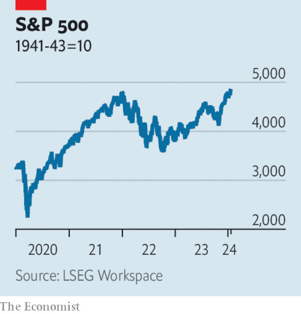

###### The world this week

# Business 

#####  

 

> Jan 25th 2024 

 


The  reached new record highs this week. The previous record had been set in early January 2022, before Russia’s war in Ukraine and the rout in tech shares that year. The Dow Jones Industrial Average also hit a record in recent days and the NASDAQ Composite was closing in on an all-time high. Like the S&amp;P 500 the NASDAQ is being propelled by the turnaround in tech stocks; Meta, Microsoft and Nvidia are all trading at new highs. In Japan the Nikkei 225 is also scaling new peaks.

By contrast the rout in continued apace, with the CSI 300 dropping to a five-year low and Hong Kong’s Hang Seng trading near its lowest close since 2009. The NASDAQ Golden Dragon China Index of Chinese-company shares listed in America has also dropped since the start of the year. China’s prime minister, Li Qiang, ordered the authorities to take “forceful” steps. Speculation mounted that the government would intervene with a state-backed stabilisation fund to buy up shares. 

The  first monetary-policy meeting of the year kept interest rates at -0.1% and made no changes to its yield-curve control strategy. Japanese government-bond yields rose sharply after the central bank’s governor, Ueda Kazuo, said the chances were increasing of it hitting its inflation target, fuelling market expectations of a rate rise in the first half of this year. 

The  kept interest rates on hold, leaving its deposit rate at 4%. The euro zone’s annual inflation rate rose to 2.9% in December, but the ECB noted that “tight financing conditions are dampening demand, and this is helping to push down” underlying inflation.

grew by 2.5% in 2023, according to a first estimate from the Bureau of Economic Analysis, defying expectations of a slowdown. GDP expanded by 1.9% in 2022.

America’s Federal Aviation Administration cleared the path for  737 Max 9 planes to fly again, once airlines complete their safety inspections. The aircraft were grounded when a panel fell off a flight just after take-off. 

 asked a court to block a shareholder motion brought by two activist- investor groups that want the oil giant to expand cuts to its emissions. Exxon says the motion does not comply with the Securities and Exchange Commission’s rules on shareholder proposals and that the activists are motivated by an extreme agenda. Similar motions were defeated at Exxon’s annual general meeting in the past two years. Shell also faces problems with an activist-shareholder motion on emissions this year. 

The last kingdom

The number of net new subscribers to  surged by 13.1m in the last three months of 2023, a figure exceeded only by the 15.8m people it signed up in early 2020, the start of the pandemic. It now has 260m users in total, pushing it further ahead of rival streaming services. The company said the growth in its customer base reflected “the benefits of paid sharing”, in other words, its crackdown on users sharing passwords. Its subscription plan including ads is also popular, growing by 70% on the quarter. And Netflix is expanding into live broadcasting, striking a $5bn deal to stream World Wresting Entertainment shows. 

 reported a 30% jump in annual net sales. The Dutch company is the dominant maker of the equipment needed to produce top-end semiconductors. Orders for its kit tripled in the fourth quarter compared with the previous three months, boosted by the mania for artificial intelligence. ASML is now Europe’s most valuable technology company. 

 revenue grew by just 3% in the last quarter of 2023, year on year. The carmaker warned that sales growth this year would be “notably” lower, and unusually, did not provide a delivery target. Tesla said that it is “between two major growth waves”, adding to concerns that demand for electric cars may be waning. 

 chairman, Toyoda Akio, forecast that the sale of purely electric cars will top out at 30% of the global market, with the rest shared out between hybrid, hydrogen and petrol vehicles. Mr Toyoda has long been less bullish than his peers on the prospects for EVs. Limiting people’s choices isn’t the answer, he opined; customers, not regulators, should decide what to drive. Toyota has lagged behind its rivals in the switch to EVs, though its sales of electrified vehicles in America last year, including hybrids, came to 29% of its total there. 

 rejected a $5.8bn buy-out offer from a pair of investment firms that it received in December. The retailer is instead closing five stores and laying off 3.5% of its workers, or around 2,350 staff. 

No sanctuary in the restroom

A privacy watchdog in France fined  for its “excessively intrusive system” for monitoring workers. Amazon collects data from goods-scanners used by employees, who sometimes feel they have to justify taking a break, the watchdog said. Amazon may appeal against the fine. A survey last year by UNI Global Union found 57% of Amazon workers felt that the constant monitoring was having a negative impact on their mental health; workers with irritable-bowel syndrome were having a particularly hard time, it said. 

