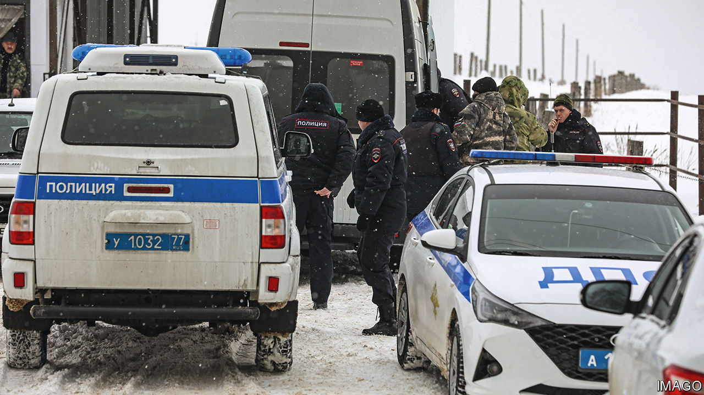

###### The world this week

# Politics 

#####  

 

> Jan 25th 2024 

 accused  of shooting down a Russian military transport plane near its border with Ukraine. The circumstances were murky, but Russia said the plane was carrying 65 Ukrainian prisoners of war who were heading for a prisoner exchange with Russian POWs, as well as nine crew. Ukraine said it had not been asked to ensure a safe passage for the aircraft. A few days earlier, Russia blamed Ukrainian forces for a strike on , a city under Russian occupation in eastern Ukraine, in which 28 people were killed (a Ukrainian army group in the area said it had not been involved). Two days after that at least 18 people were killed in Russian strikes on other Ukrainian cities.

NATO approved a $1.2bn contract that will replenish the artillery-shell stocks of the alliance’s members, allowing them to provide more ammunition to Ukraine. In Washington a bill that would free $110bn in  for Ukraine, Israel and other allies remains stuck in Congress. Republicans in the House of Representatives are refusing to back the bill until they get a deal on stricter immigration policies, though a compromise in the Senate is emerging. 

 parliament at last approved bid to join . Turkey, which as a NATO member must bless another country’s accession, had dragged its heels over the bid, claiming that Sweden harboured Kurdish militants. The only holdout now is . Its prime minister, Viktor Orban, said he would “continue to urge” parliament to ratify Sweden’s membership soon. 

 Constitutional Court banned state funding for a far-right extremist party, Die Heimat, finding that it had shown disdain for democracy. The ruling has fired the debate about taking legal steps to stop the rise of the Alternative for Germany (AfD), a party on the radical right. Around 1.4m people demonstrated against the AfD in cities including Berlin, Cologne and Munich over three days recently. 

Farmers held protests across  over a wide range of grievances. The head of the young-farmers’ union said that its roadblocks on highways would not be lifted until the government headed by the new prime minister, Gabriel Attal, came up with concrete action.

Like a freight train

Donald Trump chalked up another big win in the Republicans’ presidential nomination race, taking 54% of the vote in the . Nikki Haley took 43%. Ron DeSantis dropped out of the race ahead of the vote. Ms Haley vowed to carry on. She may make her last stand in the primary in South Carolina, her home state, where Mr Trump currently holds a huge lead in the polls. 

Police in  arrested 68 gang members who were trying to take over a hospital in a town close to the city of Guayaquil, the centre of a flare-up in violence that has swept the country. The arrested men were apparently trying to protect one of their members, who was in the hospital, from being attacked by rivals. 

 attorney-general issued 14 arrest warrants for people he claimed were involved in various conspiracies against the country’s autocratic president, Nicolás Maduro. One of the warrants is for Tamara Sujú, a human-rights lawyer who lives abroad.

In  a federal judge ruled that Justin Trudeau’s use of emergency powers in February 2022 to end protests by truckers had been “unreasonable” and violated the Charter, Canada’s bill of rights. The prime minister invoked the powers when the Freedom Convoy, which for weeks protested against covid-vaccine mandates and other pandemic measures, brought traffic to a standstill with demonstrations. The government will appeal against the ruling. 

A court in  decided that Pita Limjaroenrat, who led the Move Forward reformist party to an election victory last year, had not violated election laws and could remain in parliament. Although Move Forward won the election it was blocked from taking power by Thailand’s royalist and military elite. The same court is expected to make a decision soon in a separate case on whether Move Forward broke the country’s lèse- majesté laws. 

 


 prime minister, Narendra Modi, led the ceremonies at the consecration of a controversial Hindu temple in Ayodhya. For decades Hindu nationalists had pledged to build the temple on the site of a 16th-century mosque that was destroyed by a mob in 1992. Hindus venerate the site as the birthplace of Ram. The spectacular ceremony was part political rally for Mr Modi, who faces an election this year. 

 transport minister resigned in a corruption scandal that has engulfed the normally squeaky-clean government. S. Iswaran has been charged with 27 offences, which he denies. 

Fears are growing about the .  in Iraq and Syria launched their most serious rocket attack on American troops since the start of the Gaza war. A volley of ballistic missiles and rockets was fired at the Al Asad air base in Iraq. Most were intercepted. Meanwhile in  America and Britain continued to bomb the Houthis, another Iranian-backed group.

The Pentagon confirmed that two   had died during an operation earlier this month boarding a vessel off the coast of Somalia that was trafficking weapons to Yemen. One of the men fell into the water and another tried to rescue him; both were swept away by the sea. The operation resulted in the seizure of Iranian weapons bound for the Houthis. 

 encircled Khan Younis, the city in southern  where it believes Hamas leaders including Yahya Sinwar are hiding. Some 24 Israeli soldiers were killed in the deadliest day for the Israel Defence Forces since the start of the war. The Palestinian death toll passed 25,000, the majority of them civilians. Egyptian and Qatari negotiators continued to push for a deal between Israel and Hamas that would see a ceasefire and the release of the hostages still being held. 

 will start selling alcohol, but only to foreign diplomats (alcohol was banned in 1952 after a drunken Saudi prince shot dead a British envoy). Muhammad bin Salman, the crown prince and de facto ruler, is continuing his efforts to modernise the kingdom.

Better to stay with the USA

Antony Blinken, America’s secretary of state, visited several African countries including and , in a bid to counter Russia’s growing influence in the region. Mr Blinken offered American security assistance to countries battling jihadists, saying it was a better partner than Russia’s Wagner mercenary group.

Human Rights Watch raised concerns about repression ahead of presidential election next month. It says that perhaps 1,000 opposition members and activists have been arrested since March 2021. Ousmane Sonko, an opposition leader, has been barred from running.

More than 70 people died when a tunnel collapsed at an informal gold mine in  Koulikoro region.

Tensions continued to rise over a deal by , a breakaway region of , to lease part of its coastline to Ethiopia, which wants to build a port and naval base. Egypt’s president, Abdel Fattah al-Sisi, said he would back Somalia’s federal government, which opposes the deal, and would “not allow anyone to threaten Somalia”. 

Japan became the fifth country to land a spacecraft on . Japan’s space agency said it was able to communicate with the probe, though its power cells were not working. 

