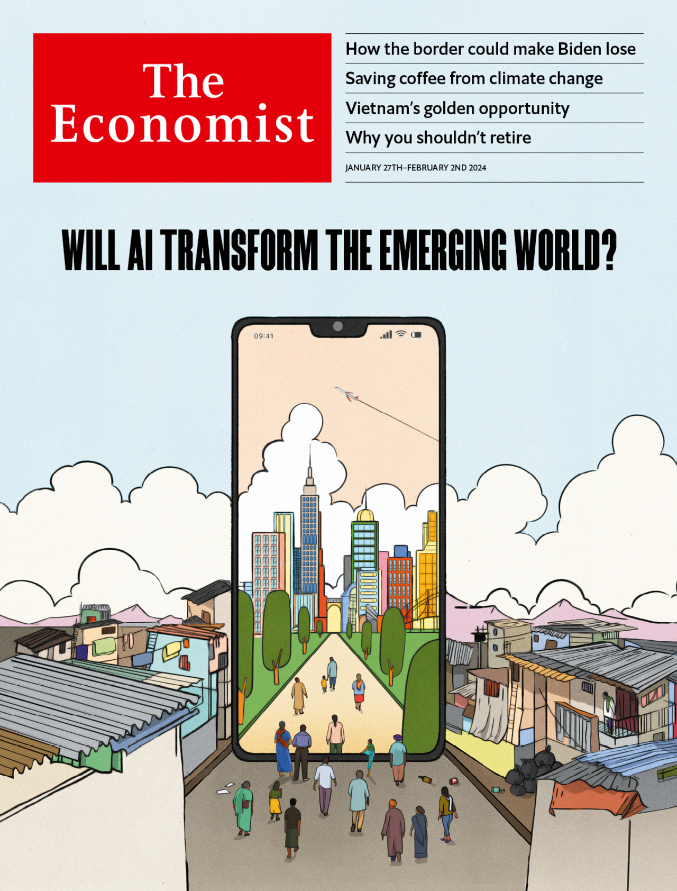

###### The Economist

# This week’s covers 

##### How we saw the world 

> Jan 25th 2024 

We had two covers this week. One was about America’s failure to impose order on its southern border and the chance that this could cost Joe Biden the White House in November. The other looked at how artificial intelligence (AI) could transform lives in the emerging world.

We started with some images of the physical barriers would-be migrants must overcome. One image we experimented with was a close-up of some razor wire, with a hand delicately touching its sharp edges. The image had menace, but not enough drama. 

Another design used a photo of outstretched hands reaching through a fence. It was emotive, but slightly dehumanising. There were no faces in the picture, and the outstretched hands suggested people asking for handouts, which is misleading—immigrants to the United States tend to find jobs quickly. Another picture we tried—showing a mother holding a child—was better, but still not quite on the mark. The mother looked passive and despondent; we wanted something that suggested more agency. 

Another gave an unusual perspective on the crowds of people waiting to be processed: we thought it was a stunning image and ended up using it in our United States section. 

One picture—showing a vast crowd of migrants—was perhaps too dramatic, and too close to propaganda images that suggest that migrants are arriving in overwhelming numbers, like an invasion. That is not what we are arguing. We think it is both possible and desirable for America to regulate the flow of newcomers better and to decide who enters and who does not. In the end we opted for this moody desert photo. The towering cacti give a vivid sense of place, the mountains frame the image beautifully and the migrants look ordinary, purposeful yet stuck in limbo. 

 


: 

: 

: 


Our other cover story was harder to illustrate. It concerned something invisible: artificial intelligence, and the possibility that it might help improve human capital and productivity in the emerging world. 

We have used robots before to symbolise AI and our team mocked up some striking images in this vein. One showed a robot hand holding a globe, with the map of Africa emphasised. Another image had a hand made of a circuit board, also grasping the poorest continent.

We played around with some of the examples that emerged from our reporting. Chatbots could provide individual instruction to kids in cash-starved education systems, so we considered an illustration of a robot scribbling on a whiteboard. Machine learning is already being used to crunch satellite data and give farmers in developing countries more timely, accurate information about such things as the weather, so we tried an image of a healthy crop with buffering symbols instead of flowers.

One early design showed a robot using a smartphone as a catapult to launch an emerging-world everyman to greater heights. Some of us found it funny and lively; others thought the robot had a creepy, Terminator vibe. So we made the robot friendlier. That was nice, but it suggested a little boost rather than a potential transformation of lives. 

Since most people in developing countries who will use AI will do so via their phones, we decided to use a smartphone screen to show a tantalising glimpse of the future. We tried a design that showed a parched landscape becoming a field of sunflowers. However, AI will be felt in cities first, so we preferred an image of a slum becoming a shining city of parks and skyscrapers. For a final touch, we added more people, climbing through the screen to grasp the opportunities this extraordinary technology may offer. 

 


: 

: 

