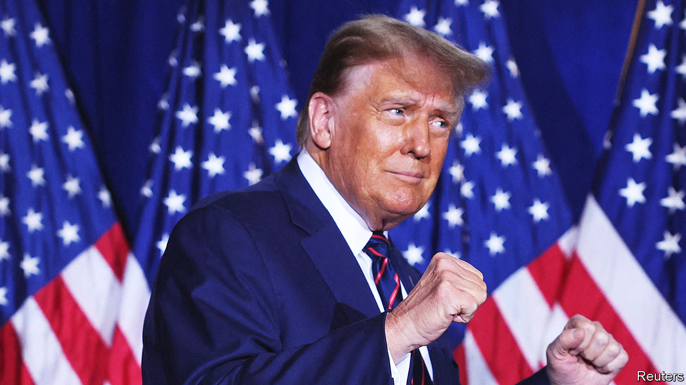
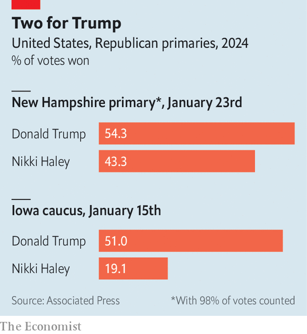

###### MAGA mania

# After winning New Hampshire, Trump is cruising to the nomination 

##### Nikki Haley fights on, but her path gets only more daunting from now on 

 

> Jan 24th 2024 

MOST THINGS become banal after a near-decade of cultural dominance. But not . Republican voters are still  by him, undaunted by all the turmoil and scandal of his time in the White House and his post-presidential life. His rallies retain their feeling of secular religious revival. His fresh-faced rivals, by contrast, have looked unoriginal and uninspiring. By the time Republicans had voted in just one state, Iowa, only one serious  remained. All the rest had dropped out; most had endorsed him. The last woman standing, Nikki Haley, a former governor of South Carolina who served as America’s ambassador to the United Nations while Mr Trump was in office, mounted her resistance in New Hampshire, the second state to cast ballots. Like all the rest, she was overrun.

Mr Trump got 54.3% of the vote to Ms Haley’s 43.3%, and quickly pointed out that no one had ever won both Iowa and New Hampshire and failed to secure the nomination. An unbowed Ms Haley vowed to fight on. “You’ve all heard the chatter among the political class, they’re falling all over themselves saying this race is over,” she said at a speech in Concord, New Hampshire, conceding victory to Mr Trump. “This race is far from over. There are dozens of states left to go. And the next one is my sweet state of South Carolina.” Mr Trump was not pleased. “Who the hell was the impostor that went up on the stage before and, like, claimed a victory?” he sniped at his victory speech.


The problem for Ms Haley is that, if she cannot win in New Hampshire, she cannot expect to win anywhere. Entrance polls conducted during the Iowa caucuses, held on January 15th, show Ms Haley overperforming among Republicans with college degrees, who labelled themselves as political moderates, who didn’t identify as evangelical Christians and especially well among those who believe that President Joe Biden legitimately won the election of 2020. Those kinds of voters are over-represented in New Hampshire. 

It was not just a demographic dividend that Ms Haley had hoped to cash in. She won the endorsement of , New Hampshire’s popular Republican governor, who barnstormed the state with her. She and her allies heavily outspent Mr Trump, splashing out $31m versus his $15.7m. She spent months traipsing around the state’s breweries and diners, while Mr Trump eschewed such drudgery. Anti-Trump Republicans had said the only way to beat the former president was to consolidate support into a single opponent—which has now happened. And even after all that she lost by 11 points. 

 


Subsequent states in the primary calendar are more hostile terrain for Ms Haley. Republicans in her home state of South Carolina, which holds its primary on February 24th, look much more like those in Iowa—where Ms Haley came 32 points behind Mr Trump—than New Hampshire. An average of recent polls there shows Ms Haley trailing by a crushing 37 points. Mr Trump has secured the endorsements of the top South Carolina Republicans with whom Ms Haley once worked as governor. 

In trying to explain away this uncomfortable reality at an election-eve rally in Salem, New Hampshire, Ms Haley branded herself as somehow more of a populist insurgent than Mr Trump. One candidate “has got the entire political elite all around him. It’s all of Congress. It’s all these legislative people. He’s got the media all around him. But you know what? I’ve never wanted them.” Only the most credulous supporters in the crowd would believe Ms Haley’s line that her former colleagues were abandoning her because she had been so zealous in pursuing ethics reforms while governor. One especially bored reporter (not this one) began timing their Rubik’s-cube-solving abilities midway through the speech.

In a memo released on the day of the New Hampshire vote, Ms Haley’s campaign argued that she had a viable path to the nomination, urging a “deep breath” until “Super Tuesday” on March 5th, when many states hold their primaries. Her team’s argument is that many of the states that will vote in the next six weeks are “open primaries”, in which independent voters who are not registered Republicans can take part. This factor will indeed help Ms Haley. But in order to be the Republican presidential nominee, one unfortunately needs to be able to command a majority of the party.

The bigger battle ahead

The meek and muddied anti-Trump resistance looks close to its last gasp. Only late in her campaign did Ms Haley take to attacking Mr Trump by name. Her criticisms of the man are usually meticulously crafted to avoid moral judgment. “Rightly or wrongly, chaos follows him,” is a favourite line of hers, as if the chaos had been a curse of some vindictive god rather than intrinsic to the man himself. 

Ms Haley’s demise would commit the Republican Party to Trumpism, with its blend of isolationism, illiberalism and protectionism, and away from the internationalism of which Ms Haley sometimes seems the sole influential ambassador on the Republican side. In America, voters get what they want. And it seems that nothing—not a dozen vanquished Republican candidates, not the one remaining woman, not the 91 criminal indictments facing Mr Trump—can get in their way.

Mr Trump can’t wait to swat away Ms Haley so that he can focus on the coming contest with Mr Biden. Mr Biden won 56% of the votes in the Democratic primary in New Hampshire on Tuesday, even though (because he disputed New Hampshire’s cherished right to hold the first primary) his name was not on the ballot. He, too, is cruising to the nomination. Brace yourself for a Biden-Trump rematch. ■


