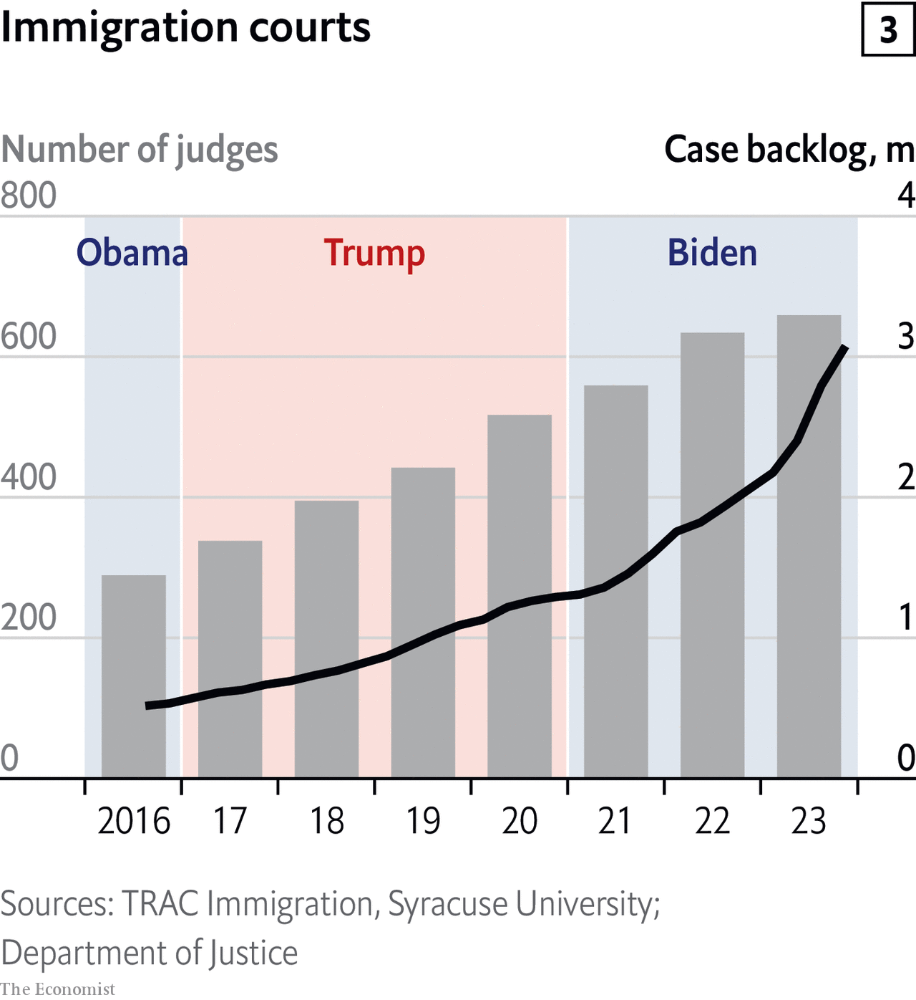

###### Trouble down south

# America’s border crisis in ten charts 

##### How did we get here? 

> Jan 24th 2024 


THE CRISIS along America’s southern border is a political liability for Joe Biden. Polling suggests that just 27% of Americans approve of the president’s handling of immigration; more than twice as many say they trust Donald Trump, his likely challenger in November’s election. Increased migration is not all down to policymaking in Washington, DC. But our ten charts below show how the problem has worsened over recent administrations. 


 


Start with the number of undocumented, or illegal, migrants crossing the border. By these numbers Mr Biden is a clear outlier. During his presidency there have been record numbers of apprehensions and expulsions at the border; nearly 250,000 people crossed in November alone. 

The president with the lowest number of arrivals in at least four decades is Barack Obama. During his first term yearly apprehensions averaged out at just 431,000, down from an average of 1.2m in the 1980s through to the early 2000s. 

Numbers began to rise again under Mr Trump. In 2019 the surge was so great that a quarter of the recent arrivals were released into the country, as government detention facilities and local jails struggled to keep up. 


 


America’s tight labour market increases the incentive for people looking to earn a better living. Wars and global instability are also playing a part. Whereas most migrants used to come from just Mexico and the Northern Triangle (El Salvador, Guatemala and Honduras), people from these countries now make up less than two-thirds of all those apprehended (see chart 2). The share of Venezuelans is growing, and tens of thousands of people from as far as India, Russia and China are also seeking asylum in America. 


 


All this is putting pressure on the country’s overstretched immigration courts. Our third chart shows that the backlog of cases more than doubled during Mr Trump’s presidency, and doubled again under Mr Biden—the backlog now stands at more than 3m. 

The number of judges who deal with these cases has risen steadily over time, though not by enough to make a dent. If America’s 659 immigration judges ruled on four cases every business day it would still take them more than four years to clear the docket (without adding any other cases). The Congressional Research Service, a government body, reckons that even doubling the number of judges would not clear the backlog until 2032. 


 


Our fourth chart shows what this backlog means for asylum waiting times. Judges reached a decision on only around 70,000 applications in the 12 months to October. Most of those cases are likely to have been several years old. The long wait is a further incentive for migrants to cross the border illegally, even if they have a weak claim to asylum. The low chance of detention means they could get at least a few years’ work in America before a decision is even made. 

Roughly equal numbers of people were granted and denied the right to stay in the past two years. That is far more than in Mr Trump’s day, when only around a third of rulings ended in asylum being granted. 


 


Handling these cases is all the more difficult when families and children are involved. Immigration detention centres were built to house single adult men, not families and children. Encounters of unaccompanied children reached similar peaks under both Mr Obama and Mr Trump (though the latter’s administration also separated children from their parents, meaning the true number was even higher). During the most recent wave, under Mr Biden, the number has rocketed (see chart 5). 


 


Despite these pressures, the number of agents hired to patrol the border has barely budged since at least 2014. In the 2017 fiscal year, during which Mr Trump was elected president, there were 746 fewer agents than the year before. In the year of the 2020 election, the number rose by less than 100. Funding for Customs and Border Protection (CBP), the agency charged with patrolling America’s borders, has stalled amid . Adjusted for prices, this fiscal year’s requested budget for the agency is roughly the same as it was in 2018.


 


Detaining illegal migrants can be done by CBP officers at the border, or by the Immigration and Customs Enforcement (ICE) agency anywhere in the country. Mr Trump enjoyed the show of force that came with ICE raids; they were a prominent feature of his time in office. Arrests peaked in May 2019, when roughly 57,000 people were taken into custody. That has since dropped to roughly 20,000 per month during Mr Biden’s term. 


 


Some of these detentions will lead to deportations, rates of which have fallen since Mr Obama left office (he was nicknamed “deporter-in-chief” among rights groups). Annual “non-citizen removals” were on average 22% higher in his second term than in Mr Trump’s time in office. 

The current administration has taken a different approach. On the campaign trail in 2020 Mr Biden promised a pathway to citizenship for some unauthorised immigrants already in America. Deportations have since dropped to record lows. ICE was told to prioritise certain people for deportation, mainly recent arrivals or those who posed a threat to national security. The perception that Mr Biden is more welcoming than his predecessor is no doubt contributing to the current surge. 


 


Despite the increasing number of migrants reaching the border, the amount of people actually living in America illegally had, until recently, been falling. The Pew Research Centre reckons that there were 10.5m illegal immigrants in 2021, the latest year available. That is roughly the same as in 2017 and fewer than in any other year between 2005 and 2015. It also puts illegal migrants at roughly 3% of people living in America and 22% of the country’s foreign-born population—the lowest shares since the 1990s. This data does not include estimates since the latest wave of encounters at the border; some 600,000 people are thought to have slipped through undetected in 2023. But the numbers did go down under Mr Trump and Mr Obama and in the latter years of George W. Bush’s presidency. 


 


Our final chart shows how America’s opinion of illegal migration has hardened, especially among the left. A poll in December 2017 found that only 12% of Democrats favoured building a wall at the southern border (one of Mr Trump’s main campaign promises in 2016). In December 2023 that rose to 32%. 

Construction of the border wall, however, has done little to help. For all Mr Trump’s talk, the Obama administration added more new barriers than he managed. Building has continued under Mr Biden, though record numbers of people are still showing up. Decades of neglect wrapped up in political fighting has crippled the country’s immigration system. Our charts show that neither party has made meaningful improvements.■ 

