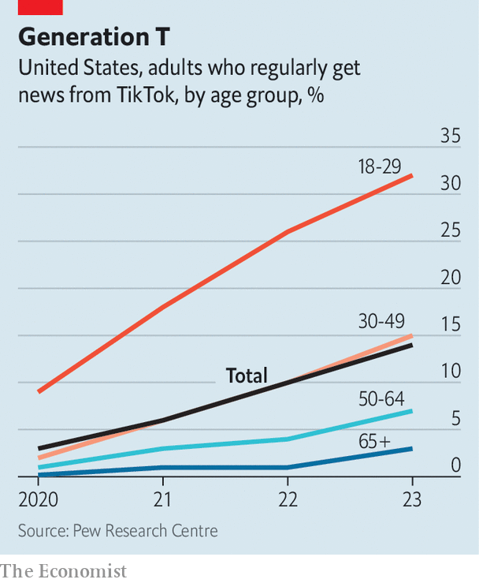

###### Breaking news

# The rise of the TikTok news anchor 

##### A horde of pocket Cronkites will read the papers and tell you, like, what they say 

 

> Jan 25th 2024 

“BREAKING NEWS: it looks like there is some weird stuff going on in America.” Welcome to the news on TikTok. Before we dwell on how and when it is appropriate to start a sentence with “breaking news”, let’s cross now to our correspondent, who is a cartoon fish, with a story about a “Potential Diabetes Cure!” (3.4m views). Next, “News Daddy” (a boy called Dylan) will read out details of a hotel explosion in Texas to some of his 10.3m followers, thankfully from the safety of his home studio in Britain; “Nah 2024 needs to chill…i need some sleep,” the description reads. In our final segment, a college student is primed to run through the pages of the  (the Iowa caucus is “just tea, it’s gossip”).

Each of these videos comes from a cohort of amateur anchors who take the business of delivering the news extremely seriously. They are the presenters, researchers and producers rolled into one. Their uploads on everything from product recalls to the war in Gaza caricature traditional news reports, aggregate them—and compete with them. News Daddy’s follower count exceeds that of the flagship TikTok accounts of the , the  and the  combined. The handful of influencers your correspondent (who is not a cartoon fish) met have over half a billion likes on all of their videos between them.

“I’m more interested in watching someone who’s fun to watch than a stuffy monotone news reporter,” says Alex Kellerman, who dresses up as a bedraggled anchor every day to film a roundup of the “f*ckin’ news” (“I give you news…but always do your own research and fact-checking!”). He says the format found overnight success after he “accidentally” uploaded a test video in September about lethal flooding in Libya, using details from mainstream outlets covering the disaster on other parts of the internet. Mr Kellerman doesn’t describe himself as a journalist, but he claims to have been “one of the first people to report [the story] on TikTok”.

 


And that’s what matters, because in 2020, 9% of Americans aged between 18 and 29 told a Pew poll that they regularly got their news on the platform; by 2023 that number had risen to 32% (see chart). Capturing this generation’s attention is a delicate balance: “It has to be short, it has to be fast,” says Jessica Burbank, a creator and freelance journalist who has grown a loyal Gen Z audience through “translating” the biggest stories of the week to them by “taking away all of the nonsense”.

Large follower counts are giving creators the chance to build upon existing stories. “People almost have this false sense of respect for you or something. It’s odd,” notes Julie Urquhart, who says the popularity of her crime and celebrity-news account has helped her land interviews with people linked to the stories she makes her videos about. “I think because you’re on social media, not, you know, like a news person who’s going to twist things maybe.”

Free from the constraints of editorial processes and executive boards, news creators believe their appeal lies in a quality that mainstream outlets lack: authenticity. “Most traditional news is devoid of emotion,” reckons Josh Helfgott, who has earned the attention of millions of followers making clips about LGBT news stories. “I believe that what catches my audience’s attention is when they see my passion behind the story.” Publishers around the world are all too aware of this shift; over half of those recently surveyed by the Reuters Institute for the Study of Journalism said that they plan to devote more effort into putting stories on TikTok this year.

Before everyone starts workshopping ways to deliver the news in a chill and relatable lilt, take a moment for some optimism. As Gallup reports the lowest amount of trust in American mass media since 2016, it seems that creators have merely figured out how to tune people back in to news stories that outlets have been reporting on the whole time, just in ways that feel more relevant and real to young internet users. That can be a good thing. So long as you choose not to think too much about comments that read, “I get my news from him, and the fish”.

With a busy election year ahead, TikTok newscasters will have much to work with. Expect to see many more of them co-opting the headlines to increase their followings, be the first to post about it, entertain people, ask why no one is talking about a thing, go viral—and spread the news. ■


