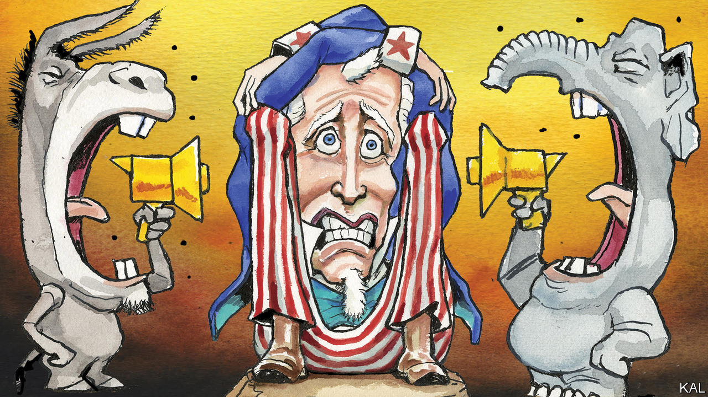

###### Lexington

# Why America’s political parties are so bad at winning elections 

##### And why a new party would probably be no better 

 

> Jan 25th 2024 

Every four years the American presidential primaries roll around to remind Americans how weak, clumsy and negative their major political parties have become. The news media’s red-and-blue maps, the repetitive partisan standoffs in Congress and the drama created by the polarisation of the parties create the impression that they hold tremendous sway, that Americans are devoted to either the Democrats or Republicans and obsessed with their prospects. The reality is more muddled and dispiriting.

The largest, and growing, share of Americans choose not to identify with either party. According to a Gallup poll released this month, 43% call themselves independent, tying a record set in 2014. In Gallup’s poll, the proportion of eligible voters identifying as Democrat has fallen to a record low, 27%, the same percentage that call themselves Republican. Another Gallup poll, also this month, found that only 28% of adults, also a new low, were satisfied with “the way democracy is working in this country”.


Yet the parties are not reacting by making themselves more appealing. Something is interfering with the signals the electorate sends to the organisations that supply candidates and ideas, never more so than this cycle, when most Americans have consistently turned their noses up at the products most likely to be on offer, President Joe Biden and former President Donald Trump.

“The first party to retire its 80-year-old candidate is going to be the party that wins this election,” declared Nikki Haley, a former governor of South Carolina, as she conceded the New Hampshire primary to Mr Trump on January 23rd. She may be right in theory. But she is wrong in practice that there is some coherent entity called a “party” capable of such a rational calculation. As Mr Trump demonstrated in 2016, and Barack Obama did before him, political parties do not plot or strategise anymore to anoint a candidate, at least not with much effect; they have instead become vehicles idling by the curbs of American life until the primaries approach, waiting for successful candidates to commandeer them. 

For most of American history, party leaders picked presidential nominees. That system collapsed after the fractious Democratic convention of 1968, in which party elders ignored the candidate of the anti-Vietnam-war left and instead bestowed the nomination on Vice-President Hubert Humphrey, who had not competed in a single primary. Reformers successfully argued that nominating delegates should be picked by voters in primaries instead, and Republicans eventually followed the Democrats’ lead. This approach opened up the system to candidates, such as Jimmy Carter in 1976 and Ronald Reagan in 1980, who might never have been chosen in a smoke-filled room. 

But in taking power from the party establishment, reformers unintentionally handed it to activists, who tend to be more extreme than other partisans, let alone the rest of the country. This is particularly true of the Republican Party. Now, relatively small numbers of impassioned voters can end up choosing nominees. 

After Mr Trump won 51% of the vote in the Iowa caucuses this month, he was credited in the news media with a “landslide” win and a “blowout victory”. But it was a frigid night, and fewer than one in six registered Republicans turned out. They were probably among the most motivated of voters, quite unlike most Americans. Mr Trump won about 56,000 of these Republicans, or about 7% of the potential pool of 752,000 Iowa Republicans. 

In New Hampshire on January 23rd Mr Trump won most Republicans who turned out, while Ms Haley won most “undeclared”, or independent voters who did so. Political analysts rightly saw this as a weakness of Ms Haley, because in many states independent voters cannot cast ballots in partisan primaries. And it might seem reasonable that the Republicans would want to nominate whoever wins the most Republicans. The flaw in this approach is that, definitionally, that candidate has demonstrated only that they can win if the electorate is Republican. A party capable of organising itself to win a general election with a big majority would place more value on reaching beyond the base.

A party’s nominee may not win the majority even of its primary voters, let alone of its eligible primary voters. The primaries tend to exaggerate the popularity of the eventual nominee because many states award all their delegates to the winner, rather than dividing them proportionately among the candidates. In 2016 Mr Trump won fewer than 45% of primary voters in all—that is, he won the Trumpy minority of the activist minority that turned out. 

This is a fragile basis on which to stake a claim to nationwide electability. Nominees overcome that handicap by relying on what political scientists call “negative partisanship”. Though the plurality of Americans call themselves independent, they tend to lean to one party or another. Encouraging these voters, as well as less politically active party members, to see the opposing party as demonic is a reliable means of getting them to vote your way. 

Third parties are hard

All this helps explain the longing of certain idealists and opportunists for a third party. That yen is particularly sharp in this cycle. History suggests it could be fulfilled quite suddenly, says Bernard Tamas, a political scientist at Valdosta State University and the author of “The Demise and Rebirth of American Third Parties”. “It’s often at times like this when the two major parties are polarised, because it opens a door for a third party to attack,” he says. “You don’t know if it’s going to happen until it happens.” 

But the group No Labels, which is considering a third-party bid, appears to be off to a poor start. Successful third parties have tended to run candidates not just for president but down the ballot, too, and to have specific, galvanising issues. Had Donald Trump been capable of organising such an effort, he might have been a powerful third-party candidate. But why bother, when an existing party was just sitting there waiting to be commandeered? ■


