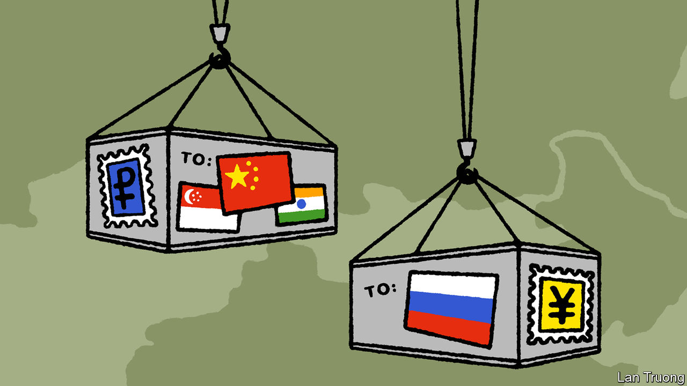

###### Banyan

# Asia’s commercial heft helps keep Russia’s war economy going 

##### That holds future lessons for America 

 

> Feb 1st 2024 

FOLLOWING VLADIMIR PUTIN’S invasion of Ukraine two years ago, more than three dozen countries, led by the West, slapped economic sanctions on Russia. They were unprecedented in their scope for a target of its size, covering energy and other commodities, finance, technology, travel, shipping and more. Their aim was to raise the cost to Russia of continuing the war.

The reorganisation of trade that has followed highlights the relentless eastward shift in the world’s economic centre of gravity. Asia accounts for two-fifths of the world’s GDP. Its ever-increasing commercial pull is diverting much trade that Russia previously conducted with the West, undermining sanctions. That is despite the fact that three of the six Asian countries which have joined the sanctions—Japan, Australia and South Korea—number among the region’s five biggest economies. America should bear this in mind if it ever considers slapping similar sanctions on China.

Of course China itself, under Mr Putin’s pal, Xi Jinping, has done the most to undermine the West’s sanctions. Trade between Russia and China jumped by 29% in 2022 and probably by more last year. China and Hong Kong are now Russia’s chief suppliers of microchips, frustrating Western efforts to starve Russia of the integrated circuits essential to the war effort. China has also swiftly become the top supplier to Russia of cars and smartphones.

Chinese support is far from the only factor, however. The , an online newspaper, recently revealed how Russian military enterprises are getting hold of sophisticated machine tools from Taiwan, despite sweeping sanctions there: middlemen in Turkey and elsewhere are sourcing what Russia needs. In Central Asia, Kazakhstan and Kyrgyzstan are key conduits for shady “parallel imports” into Russia: their trade with neighbouring Russia has boomed.

From the start sanctions had to be designed around Asia’s apathy. The alternative was for the West to compel its involvement by imposing massive and indiscriminate “secondary” sanctions: that is, measures targeting third parties who help Russia. But Asia is too important, economically and geopolitically, for the West to issue such threats.

Another important example is oil. On the eve of the invasion, Europe bought three-fifths of Russia’s oil exports; that has fallen sharply because Europe has banned those that come via sea. Russia’s oil exports to Asia, meanwhile, have leapt to more than half its total, with India the biggest buyer. Singapore is one odd case. It condemned Russia’s aggression and was the only member of ASEAN to sanction Russia. Oil, though, is not covered. Singapore is a refining and oil-trading giant, as well as the world’s busiest bunkering port. In the year to May 2023 its imports of Russian oil nearly doubled. Demand for storage has also risen, suggesting that Russian oil products are being blended and sold on as non-Russian oil with a juicy mark-up.

In part Asia’s appetite for Russian oil is helpful to the West. America and Europe have tried to use their control of maritime insurance and vessels to cap the price of Russian oil while ensuring it still flows, thereby avoiding a global supply crunch that would hurt their own consumers. Yet Russia’s sales to Asia also highlight that even if the West had wanted to stop Russia’s oil exports, it could not have done so. The price cap is leaky, too, because a “shadow fleet” accounting for roughly 10% of all tankers ignores it. Today Russia earns more from oil exports than before the invasion.

Now the speculation in Asia is about how much America might ratchet up secondary sanctions aimed at Asian entities deemed to be supporting Russia’s war economy. In December President Joe Biden issued an executive order detailing secondary measures against foreign firms and banks. Asian banks appear keen to be seen as compliant. 

Even if the West successfully uses secondary sanctions to coerce Asian countries, says Nicholas Mulder, a sanctions scholar at Cornell University, the long-term risk is that economic warfare undermines both the primacy of the dollar-based financial system and America’s influence in Asia. And if America is having this much trouble getting Asians to support a sanctions regime against a (for them) relatively unimportant country such as Russia, think how much more trouble it would have with China’s neighbours should it ever attempt to impose a similar regime on the region’s military and economic colossus. ■


