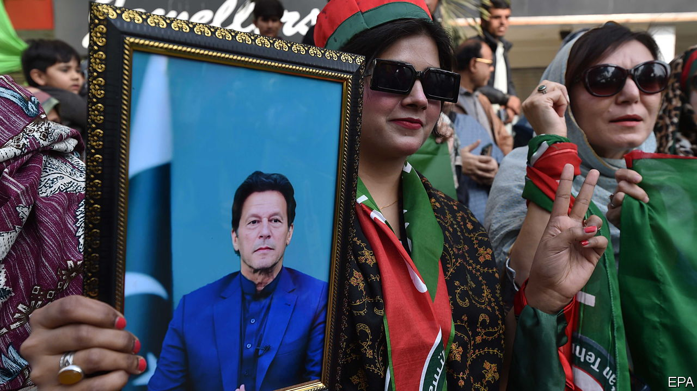

###### Clean bowled

# Imran Khan is convicted. Pakistan’s generals are content 

##### The message is clear: don’t bother voting for his party 

 

> Jan 30th 2024 


THE CONCLUSION of the trial was sudden, and chaotic. On Saturday the court replaced the defendant’s lawyers with state counsel. By Monday night the defence had wrapped up its case—over the rancorous objections of the defendant. On Tuesday morning the verdict was in. Imran Khan, Pakistan’s former prime minister, was found guilty of making public the contents of a confidential diplomatic cable sent from Pakistan’s ambassador in Washington to the government in Islamabad, and sentenced to ten years in prison under the Official Secrets Act. 

The hurried verdict reinforces a message to voters from Pakistan’s generals (who in effect run the government): do not bother voting for Mr Khan’s party, Pakistan Tehreek-e-Insaf (PTI), in the general election scheduled for February 8th. Mr Khan had accused the generals of having driven him from power in cahoots with the Americans. That angered the generals, who appear determined to ensure that Pakistanis are not tempted to return him to power. The biggest beneficiary is likely to be Nawaz Sharif, Mr Khan’s political opponent and another former prime minister, who looks set to win the election with the army’s backing.

The immediate cause of Mr Khan’s conviction is his taste for conspiracy theories. The former prime minister, who retains wide popular support, blamed his removal in a parliamentary vote of no confidence in April 2022 on a plot hatched by America and facilitated by Pakistan’s army. (He  in a recent guest essay for .)

To support the implausible theory, which the American and Pakistani governments have denied, Mr Khan cited a message from Pakistan’s ambassador in Washington outlining the alleged threat from America. The court found him guilty of misusing and misplacing that cable. Mr Khan’s lawyer called the sentence “illegal”. (Shah Mehmood Qureshi, a former foreign minister, was also convicted and received the same sentence.)

But the purpose of the verdict is to remove what little political space Mr Khan and the PTI had ahead of next week’s election. After receiving a three-year sentence in a separate corruption case in August, Mr Khan has already been disqualified from contesting the election. Candidates for the PTI have been arrested and the party’s rallies broken up. The media are subject to an undeclared ban on covering the PTI’s activities or the fate of its leader. 

Most damagingly, the Supreme Court has stripped the PTI of its electoral symbol: a cricket bat, a nod to Mr Khan’s famous sporting past. Given low literacy levels and crowded ballot papers, such symbols are crucial to help voters identify party candidates. Among the alternative symbols allocated to PTI candidates are bowls, shoes and pairs of tongs—all considered demeaning in local culture.

With the generals’ ire directed at Mr Khan and his party, Mr Sharif is quietly marching towards what would be a fourth term. Last year he patched up relations with the army and returned to Pakistan, after four years of exile in London. Since then he has struck a restrained note, emphasising his economic record and eschewing the attacks on the army for which he used to be notorious. In an election manifesto unveiled on Saturday his Pakistan Muslim League pledged to create 10m jobs, reduce inflation to single digits (in December it stood at 30%) and slash soaring electricity prices.

An economic turnaround is badly needed. Yet it is far from clear that Mr Sharif will be able to deliver it. Although he is a subdued figure for now, in office he could quickly chafe at the domineering presence of the army chief, General Asim Munir, who has in effect ruled the country since August through a handpicked caretaker government. Mr Khan’s restless supporters and Pakistan’s economic malaise will test the relationship between Mr Sharif and the generals. 

“There is such a deep crisis of state and economy, that the optimistic view is that the generals and Nawaz Sharif will manage to co-exist,” says Suhail Warraich, a political commentator. “The pessimistic view is that both sides will do what they have always done.” The losers, as always, will be Pakistani voters. ■


