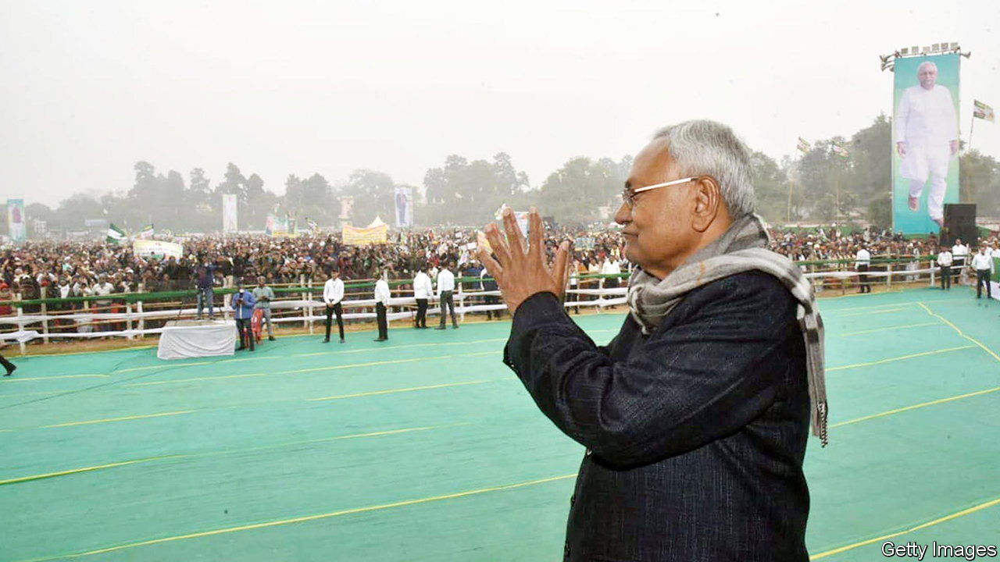

###### Bihar blues

# India’s opposition bloc disintegrates 

##### The defection of Bihar’s chief minister is excellent for Narendra Modi 

 

> Jan 28th 2024 

LATE IN the afternoon of January 28th Nitish Kumar was sworn in as chief minister of the east Indian state of Bihar for the ninth time. He had resigned from the job only a few hours earlier, after announcing that he would ditch his coalition partner and rejoin forces with Narendra Modi’s Bharatiya Janata Party (BJP). Less than three months before Indians are due to start voting in a general election, this is a big boost to the prime minister’s hopes of . 

A serial turncoat, Mr Kumar exemplifies the efforts of India’s regional parties to play the two national giants, the BJP and Congress party, off against each other. He last walked out of a state-level coalition with the BJP 18 months ago, after accusing the Hindu nationalists of trying to split his Janata Dal (United) party (JDU).

This latest flip-flop is a huge blow to Mr Modi’s opponents, including , who have clubbed together in the heroically named Indian National Developmental Inclusive Alliance (INDIA). Indeed, Mr Kumar’s decision is only the latest bad news for Congress: two other powerful regional leaders recently spurned its offers of an electoral pact in order to contest the poll independently. Taken together, these moves leave the opposition in potentially terminal disarray.

The india alliance had been creaking ever since Congress  to the bjp in the populous Hindi heartland late last year. The defeats weakened Congress’s claim to leadership of the opposition and undermined its efforts to institute seat-sharing deals with beefy regional parties such as Mr Kumar’s. In recent weeks Arvind Kejriwal of the Aam Aadmi Party (AAP), which runs Delhi and Punjab, and Mamata Banerjee of the Trinamool Congress (TMC), which controls West Bengal, said that they would spurn Congress and campaign alone in Punjab and West Bengal. Though Congress has some support in Punjab it has almost none in West Bengal. This means it is now unlikely to win many of their combined total of 55 parliamentary seats. 

Mr Kumar’s defection is a bigger blow. The bjp has a lot of support in Bihar, India’s poorest state, so an election pact with Mr Kumar should help it secure most of its 40 seats. Mr Kumar’s decision is also a powerful sign to other regional leaders of where the political wind is blowing. He briefly put the BJP on the back foot in Bihar last year, by  behind his demands for more generous affirmative-action measures in their favour. Mr Kumar was also instrumental in persuading other regional leaders to set aside their longstanding wariness of Congress and join india. Others are now much likelier to go it alone or follow Mr Kumar to the BJP.

The chief minister has managed to stay in power in Bihar almost continuously since 2005, by joining forces with whichever partner seemed most opportune at the time. He has switched allegiance five times in the past decade, earning him the nickname “Kursi Kumar” (“Chair Kumar”). Before he became chief minister in 2005, he held several posts in the BJP-led government of Atal Bihari Vajpayee, including control of the powerful railway ministry.

Underlining the sense that he believes the national mood is now with Mr Modi, Mr Kumar was re-sworn in as chief minister to chants of “Jai Shri Ram” (“Victory to Lord Ram”). This pointed to the Hindu nationalist fervour that has swept much of the country since the consecration on January 22nd of a  in Ayodhya, in the next-door state of Uttar Pradesh. Mr Modi immediately congratulated Mr Kumar and the BJP’s leaders in Bihar on the state’s new government. The prime minister said he was confident they would “leave no stone unturned” in developing Bihar for the benefit of its 130m people.

The remaining INDIA leaders lambasted Mr Kumar’s “betrayal”. Much good that will do them. Ms Banerjee, Mr Kejriwal and Mr Kumar were the opposition alliance’s most powerful non-Congress members. Without them, it looks doomed. ■


