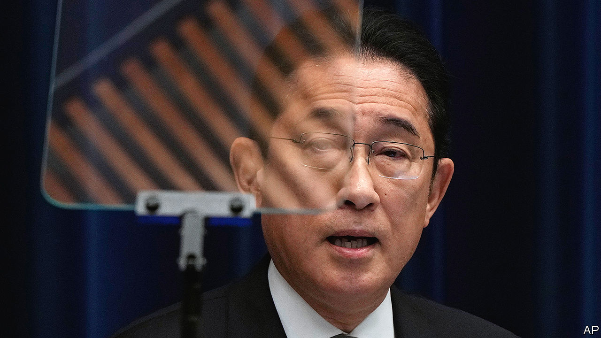

###### On the rocks

# Japan’s ruling party is in crisis 

##### Kishida Fumio’s chance of a second term looks ever slimmer 

 

> Jan 30th 2024 

The newspaper has polled approval of the Japanese government regularly since July 1947. During that time the country has had 34 prime ministers, including plenty of forgettable faces and reviled figures. But according to the newspaper’s surveys none has been more unpopular than Japan’s current leader, Kishida Fumio. In December disapproval of his administration reached a record high of 79%, up from under 50% in June.

This historic nadir comes as Mr Kishida’s Liberal Democratic Party (LDP), which has held power almost continuously ever since its formation in 1955, faces its biggest financial scandal in decades. The , or institutionalised groupings of lawmakers, have been accused of systematically under-reporting ticket sales at fundraisers and kicking back the proceeds to members. 

Since news of the wrongdoing broke in November, ten people associated with the LDP, including three lower-level parliamentarians, have been indicted in a wide-ranging criminal probe. Four cabinet ministers have been sacked. In late January four of the LDP’s six factions—including Seiwakai, once led by the late prime minister and Kochikai, which Mr Kishida heads—were formally disbanded. During an appearance at Japan’s new Diet session on January 29th Mr Kishida bowed and asked for forgiveness.

He was never particularly popular. Mr Kishida was elected president of the LDP—and thus became prime minister—in October 2021 thanks largely to the backing of the faction bosses. Minor scandals and unpopularity have since dogged his government, even as he has pursued ambitious policies, including major reforms to Japanese security policy. Apparently unfazed by his worsening ratings, Mr Kishida defied the many sceptics who questioned his staying power.

The latest troubles are more serious, however. With the opposition parties in disarray, the ldp’s grip on power is probably secure. But Mr Kishida’s leadership is creaking. He has called for an end to factional politics and launched a taskforce on internal reform. 

Such moves have improved his image, but only a little: in s January survey, disapproval of his government had dropped slightly to 72%. Mr Kishida’s chances of a further boost may hinge on good news emerging from Japan’s annual wage negotiations in March, a state visit to the White House in April and a package of tax cuts due to take effect in June. 

Yet Mr Kishida will still struggle to win re-election as LDP president when his term ends in September. Although challengers have yet to step forward, many party members will be looking for new leadership as the deadline for the next general election looms in 2025. The contest will be unpredictable in part because of the weakening of the factions, which used to be able to direct their members’ votes. “Now I can choose the candidate whom I truly believe in—before it was just a set menu from the faction,” says one LDP parliamentarian.

Even if Mr Kishida hangs on, the LDP faces a new era of instability. The turmoil will at the very least distract from other priorities. The government may also find it harder to fulfil big promises, especially those that require the public to shell out, such as Mr Kishida’s pledge to increase the defence budget by two-thirds by 2027. His government’s plans to finance the increase by raising corporate, income and tobacco taxes have already been delayed once.

The balance of power inside the LDP may also shift appreciably on several big policy debates. “It’s still the LDP, so it’s only within a range, but there may be changes,” the LDP lawmaker says. The wing of the party that belonged to Seiwakai, the largest faction and the one at the centre of the financial misdeeds, is likely to see its influence diminished. That faction has been a staunch advocate of strengthening Japan’s defences. “We lose that engine,” says Mutai Shunsuke, an LDP lower-house member. 

Seiwakai has also been a brake on social reforms, such as legalising gay marriage, allowing married couples to have separate surnames and opening the imperial family to female succession. a business daily, has speculated that Seiwakai’s decline may open political space to relax Japan’s stringent immigration policy.

The ldp’s legal troubles are unlikely to fade quickly. At issue is how the party raises funds from supporters and distributes money to its members, rather than the outright bribery of an earlier political era. The dollar amounts may seem trifling to those accustomed to American political contests: Seiwakai is accused of amassing a slush fund of ¥500m ($3.5m) over a period of five years. 

Yet the revelations come just as the government has been pushing for greater transparency in the private sector, through a strict new tax-invoicing system and corporate-governance reforms. Learning that politicians were stuffing their pockets meanwhile has enraged the public. The prosecutors handling the affair want to take the case as far as possible, says Toshikawa Takao, editor of , a political journal: “They are motivated by the idea of standing up to power.”

The internal ldp reforms may nonetheless amount to little more than cosmetic changes. Some in the party would like to see the factional structure evolve. Mr Mutai compares the process to the , the abolition of feudal domains and establishment of prefectures in the late 19th century: “We need to get rid of archaic ways of doing politics…and instead introduce modern governance.” 

But talk of abolishing factions is nearly as old as the LDP itself. The party formed through the merger of two conservative parties that maintained distinct identities; past promises of change have amounted to little. “They are likely to change the name or shape, but remain intact in terms of content,” says Uchiyama Yu, a political scientist at the University of Tokyo.

The LDP might feel more pressure to undertake deeper reform if other parties posed a bigger threat. But the opposition is split between disparate wings: the Constitutional Democratic Party of Japan, made up of remnants of the Democratic Party of Japan (DPJ), a liberal challenger that held power between 2009 and 2012; the Japan Communist Party, an old-school left-wing outfit; and the Japan Innovation Party, a newer right-wing one. 

For many voters, memories of mismanagement during the DPJ era are still too fresh to eject the LDP again. “For the LDP to lose, someone else has to win, and there’s nobody who can gain,” notes Gerald Curtis of Columbia University. Though Japan’s democracy has so far avoided the ills of populism and polarisation that vex others, it is far from healthy. ■

