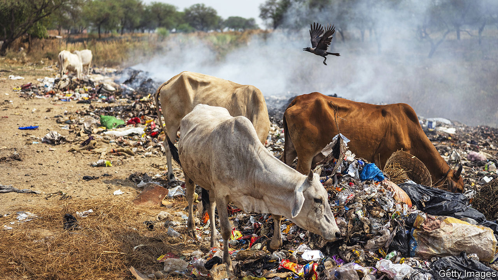

###### Counting cattle

# The Hindu right’s pro-cow policies are terrible for India’s cows 

##### A Hindu nationalist cow census is an effort to solve a problem after making it worse 

 

> Jan 28th 2024 

THE INDIAN government is not terribly keen on . The country’s census, conducted every ten years between 1881 and 2011, was postponed in 2021 owing to the covid-19 pandemic. It has yet to be rescheduled. Counting cows, for the ruling Bharatiya Janata Party (BJP), is a different matter. The BJP government of the big northern state of Uttar Pradesh (UP), home to an estimated 240m people and perhaps 20m cattle, is conducting a new bovine census. The point of this, says the government, is better cow protection.

The effort highlights a glaring cow-related contradiction in the BJP’s Hindu nationalist ideology. The party says it wants to protect cows, which are associated with divine beneficence and venerated by Hindus. Yet its pro-cow policies, including bans on cow slaughter, appear to be detrimental to cattle welfare. They are thought to be causing an increase in stray cows, typically male calves and aged milkers which, having little commercial value, are let loose by their owners. Abandoned, they feed on plastic bags and other rubbish, cause car crashes and raid farmers’ crops. There were an estimated 5m stray cattle in India in 2019, including 1.2m in UP. The government reckons the number has since increased.

Stray cattle have long been a menace in India, given the Hindu taboo on cow slaughter. Anti-slaughter laws such as the one introduced by the UP government in 2017 have further reduced the options for farmers to dispose of unwanted animals. Almost all of India’s 28 states now have laws banning cow slaughter, many of which have grown stricter in recent years. So has the taboo, thanks to thuggish Hindu activists—so-called —who attack traders, particularly Muslims, whom they suspect of transporting cattle. They operate largely with impunity and in some states alongside the police.

To mitigate the problem in UP, its BJP government, which has been in power since 2017, promised to care for ageing livestock. The government set up its own shelters and doled out subsidies to private ones. At a shelter in Noida, a city in UP across the Yamuna river from Delhi, around 160 cows are housed in a crowded neighbourhood beside a busy road.

The men who run it say they are using time off from their jobs as estate agents and bank clerks to serve “mother cow”. As leaders of the local branch of the Bajrang Dal, a militant Hindu group, they also have non-bovine interests. They scan the neighbourhood for signs of “” (a conspiracy theory that alleges Muslim men seduce Hindu girls in order to convert them and produce Muslim children), “land jihad” (alleged attempts by Muslims to take over Hindu-owned land) and Christian missionaries. They claim to press local police to prosecute such “crimes”.

If the census finds, as is expected, that the number of stray cows has grown, operations like the one in Noida are sure to proliferate. That will be another boost to . It might not do much for UP’s legions of famished cows. ■


