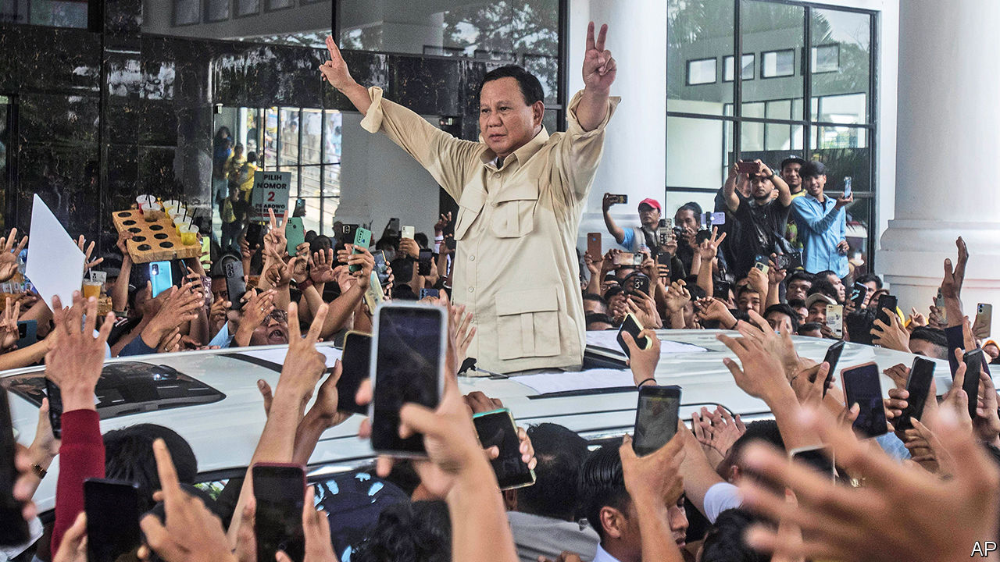

###### Dancing to victory

# TikTok is a key battleground in Indonesia’s election 

##### Liberalism is under threat in the world’s third-largest democracy 

 

> Feb 1st 2024 

Prabowo Subianto used to crack heads; now he busts moves. The favourite to win Indonesia’s presidential election on February 14th stands accused of many past abuses. As a special-forces commander under Suharto, a dictator, he allegedly permitted atrocities in Timor-Leste in the 1980s. In the late 1990s, he ordered the kidnapping of more than 20 democracy activists, of whom 13 remain missing. (Mr Prabowo denies wrongdoing.) This record got him barred from America and Australia for a time. His strongman reputation has blighted his political prospects; Mr Prabowo has twice tried and failed to become president. So he has lately undergone a startling makeover.

Social media have been flooded with videos of the portly former general dancing terribly. Young internet users, who mostly do not know or care about his past, seem to find them cute. This is not a trivial advance. More than half of Indonesia’s 204m voters are millennials or younger, and Mr Prabowo is especially popular with them. It helps that he is backed by Joko Widodo (known as Jokowi), the current president, who is beloved and also obsessively curates his image on social media. Nearly four-fifths of Indonesians own smartphones, so politicians can reach even those on the remotest of the 13,000 inhabited islands that make up the world’s third-biggest democracy.


TikTok is proving especially important as a place where politicians compete for votes from the young. Indonesia has more TikTok users than any country except America. A typical user scrolls for 29 hours a month, making it one of the country’s most popular social-media platforms.

It is making politics more fun, too. Unlike X (formerly Twitter), which is used by people who take an interest in candidates’ policies, TikTok is reducing the election to memes, songs and dances, notes Rustika Herlambang, a social-media expert at Indonesia Indicator, a consultancy. 

Mr Prabowo’s popularity on TikTok is buoyed by his running-mate, Gibran Rakabuming, the 36-year-old son of Jokowi. Mr Gibran posts clips of himself embracing TikTok’s most popular trends, such as silly dances and videos of young Indonesians pretending to talk to their future children. His most popular TikTok videos have been viewed over 20m times, putting him on a par with Taylor Swift on an average day. 

TikTok has taken the appeal of personality over policy to another level. A rival candidate, Ganjar Pranowo, complains that young voters aren’t interested in his policies but are “more into gimmicks” that go viral on social media. Anies Baswedan, the third presidential candidate, has pulled ahead of Mr Ganjar in the polls, in part due to a social-media campaign that appeals to Indonesia’s many K-pop fans. His newfound admirers have given Mr Anies a Korean nickname: Park Ahn Nice. 

This marks more bad news for Indonesian democracy, which has retreated under Jokowi. TikTok says it is working with Indonesia’s election oversight agency to stop fake news and hoaxes. Yet it has a bad record in this regard. According to a study by New York University and Global Witness, an NGO, TikTok approved the highest percentage of false political advertisements among websites, including YouTube and Facebook, in America’s midterm election campaign in 2022 (in response, TikTok said it prohibited misinformation and welcomed feedback to improve).

Another low trick, paying individuals to praise a politician online and castigate his rivals, is also common on TikTok and hard to police. Such social-media hacks are known in Indonesia as “buzzers” and are allegedly being used in all the campaigns. A typical buzzer is a young, well-educated man, operating up to several hundred fake social-media accounts, says Wija Wijayanto of Diponegoro University in Java, the country’s most populous island. A buzzer’s pay might start at a few hundred dollars a month, but can be much more. When it comes to ruling on TikTok, the fact that Mr Prabowo’s campaign is estimated to have up to 30 times more cash than its rivals looks like a big advantage. ■

